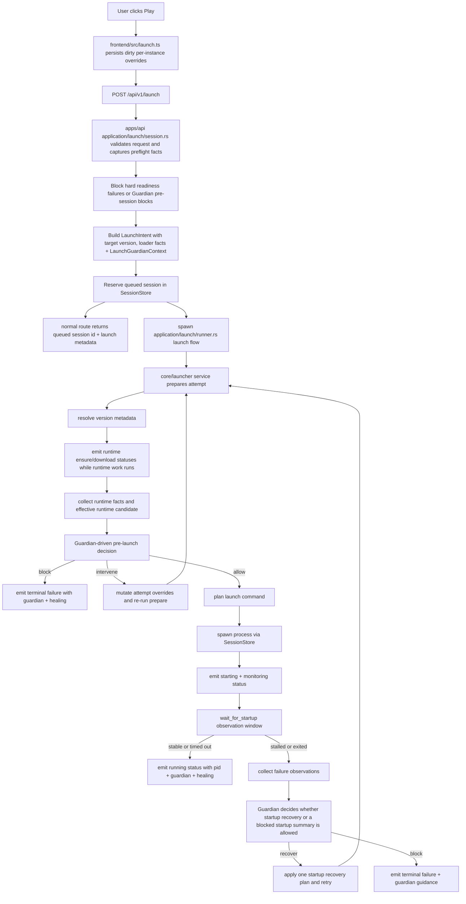
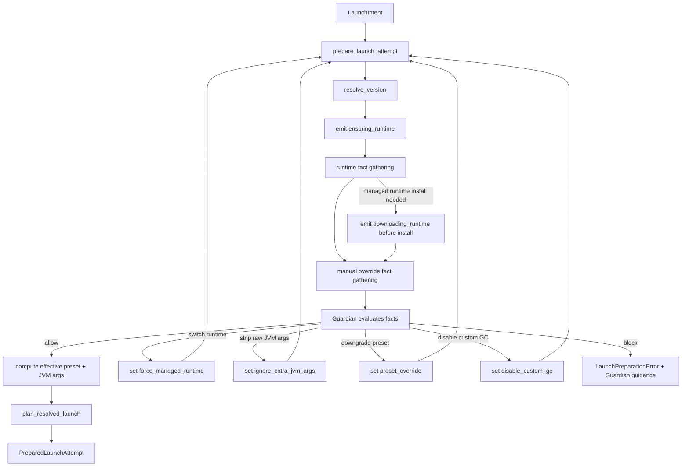
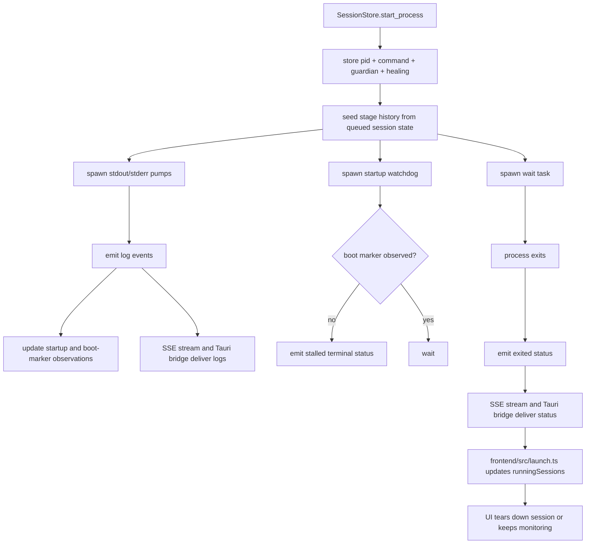
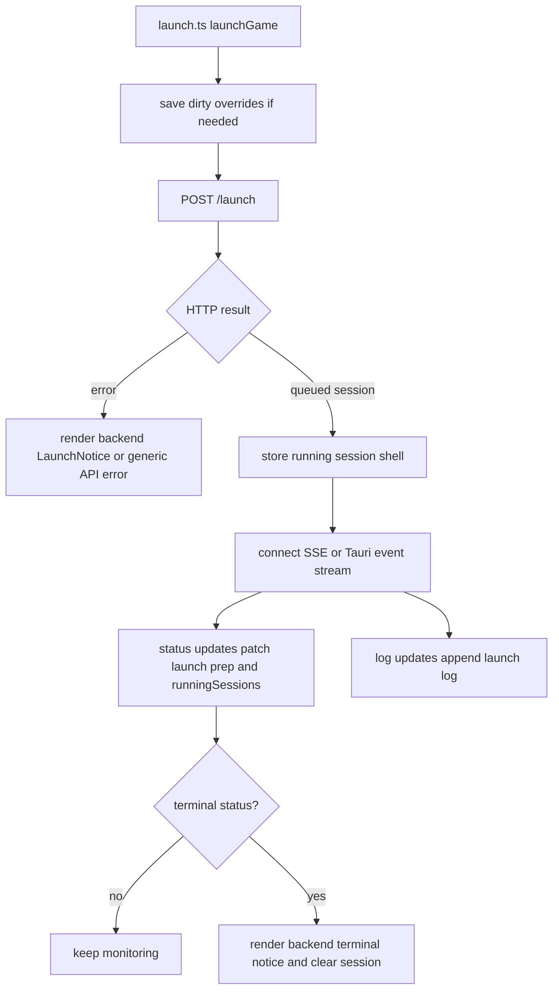
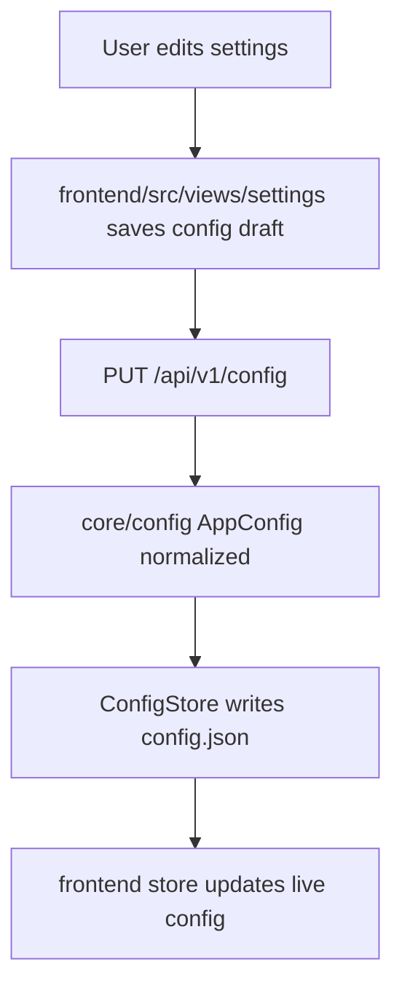
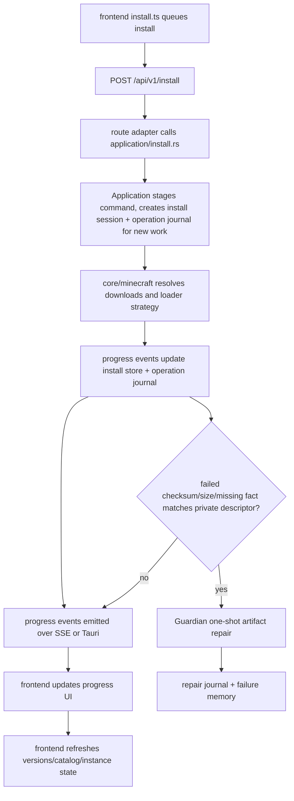
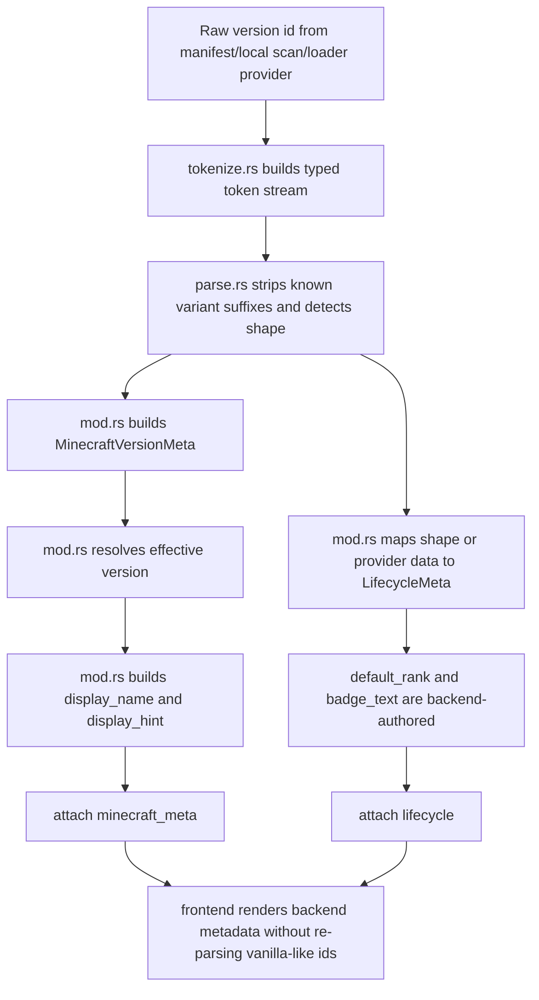
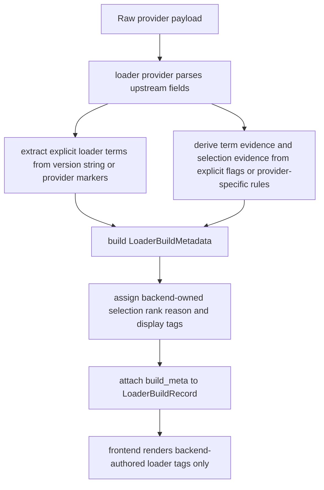

# Architecture
This is the current map of the launcher. Keep it accurate. If the architecture changes, update this file in the same change.

## Topology
- `frontend/`: Preact UI, draft/presentation state, backend-authored action rendering, browser + desktop runtime integration
- `apps/api`: local Axum HTTP surface and SSE endpoints under `/api/v1/*`
- `apps/desktop`: Tauri shell and native event bridge
- `core/config`: config model, normalization, persistence, path detection
- `core/launcher`: launch command planning, launch notices, Healing summaries, and launch status vocabulary
- `core/minecraft`: version metadata, runtime discovery/install, download/install, loader strategies
- `core/performance`: managed performance planning/install

## System ownership model
Axial is organized around backend-owned product decisions and frontend rendering boundaries. The source tree and technical identifiers still use the former `axial` name during the rebrand:

- Application owns command staging, operation identity, route orchestration, and command result/view-model carriers.
- Execution owns primitive effects and facts for files, downloads, JVM/runtime inspection, process launch, and process observations. It does not decide product safety policy.
- Guardian owns horizontal safety diagnosis, action selection, self-healing orchestration, failure-memory loop control, and backend-authored safety outcomes/notices. Self-healing is a Guardian subsystem.
- State owns live sessions, operation journals, install/performance operation state, failure memory, proof state, and strict current-schema persistence boundaries.
- Observability owns evidence tiers, redaction, local proof records, and the consent-gated telemetry-safe export shape.
- Performance owns performance rules, plan resolution, composition health, composition-managed mutation, rollback snapshots, and queued performance operations.
- Interface/API owns DTO and view-model boundaries that let the frontend render without reconstructing policy.
- Frontend owns draft form state, event wiring, subscriptions, and rendering backend-authored actions, notices, progress, and view models.

The frontend must not decide readiness, classify exits, infer install repair state, parse JVM args for policy, decide performance health, or choose Guardian/Healing precedence.

## Runtime topology
- Desktop builds use Tauri's local frontend bundle from `frontend/static`; desktop dev uses Tauri `devUrl` at `http://127.0.0.1:3000`.
- The desktop shell always starts its own Axum API on an ephemeral loopback port and exposes that address to the frontend through the `api_base_url` Tauri command.
- When desktop builds are compiled with `AXIAL_DISCORD_APPLICATION_ID`, the desktop shell also starts a custom Discord RPC worker. It speaks directly to Discord's local IPC socket or named pipe, consumes sanitized presence snapshots from the API state, and stays inactive when the build-time application id is missing or invalid.
- Browser dev runs the frontend dev server at `http://127.0.0.1:3000` and talks to the standalone API at `http://127.0.0.1:43430` unless `AXIAL_WEB_API_BASE` overrides it.
- The API only accepts browser CORS requests from local development and Tauri origins; production desktop traffic uses the bundled frontend plus the shell-provided loopback API address.

## Primary docs
- Docs index: `docs/README.md`
- Discord RPC setup: `docs/DISCORD-RPC.md`
- Guardian architecture: `docs/GUARDIAN-ARCHITECTURE.md`
- Loader architecture: `docs/LOADER-ARCHITECTURE.md`
- Version metadata architecture: `docs/VERSION-METADATA-ARCHITECTURE.md`
- ADRs: `docs/adr/`

## Frontend map
- `frontend/src/main.tsx`: app bootstrap
- `frontend/src/store.ts`: runtime state
- `frontend/src/actions.ts`: state transitions
- `frontend/src/launch.ts`: launch request submission, status/log subscription, backend notice rendering
- `frontend/src/install.ts`: install queue command submission, backend progress/status rendering, and install event subscription lifecycle
- `frontend/src/views/settings/`: settings UI sections, config save commands, and Performance Lab rendering from backend DTOs
- `frontend/src/native.ts`: desktop event bridge
- `frontend/src/machines/`: workflow machines for UI state, not backend policy

## Backend map
- `apps/api/src/application/`: backend command contracts, Application-owned staging helpers, launch session/runner orchestration, benchmark suite execution workflow, launch report/status/command/control response shaping, install operation orchestration and install/loader progress stream behavior, performance route orchestration, auth/account route orchestration, skin route orchestration, skin saved-library command orchestration, skin profile/media response orchestration, skin profile-change orchestration, skin bounded error/public-copy helpers, skin cache helpers, skin saved-state helpers, skin provider clients, and skin image normalization/rendering submodules, instance route orchestration, version/catalog route orchestration, update provider interpretation, and backend-authored command result/view-model carriers
- `apps/api/src/application/authority.rs`: stabilization authority cut-lines, route adapter contract/probes, frontend non-policy gates, Execution non-policy gate, required source/control-plane reproducibility gate, and the quality-gate failure-scenario proof matrix
- `apps/api/src/guardian/`: backend Guardian facts, diagnosis, policy scoring, failure-memory-aware safety outcomes, managed-runtime repair execution, structured install artifact failure evidence, install provider/network/interruption retry outcome authoring, install invalid-metadata/permission/temp-write/promotion/ownership blocking outcome authoring, persisted-state load warning authoring, bounded artifact repair planning, Minecraft artifact repair descriptor construction, and explicit-source launcher-managed artifact repair execution. Artifact repair execution requires caller-provided destination, provider URL, size, and explicit SHA-1 or SHA-256 checksum metadata; install workers invoke it only after a failed install fact matches a private selected launcher-managed descriptor.
- `apps/api/src/execution/`: backend Execution primitives for bounded file/download/JVM/launch/process/runtime effects. File capabilities include atomic launcher-managed writes, temp promotion, and launcher-managed file quarantine; download capabilities stream to temp, validate explicit SHA-1 or SHA-256 metadata before promotion, validate ownership before mutation, and emit structured facts without deciding Guardian policy.
- `apps/api/src/observability/`: evidence tiers, redaction helpers, local proof record vocabulary, and consent-gated telemetry-safe export boundary
- `apps/api/src/routes/launch/`: launch HTTP/SSE adapters for launch, benchmark, suite driver, qualification, report, status, command, and stop endpoints; launch preparation/session runner, benchmark execution workflow, benchmark suite-driver workflow/status view models, launch proof export view models, report/status/command response shaping, and stop workflow ownership live under `apps/api/src/application/launch/`; benchmark matrix, suite-run descriptors, and Family C qualification semantics/status view models live under `apps/api/src/application/performance/`
- `apps/api/src/routes/status.rs`: launcher status request adapter; status view-model shaping, startup warning exposure, Guardian persisted-state load warning adaptation, setup-required derivation, app/version labels, and library-mode fields live under `apps/api/src/application/status.rs`
- `apps/api/src/routes/install.rs`: install queue/request/status/event adapter; install command identity, backend queue state/action view models, duplicate suppression, retry placement, pending removal, worker coordination, journal recording, progress redaction, Guardian artifact repair invocation, Guardian install safety status adaptation, and install event stream behavior live under `apps/api/src/application/install.rs`, `apps/api/src/state/installs.rs`, and `apps/api/src/application/install/stream.rs`
- `apps/api/src/routes/loaders.rs`: loader catalog query and loader-install request/event adapter; catalog lookup, loader install worker coordination, public loader install error/progress shaping, and loader event stream behavior live under `apps/api/src/application/install.rs` and `apps/api/src/application/install/stream.rs`
- `apps/api/src/routes/performance.rs`: performance status/refresh/plan/health/install/rollback/operation request adapter; performance route command entrypoints live under `apps/api/src/application/performance.rs` and `apps/api/src/application/performance/workflow.rs`; benchmark matrix descriptors, suite-plan vocabulary, suite-run descriptor ids, and manifest run inputs live under `apps/api/src/application/performance/benchmark_matrix.rs`; Family C qualification semantics, target readiness checks, managed expected artifact checks, comparison requirements, and qualification payload/status assembly live under `apps/api/src/application/performance/qualification.rs`; plan/health response assembly, effective plan payloads, Guardian fact adaptation, performance health proof shaping, display view models, target descriptors, and installed-mod evidence live under `apps/api/src/application/performance/workflow/plan_health.rs`; managed-artifact install/remove/rollback execution, rollback list/preflight, and bounded install error shaping live under `apps/api/src/application/performance/workflow/mutation.rs`; queued operation identity/resume/status, backend-authored operation status view models, progress events, public operation status redaction, and operation journal step vocabulary live under `apps/api/src/application/performance/workflow/operations.rs`; direct non-queued performance install calls are synchronous API/test helpers that still journal internally and return bounded JSON errors, while queued operation status is the canonical user-facing proof surface
- `apps/api/src/routes/instances.rs`: instance CRUD/resource request adapter; instance response enrichment, version scan interpretation, resource listing and mutation, log tailing, folder-opening semantics, and bounded instance/resource error shaping live under `apps/api/src/application/instances.rs`
- `apps/api/src/routes/accounts.rs`: account list/create/update/select/remove request adapter; launcher account response shaping, auth-store reconciliation, account selection/removal semantics, config sync, and bounded account errors live under `apps/api/src/application/accounts.rs`
- `apps/api/src/routes/auth.rs`: auth status/refresh/profile-sync/logout request adapter; Microsoft/Minecraft readiness, provider failure mapping, skin action state, account-store sync after refresh, and bounded auth response shaping live under `apps/api/src/application/auth.rs`
- `apps/api/src/routes/skin.rs`: skin/profile/saved-skin request adapter; saved-skin library list/upload/normalize/save-from-profile/save-from-username/update/delete/replace/file-response orchestration, request DTOs, and response DTOs live under `apps/api/src/application/skin/library.rs`, with saved-library behavior proof in `apps/api/src/application/skin/tests/saved_library.rs`; online/offline skin selection, profile lookup DTOs, profile/head/cape media responses, active profile skin/cape selection, and offline identity/head rendering live under `apps/api/src/application/skin/profile_media.rs`, with profile/media behavior proof in `apps/api/src/application/skin/tests/profile_media.rs`; saved-skin apply/upload/cape-sync/reset, pending apply scheduling/flush, account readiness for skin changes, current-profile preservation before mutation, and immediate skin-change response assembly live under `apps/api/src/application/skin/profile_change.rs`, with profile-change behavior proof in `apps/api/src/application/skin/tests/profile_change.rs`; bounded skin API error shape, provider failure mapping, status ids, and user-safe provider copy live under `apps/api/src/application/skin/errors.rs`; profile skin/cape texture cache paths, cache keys, cache-control constants, cache reads/writes, and cache validation hooks live under `apps/api/src/application/skin/cache.rs`; saved-skin validation, store access, and pending saved-skin apply queue state live under `apps/api/src/application/skin/saved.rs`; Minecraft provider lookup/download/upload/reset/cape-sync clients, provider DTO parsing, provider cache state, provider response limits, and texture URL validation helpers live under `apps/api/src/application/skin/provider.rs`; PNG normalization, cache validation, texture keys, and rendered skin-head PNGs live under `apps/api/src/application/skin/image.rs`; `apps/api/src/application/skin.rs` wires the submodules and hosts the shared skin behavior fixture/mock servers used by the split proof modules
- `apps/api/src/routes/catalog.rs`, `apps/api/src/routes/versions.rs`, `apps/api/src/routes/version_info.rs`: catalog/version request and SSE adapters; version scanning, manifest enrichment, catalog interpretation, version info, folder open, and version deletion workflows live under `apps/api/src/application/version.rs`
- `apps/api/src/routes/update.rs`: update status and update-flow request adapter; GitHub release fetch, provider payload interpretation, asset selection, update response shaping, and the short-lived check cache live under `apps/api/src/application/update.rs`; in-app update staging (checksum-sidecar verification, bounded asset download, archive extraction into `<config_dir>/updates/`, self-replace apply gated on idle installs/sessions, and static user-facing failure copy) lives under `apps/api/src/application/update/flow.rs`, with flow state owned by `apps/api/src/state/updater.rs`
- `apps/api/src/state/journals.rs`: State-owned bounded current operation journals for staged Application operations and Guardian/Healing repair evidence, persisted as strict launcher-managed snapshots under `<config_dir>/state/operation-journals.json`
- `apps/api/src/state/failure_memory.rs`: State-owned Guardian failure-memory contracts and strict current-schema snapshot persistence under `<config_dir>/guardian/failure-memory.json`; Guardian records/consumes entries for suppression, while State owns validation, retention, and restart survival
- `apps/api/src/state/installs.rs`: live install sessions, install progress subscriptions, active install counts, and the in-memory backend install queue snapshot used for queue duplicate suppression, retry front-placement, pending removal, active queued install tracking, and queue view-model state
- `apps/api/src/state/performance_operations.rs`: strict current-schema queued performance operation status, resume, interruption, bounded load diagnostics, and public operation redaction
- `apps/api/src/state/sessions/`: live launch session store, subscriptions, process supervision
- `apps/api/src/state/presence.rs`: privacy-bounded launcher presence snapshots for desktop Discord RPC
- `apps/desktop/src/discord_presence/`: crate-free Discord local IPC client, reconnect loop, and activity update worker
- `core/launcher/src/guardian/`: launch notice/outcome vocabulary used by the launch pipeline; backend Guardian authority lives in `apps/api/src/guardian/`
- `core/launcher/src/service/`: launch preparation, mappings, Healing summary/recovery helpers
- `core/minecraft/src/runtime/`: runtime discovery and managed runtime installation; managed Java runtime files are streamed to temporary files, validated against Mojang component-manifest size/SHA-1 metadata, and persisted with a local component-manifest proof before the ready marker is written. Axial-managed runtime readiness requires the ready marker, an executable Java binary, and verified persisted manifest/checksum proof; Execution runtime repair refuses to recreate ready markers when that full content verification fails. Before repair installs, stale managed runtime temp and destination paths are removed as files/symlinks or directories, and cleanup failures stop the install instead of being ignored.
- `core/minecraft/src/download/`: Minecraft version, library, asset, log-config, and shared launcher-managed cache write/install primitives. The shared vanilla artifact download primitive now uses an Execution-style temp/verify/promote capability: it writes launcher-managed artifacts to a temp file, validates trusted size/SHA-1 metadata when present, rejects missing or invalid checksum metadata for selected launcher-managed artifacts, rejects short/interrupted responses, and promotes only after verification without deleting a known-good destination if fallback promotion fails. Its redacted fact/report/error types are public for API/Application evidence adaptation. Descriptor-backed selected artifacts use Guardian-safe semantic target ids, require valid SHA-1 metadata, and also emit a redacted `ArtifactMissing` fact before the attempted download when the destination is absent, giving Guardian a fact source for missing selected-artifact repair without Application filesystem scanning. Shared cache writers for loader artifacts, loader catalog indexes, and the persistent Minecraft version manifest cache use the same redacted fact model for missing metadata, temp/permission failures, temp discard, and promotion while preserving current provider resolution, retry bounds, public route errors, and install progress phases. Trusted Fabric/Quilt profile libraries may use the bounded missing-checksum path because upstream profile JSON often omits SHA-1 metadata; selected vanilla artifacts and installer-selected artifacts remain strict. Checksumless `.jar` profile libraries still need to be structurally readable JAR/ZIP files, so stale HTML, zero-byte files, or truncated cached jars are replaced instead of reused.
- `core/minecraft/src/version_meta/`: Minecraft version interpretation, lifecycle classification, effective-version resolution, display metadata, deterministic ordering
- `core/minecraft/src/lifecycle.rs`: launcher-owned lifecycle model for Minecraft versions
- `core/minecraft/src/loaders/types.rs`: loader build metadata contract, explicit upstream terms, evidence, backend display tags, and default-selection policy

## Instance Isolation

Instances are direct Minecraft game directories under `<config_dir>/instances/<instance-id>/`. Launch requests are instance-scoped: the API resolves the instance, uses that directory for Minecraft's `--gameDir` and process working directory, and still resolves shared immutable launcher material such as `assets/`, `libraries/`, `runtime/`, and `versions/` from the configured library directory. The current Rust model does not create symlinks or junctions inside instance directories.

The mutable game-state boundary is instance-local. Axial creates and reads user-visible folders such as `mods/`, `saves/`, `resourcepacks/`, `shaderpacks/`, `config/`, `screenshots/`, and `logs/` under the instance directory. The folder-opening API accepts an omitted `sub` query to open the instance root, or one of those explicit subfolder names; any other `sub` value returns a bounded JSON `400` instead of falling back to the root. Resource listing APIs scan fixed instance-local subdirectories and never accept caller-provided paths. Direct log tailing accepts only a single safe filename and rejects traversal, hidden, separator-containing, and control-character names.

Instance list/detail responses are readiness-verified at the Application boundary. `/api/v1/instances` first reads the shared installed-version scan state, then applies the same launch-readiness inspector used by launch preflight before authoring `launch_action`. Shallow installed-version presence can no longer produce `Launch` when launch readiness would block on missing/corrupt libraries, assets, client jar, incomplete inherited installs, scan degradation, or user-owned runtime blockers. Missing launcher-managed files return backend-authored install actions, corrupt launcher-managed artifacts return repair actions, and user/config or degraded-scan blockers return blocked actions for the frontend to render.

Instance chrome does not serve screenshot or world imagery. The frontend renders deterministic `art_seed`-derived identity tiles with loader-specific SVG masks and plain themed banner surfaces. Screenshots remain available only through the instance Screenshots tab file endpoint, which is scoped to the fixed `screenshots/` subdirectory and validates screenshot filenames before streaming.

## Full launcher pipeline

### High-level launcher lifecycle

### Launch pipeline: end-to-end

### Launch pipeline: backend detail

Effective launch memory selection is backend-owned at launch request time. Per-instance memory values remain the highest-precedence explicit selection, explicit launch request memory remains next, and customized global config memory remains the global default. Fresh instances whose global config still has the built-in memory pair use launch-time host total RAM and the current version target to derive defaults before the Guardian/resource-budget snapshot is recorded: legacy vanilla targets use a smaller allocation, modern vanilla targets use the standard allocation, and loader/modded targets use a larger allocation, all bounded by the launcher OS-headroom policy when host memory evidence is available. Normal launch preparation rejects blocking local readiness before inserting a session and returns bounded readiness reasons without paths. Missing installed version metadata, incomplete version-install markers on the target or inherited base version, missing client jar, missing libraries, missing asset index, and bad explicit Custom Java readiness are also promoted into Guardian facts and a Guardian-authored blocked summary on the same `412 Precondition Failed` readiness response, so the UI receives backend safety state without losing the readiness status class. Asset readiness checks the asset index and every referenced object, including legacy virtual/map-to-resources copies; library readiness uses the same artifact resolver and legacy top-level SHA-1/size metadata as downloads. Managed Java runtime absence in Managed mode is recoverable readiness and a Guardian-visible recoverable runtime fact: the normal runner preparation path is allowed to ensure/download the runtime, while explicit Custom Java override absence remains blocking. A present launcher-owned managed runtime that is not ready, including missing or corrupt persisted manifest/checksum proof, a missing ready marker, bad ready-marker shape, missing Java executable, or non-executable Java file, is treated as pre-session managed-runtime corruption and goes through Guardian repair/block with journals and failure memory before any session is inserted. If Guardian attempts a pre-session managed-runtime repair and that repair is blocked, failed, or suppressed by failure memory, the launch is stopped before session creation with a Guardian-authored `422` response. Normal launch responses return as soon as a queued session exists and include the session id, `state: "queued"`, `pid: null`, launch timestamp, Guardian summary, and the effective `max_memory_mb` and `min_memory_mb` selected by backend preparation so the frontend can subscribe to live events before runtime preparation starts and record the running session allocation without recomputing memory policy locally. Benchmark launch routes still await the runner and return the normal post-spawn success payload plus benchmark metadata.

Version JSON resolution is centralized in `core/minecraft/src/launch`. Launch, install, readiness, runtime repair, runtime selection, JVM validation, and installed-version scanning consume the resolved effective model rather than independently interpreting raw child manifests. Resolution merges inherited manifests before validation, treats missing `assetIndex` as inheritable, prefers child download artifacts when present, falls back to a parent client jar only when the child has no client artifact, and normalizes legacy `minecraftArguments` into the modern argument flow when profiles mix both formats. Library resolution applies OS rules before artifact de-duplication and resolves legacy native classifiers before skipping duplicate classpath artifacts, because Mojang manifests can list the same `group:artifact` once for classes and again for platform natives. Effective Java metadata is finalized in the same model: missing `javaVersion` on pre-1.17 releases resolves to `jre-legacy` Java 8, 1.17 resolves to Java 16, 1.18 through 1.20.4 resolves to Java 17, and 1.20.5 and newer resolves to Java 21 unless the manifest declares a more specific component or major version. Module-bootstrap Forge/NeoForge launch plans still keep the resolved game jar on the classpath.

Launch planning owns hardcoded version quirks that affect command correctness. Offline/local launches targeting exactly Minecraft `1.16.4` or `1.16.5`, including inherited loader profiles whose explicit target version is one of those ids, receive the `authlib` offline-multiplayer workaround before user JVM arguments are appended: Axial sets `minecraft.api.env=custom` and redirects the Mojang auth/account/session/services API hosts to `https://nope.invalid`. This avoids the old `authlib` 2.1.28 path that disables Multiplayer and Realms when an offline token is used. The workaround is gated by `LaunchAuthContext::is_offline()` and is never applied to authenticated Microsoft launches.

Loader install prewarm is a best-effort readiness optimization after the loader build has been installed. A prewarm failure can emit progress evidence, but it does not turn a completed loader install into a terminal install failure.

Launch preparation emits live status observations on the existing session stream. The runner starts the backend-authored preparation stream at `planning`, emits `ensuring_runtime` after version resolution and before runtime selection begins, emits `downloading_runtime` immediately before the task that owns a missing managed Java runtime install enters the install path, emits `validating` while runtime and manual override compatibility checks run, and emits `preparing` before command planning and launcher-managed launch artifact preparation. After process spawn, the runner allows a bounded startup observation window before treating no-output startup as stalled; the longer supervisor watchdog still owns final no-boot-marker termination. These are launch-stage status events, not a new frontend workflow or per-file runtime download progress channel. A concurrent launch waiting on the same runtime install lock can remain at `ensuring_runtime` until the owning install completes.

When Guardian blocks a launch before a process is available, benchmark launch and benchmark suite launch routes return HTTP `422 Unprocessable Entity` with the normal bounded launch-error JSON (`error`, optional `healing`, optional `guardian`). Normal launches have already returned the queued session response by that point, so the runner emits the same bounded Guardian/Healing failure through the session log/status stream and leaves a terminal session snapshot available through `/api/v1/launch/{id}/status`. Pre-session validation errors from the normal launch route still return their route-level HTTP errors before any session id is created; Guardian-visible readiness blocks remain `412` readiness responses with an added bounded `guardian` payload. This keeps a deliberate Guardian safety block distinct from an internal API failure, while non-Guardian launch request failures remain HTTP `500` unless a more specific route-level status applies.

Launch request responses, launch pre-session error responses, status snapshots, browser SSE status events, and desktop status events can carry an optional backend-authored `LaunchNotice` view model: `message`, optional lead `detail`, ordered `details`, and `tone`. The notice is built in `core/launcher` from Guardian, Healing, and failed/unknown session outcomes so the user-facing precedence is not reconstructed by the frontend. Actionable Guardian messages/details own the notice; allowed/no-op Guardian summaries are diagnostic state only and do not become user notices. Healing contributes recovery/failure-class detail only when Guardian has not already authored an actionable blocked/warned/intervened notice; failed or unknown session outcomes can create terminal notices; clean or stopped outcomes do not. In particular, closing the game outside the launcher after startup is a clean `ExternalUserClosed` outcome and remains log-only unless the backend explicitly sends a notice.

The API exposes `GET /api/v1/launch/preflight/{instance_id}` as a read-only backend-authored Guardian preflight. The endpoint validates the configured library and instance existence, captures launch-preparation facts for Guardian mode, override origins, effective memory, selected-memory bounds, resource pressure, Custom-mode risky overrides, explicit executable Java override probe facts, and no-download local launch-readiness diagnostics, then lets Guardian produce the warning or blocked summary and copy. Explicit Java override probes are bounded so a hanging `java -version` attempt becomes a redacted probe-failure fact instead of a stuck preflight. It returns only bounded JSON facts: Guardian summary, effective memory, override origins/booleans, scalar resource pressure, additive readiness state with stable reason ids such as missing installed version metadata, incomplete install marker, client jar, libraries, launcher-managed jar signature corruption, asset index, managed runtime, or explicit Java override, and Guardian facts for every current readiness class. Installed metadata, incomplete install, client jar, libraries, launcher-managed jar signature, and asset-index readiness facts are sanitized install/download facts; Managed-mode missing runtime is a recoverable runtime fact; explicit Custom Java absence, probe failure, wrong Java major, or too-old Java 8 update are user-owned runtime facts with no raw path. Readiness reasons carry a backend-authored severity; `blocking` prevents session creation, while `recoverable` remains visible to the UI without becoming frontend policy. When Guardian selects a safe one-attempt launch intervention, the preflight outcome carries typed directives such as `UseManagedJavaForAttempt` or `StripExplicitJvmArgsForAttempt`; Application executes those directives directly instead of re-deriving the action from diagnosis ids. It never creates a launch session, starts Minecraft, installs files, ensures instance layout, writes proof state, or exposes filesystem paths, command lines, raw JVM args, account names, usernames, or tokens. The current InstanceDetail overview does not render a persistent preflight panel; it keeps launch safety user-facing through launch/install affordances and backend-authored launch outcome notices.

Effective JVM preset selection is backend-owned. With no explicit preset override, HotSpot runtimes select from the current presets using explicit target Minecraft version, loader/modded state from installed version metadata, detected Java distribution, and host CPU/RAM evidence: supported GraalVM runtimes use the GraalVM preset, Java 8 legacy targets use the specific legacy preset for 1.8.9 PvP and modded 1.12.2 heavy launches when applicable, other Java 8 legacy targets use the conservative legacy preset, modern modded launches use the performance preset, high-end modern vanilla Java 21+ launches with at least 8 logical cores and 8 GiB total RAM use the ultra-low-latency preset, and other supported modern vanilla launches use the smooth preset. OpenJ9 and other unsupported HotSpot-tuning targets receive no Axial GC flags. Launch preparation and startup recovery must not infer loader identity or base Minecraft versions from composite installed version ids.

Native library extraction is launch-planning owned in `core/launcher`. When a resolved launch includes native libraries, the planner extracts them into the Axial natives cache under the OS cache directory, writes through a process-local staging directory, marks completed directories with `.ready`, and only reuses a cached extraction when the cache key still matches the version id plus native artifact identity and current file metadata. This keeps interrupted or repaired native artifacts from being treated as ready launch input.

### Live session and event flow

`SessionStore` owns the live stage history for each launch session. Status transitions update the stored `LaunchSessionRecord.stages` array and every status payload can include the current stage records. Each stage record carries the backend stage id, label, start timestamp, optional end timestamp, optional duration, optional result, warnings, and fallback reason. When a status payload carries Guardian data, non-allowed Guardian outcomes (`warned`, `intervened`, or `blocked`) contribute bounded unique Guardian-authored `details` to the stage warnings before Healing warnings are appended without duplicates; Healing `fallback_applied` remains the source of stage fallback reasons. Benchmark launches also attach bounded benchmark metadata to the live session record so active status can be correlated before proof persistence. Startup-failure log signals are stored as timestamped observations. A terminal process exit can use such a signal as direct failure cause only when the signal is still correlated with the exit window; stale signals remain historical evidence and cannot turn a later clean external close into a crash warning. Process lifecycle observations also attach redacted Execution stage evidence for process spawn, boot marker, process exit, exit code, launcher stop intent, watchdog kill, and watchdog action, so status snapshots and proof records preserve useful facts without exposing command lines or raw process output. The startup watchdog remains active until an explicit boot marker is observed; ordinary output alone is not enough to mark startup complete, and a process that never reaches a boot marker is reported as a stalled startup instead of being treated as healthy. The route snapshot at `/api/v1/launch/{id}/status`, browser SSE stream, and desktop Tauri bridge all expose the same additive `stages` data and optional benchmark metadata. `GET /api/v1/launch/{id}/command` is a local diagnostic endpoint only: it returns the launch command with credential-looking values redacted, reports whether redaction changed the command, and does not expose the raw Java path or act as an online credential channel. The backend now emits a `prewarming` stage after launch planning and before JVM spawn; that stage performs a bounded, sequential, best-effort read of high-value local launch files and records its duration like any other launch stage. The prewarm budget is selected from the launch resource-budget snapshot: low-pressure launches keep the normal bounded prewarm, pressure reduces prewarm work, and severe CPU/install or disk-headroom pressure skips prewarm rather than adding avoidable load. On Windows, the session process helper starts the game process below normal priority and promotes it back to normal priority after an explicit boot marker is observed; setup and promotion failures are logged as warnings and never fail launch status. Other platforms intentionally no-op this priority sandwich until Axial has a reliable restore design. The live session record keeps bounded priority-management evidence for later proof persistence, but status events do not expose this evidence.

The desktop Discord RPC worker subscribes to `SessionStore` change notifications and also performs a bounded snapshot poll so user settings apply even when no launch status changes. Presence text is backend-authored in `apps/api/src/state/presence.rs`: idle shows only launcher-level activity, one active session shows broad Minecraft/loader/performance context, and multiple sessions collapse to an aggregate count. The desktop payload maps those snapshots to Discord activity fields: `details`, `state`, elapsed timestamps for active game sessions, large/small rich-presence assets, and a party count only for multi-session activity. Instance names, account names, world/server names, paths, commands, mod lists, tokens, UUIDs, and raw custom version identifiers are not included. Discord RPC updates use no buttons or join secrets, and connection failures remain quiet diagnostics.

Launch completion also writes a local proof record under `<config_dir>/benchmarks/launch/`. Proof records are best-effort and never fail the launch path; persistence writes through a temporary JSON file before replacement. They include session, instance, version, launch timestamps, outcome, scenario metadata, conservative local device metadata, launch-time resource budget snapshot, pid/exit/failure data, optional boot-marker-derived boot duration, optional priority-management evidence, Guardian, Healing, and stage history, while avoiding full command-line, Java-path, and raw process timestamp persistence. Priority proof evidence records bounded scalar modes only: startup mode, optional sanitized setup error, optional post-boot promotion outcome, and optional sanitized promotion error. Non-Windows launch sessions record explicit `noop` priority evidence because process priority restore is intentionally not attempted there. Proof JSON is parsed as strict current-schema local state: unknown fields and missing structural fields such as scenario, device, or stages are invalid rather than migrated. Optional evidence remains optional only where the current writer intentionally omits unavailable data, such as boot duration, priority evidence before a process launch attempt exists, benchmark tags on normal launches, comparison data, or host measurements that the OS did not expose. The boot duration is recorded only when the backend observes an explicit game boot marker after process spawn; timeout-based running transitions do not synthesize it. The resource budget snapshot is captured before the new queued session is inserted and records scalar pressure evidence such as active launch/install counts, active launch memory allocation, requested memory, signed estimated remaining memory, headroom threshold, and memory/CPU/install pressure booleans, plus best-effort measured memory evidence for host available memory, host used memory, and launcher process memory when the host exposes those values. It also records best-effort CPU load-average evidence, launch-relevant free disk space, and a conservative disk-pressure flag without storing filesystem paths. Stage history includes the bounded prewarming stage when launch reaches it, so benchmark proofs can show whether prewarm work ran and how long it took without storing warmed file paths.

When a previous local proof matches the same known launch mode, version target, requested memory, device tier, and any present benchmark profile/run-type/mode dimensions, the new proof also stores an additive comparison summary, but only when both the current proof and the baseline candidate have comparable outcomes (`running`, `exited`, or `completed`). Managed proofs may also compare against matching vanilla baseline proofs and prefer a matching vanilla baseline over a matching managed baseline when both exist; vanilla proofs compare only to vanilla proofs, custom proofs compare only to custom proofs, and unknown or empty modes do not compare. Failed, error, blocked, unknown, or empty outcomes are not compared and are not selected as baselines. Empty or `unknown` benchmark profile/run-type/mode values are treated as absent for normal launch comparisons; if either proof has a real value for one of those benchmark dimensions, both proofs must carry the same value. Benchmark id is persisted as a run descriptor but is not required for reusable baseline matching. Proofs with boot-marker-derived `boot_duration_ms` compare only against matching proofs that also have `boot_duration_ms`; proofs without boot duration retain the total completed launch-stage duration comparison. `POST /api/v1/launch/benchmark` reuses the normal launch path, returns the normal launch response plus bounded benchmark metadata, attaches the same sanitized metadata to the active session status, and tags the resulting proof scenario with sanitized benchmark profile/run-type/mode/id fields. Benchmark mode metadata accepts the current `development`, `qualification`, and `release_validation` ids only. `GET /api/v1/launch/benchmark/matrix` exposes the backend-authored local benchmark descriptor for stable `development`, `qualification`, and `release_validation` modes, run types, benchmark profile ids, and representative target descriptors; it is descriptor-only and never exposes paths, commands, account names, or runtime arguments. `POST /api/v1/launch/benchmark/suite` expands those stable ids into a deterministic bounded suite plan and launches one selected suite run through the same benchmark launch path, returning selected and remaining run metadata, including descriptor target ids where a suite run is tied to a representative target, plus a stable `suite_id` for an advanced caller to drive the suite one run at a time. When `run_index` is omitted, the suite endpoint resumes the first planned run in the persisted manifest without a session id; a complete suite returns a JSON conflict instead of relaunching run 0, and an existing non-terminal suite run returns a JSON conflict instead of overlapping runs. `POST /api/v1/launch/benchmark/suite/tick` is a polling-safe driver primitive for background orchestration: it returns `active` or `complete` as HTTP 200 non-error states when no run should start, or launches exactly one next pending run through the same suite path when the suite can advance. `POST /api/v1/launch/benchmark/suite/driver` starts one explicit in-memory suite driver per suite, clamps the polling interval to safe bounds, and reuses the tick decision path until stopped, complete, or failed; `GET /api/v1/launch/benchmark/suite/drivers/{id}` reports bounded driver state, `GET /api/v1/launch/benchmark/suite/drivers` lists a bounded set of recent driver states, `POST /api/v1/launch/benchmark/suite/drivers/{id}/stop` cancels future driver iterations without killing a launched game session, and `POST /api/v1/launch/benchmark/suite/drivers/{id}/resume` explicitly starts a fresh driver from a persisted terminal/interrupted record when its suite manifest still has a pending run. Driver status records persist under `<config_dir>/benchmarks/suite-drivers/`; API and desktop startup parse only strict current-schema driver records for discovery, mark previous non-terminal records as restart-interrupted, and run one bounded automatic resume pass for records whose visible terminal state is `interrupted` with the restart-interruption error. Stopped, failed, complete, manually interrupted, malformed, excess, and already consumed records remain visible but are not auto-resumed, and automatic resume reuses the same fresh-driver path as the explicit resume endpoint. Suite runs update a strict current-schema local manifest under `<config_dir>/benchmarks/suites/` with each planned run's profile, run type, target id when present, benchmark id, launch mapping, and state; after proof persistence, matching suite manifest runs are updated with the persisted proof outcome state. `GET /api/v1/launch/benchmark/suites/{id}` returns that manifest with planned runs and launched session mappings. `GET /api/v1/launch/benchmark/qualification/family-c-1-12-2/{suite_id}` is a local-only evidence check for the Family C Forge 1.12.2 release-validation pair: it reads the strict current-suite manifest plus bounded local proof records, reports `ready` or `incomplete` with per-target missing reason ids for the vanilla baseline and managed Family C Forge core target, and never launches Minecraft, installs files, or exposes paths, commands, accounts, tokens, Java arguments, or runtime arguments. `GET /api/v1/launch/benchmark/qualification/family-c-1-12-2/preview` is the no-launch preview boundary for the same pair: it expands the current `release_validation` suite plan in memory, returns an `incomplete` descriptor-only qualification shape without requiring a suite id, and does not read or write suite/proof state. The API exposes recent proofs through `GET /api/v1/launch/reports` and individual proofs through `GET /api/v1/launch/reports/{id}` using a sanitized export shape: unbounded failure detail, priority setup errors, arbitrary provider payloads, command fragments, Java paths, JVM arguments, usernames/account ids, token-like strings, and suspicious stage/Guardian/Healing free text are dropped or redacted at the API boundary while scalar proof evidence, bounded Guardian/Healing summaries, stage timing, resource budget, scenario metadata, and comparison evidence remain available. Settings Performance renders the recent proof history with benchmark metadata, comparison text, compact resource-budget evidence, sanitized proof-copy support, and a bounded advanced benchmark-driver block with instance, suite-mode, interval, start, refresh, stop, and resume controls.

Benchmark suite launch reserves the selected manifest run with the prepared session id before entering the process spawn path. If suite manifest storage fails, the benchmark-suite request fails with bounded storage copy before Minecraft can start, preventing an untracked running benchmark session.

Corrupt or unreadable strict-schema performance operation and benchmark suite driver status records produce bounded State load diagnostics at startup. `/api/v1/status` adapts those diagnostics through Guardian as the `persisted_state_schema_invalid` warning, without exposing paths, parse errors, or malformed JSON fields, and without rewriting or deleting local files.

Guardian failure memory is persisted as launcher-managed State data under `<config_dir>/guardian/failure-memory.json`. Runtime repair, launch startup recovery, artifact repair, install provider retry suppression, and Performance repeated-failure facts all use the same State-owned memory store, so suppression windows and occurrence counts survive API/desktop restart. State validates the strict snapshot shape, keeps descriptors redacted and bounded, prunes retention, and persists through the Execution atomic write capability; Guardian still owns whether a persisted entry suppresses, allows retry after cooldown, records only, blocks, repairs, or degrades.

Operation journals are persisted as launcher-managed State data under `<config_dir>/state/operation-journals.json`. The store keeps a bounded current-state snapshot with strict schema validation, structured-id checks, redacted target descriptors, retention pruning, and Execution atomic writes. Application and Guardian write operation facts, diagnosis ids, repair outcomes, and workflow progress into the journal, but State only stores and validates the shape; it does not decide repair, retry, block, degrade, proof, privacy, or telemetry policy. Observability can compact a terminal operation journal into a redacted `OperationProofRecord` that carries command/status/outcome, target descriptors, failure point, Guardian diagnosis ids, journal counts, latest step evidence, and generated Guardian facts. Install status and install event replay can reconstruct bounded terminal progress and Guardian repair summaries from a restart-loaded journal when the transient install session snapshot is gone; install status also includes the journal-derived proof for terminal journal-backed installs. Queued Performance operations link their durable status id to the operation journal id, so terminal performance operation status responses can attach the same Observability-bounded operation proof without making State or routes own proof policy. Direct non-queued Performance mutation calls still create internal operation journals with generated ids and return sanitized synchronous JSON errors, but they do not expose a separate proof-bearing error envelope because product UI and observable lifecycle monitoring use queued operation status for proof.

For the Performance-owned Family C qualification route, `ready` additionally requires each target proof to carry backend-authored Guardian decision evidence and resource-budget memory, CPU, install, and disk evidence; the managed target also requires local `family-c-forge-core` composition state with expected managed artifacts, composition-managed ownership, Modrinth provenance, verified SHA-512 integrity, and a compact comparison against the vanilla baseline proof from the same suite using a supported launch-duration metric with non-empty samples and positive values. Missing evidence is reported through per-target descriptor-only reason ids.

### Frontend launch flow

Before `/launch` returns a session id, the frontend uses a bounded local launch-stage placeholder sequence from the same stage vocabulary. Those placeholders are conservative estimates only; the initial request state is indeterminate until the backend provides a real progress view model. The normal route now returns immediately after the queued session is inserted, and backend status events drive the visible session state and pid from that point forward. Normal frontend launches post the instance id, username, and client start timestamp; memory warnings and effective memory selection are backend/Guardian authority. `frontend/src/launch.ts` validates and displays backend `LaunchNotice` payloads and logs their ordered details, but it does not classify failure classes, choose Guardian-versus-Healing precedence, author online-auth recovery copy, infer terminal-warning tone, or synthesize a crash warning for clean external process closure.

Instance list, get, create, duplicate, and update responses expose enriched instance DTOs for UI-bound consumers. The DTO keeps the older scalar `launchable`, `status_detail`, and `needs_install` fields, and also carries backend-authored `launch_action` with `state_id`, `label`, `tone`, `launchable`, `primary_action`, and optional `disabled_reason`. List/get enrichment uses summary launch readiness only: it checks version metadata, incomplete markers, required client/index/library file presence, cheap size-obvious client/index/library corruption, and missing explicit Custom Java overrides, but it must not walk asset objects, hash client jars, hash libraries, hash asset indexes, verify managed runtime manifests, or count instance resource folders on the hot path. Full readiness, including complete asset-object, library, client, asset-index, and managed-runtime integrity verification, belongs to launch preflight and explicit install/repair flows. Detailed saves/mods/resourcepack/shader counts belong to resource endpoints and views that actually need them, not the instance list route. The instance split button consumes `launch_action` for the Launch versus Install command state, while transient install queue/progress and launch-prep progress remain presentation overlays from backend operation/session streams.

The create flow is backend-authored and source-scoped. `GET /api/v1/instances/create-view` without a source returns the vanilla source only; `GET /api/v1/instances/create-view?source=<source-id>` returns rows for that one source, where `<source-id>` is `vanilla` or a loader component id such as `net.fabricmc.fabric-loader`. Loader create-view rows are Minecraft-version rows, not eagerly resolved build rows: their opaque `selection_id` identifies the component plus Minecraft version, and the exact preferred loader build is fetched and validated only when `POST /api/v1/instances` submits that selection. Version-level loader selections prefer stable defaults, fall back to provider-ranked unstable builds when no stable build exists, and render beta-only targets with backend-authored row tags instead of disabling selection. Provider-unlabeled non-beta builds such as Quilt remain valid stable defaults, and exact `loader_build` selections still work for deliberate build selection. Provider failures disable only the affected source and produce one backend notice for that source, never one notice per Minecraft version and never a global frontend-authored blocker. `download_state: full` means the exact loader build is installed when exact build identity is known; lazy loader rows stay conservative and can report base availability until submit-time build resolution proves the exact target. Application revalidates vanilla selections against the backend manifest, resolves lazy loader selections through build catalogs and the loader policy layer, rejects unknown, incompatible, or stale uninstalled loader selections, owns duplicate-name suffixing, applies initial settings, normalizes JVM presets through Guardian, and queues any required install before returning the create result. The frontend may request a source, filter/search returned rows, and submit draft values, but it does not choose install intent, preferred loader builds, provider failure policy, loader catalog freshness policy, or JVM preset safety.

Deliberate loader-build selection is also backend-classified. `GET /api/v1/instances/create-view/loader-builds?source=<component-id>&minecraft_version=<id>` returns a backend-authored view: an "Automatic" option carrying the lazy `loader_version` selection id plus its explanation, and one option per provider build with label, Stable/Beta channel classification, recommended flag (the same preferred-build policy used at submit time), installed state, and disabled reasons for known-incompatible builds or stale uninstalled catalogs. The frontend renders these options verbatim and submits the chosen `selection_id`; it never parses build ids or ranks builds itself. The create view also carries an `optimize_option` view model (id, label, detail, default state) that the frontend renders as the Auto-optimize toggle; `POST /api/v1/instances` accepts the resulting `auto_optimize` flag and persists it on the instance as the opt-in for the launcher-owned instrumentation layer (plans/03.4), which current launches do not yet consume.

Instance update persists explicit Java path and raw JVM argument overrides when the user saves them, but the update response redacts those raw strings before serialization. Launch preparation reads the stored values on the backend and turns bad, empty, missing, or unsafe overrides into Guardian facts/notices without requiring the frontend to re-echo paths, command fragments, or tokens.

### Config/settings flow

Normal config reads and writes parse and validate the strict current `AppConfig` schema. The config schema includes `telemetry_enabled`, a disabled-by-default consent flag, and `telemetry_install_id`, a random UUID created only after consent when a telemetry event is queued. Builds or runs with a valid `AXIAL_POSTHOG_API_KEY` upload the closed telemetry vocabulary through the Observability redaction boundary; consent-off and keyless runs do not queue or send telemetry, and disabling consent clears the install id and queue. The same consent and key gate controls remote feature flag fetch/apply behavior. See `docs/TELEMETRY.md` for the public data inventory. Config also includes `discord_rpc_enabled`, enabled by default for builds that provide a Discord application id, and `discord_rpc_onboarding_seen`, which records that onboarding already offered the public Discord activity choice. API and desktop startup use a narrower startup-only load path: if `config.json` parses as current `AppConfig` and validation fails only because `launch_auth_mode` is not `offline` or `online`, startup keeps the file unchanged, uses `offline` in memory, and exposes a bounded warning through `GET /api/v1/status`. Parse failures, invalid usernames, and any other validation failure still fail startup. On a fresh user profile where status reports no configured library, the frontend initializes the backend-managed library through `POST /api/v1/setup/init` before loading versions and instances; the legacy blocking setup overlay is not part of the current startup path.

### Feature flags

Feature flags start in the static `FEATURE_FLAGS` registry in `core/config/src/flags.rs`. User overrides live on `AppConfig.feature_overrides` and persist through the same atomic `ConfigStore` write path as the rest of `config.json`; normalization prunes overrides whose registry entry no longer exists. `GET /api/v1/flags` and `PUT /api/v1/flags/{key}` expose Application-owned flag view models, and dev-only registry entries are omitted from release builds. Flag resolution precedence is user override, then consent-gated remote PostHog value, then registry default. Remote values are fetched only when telemetry export is configured and consent is enabled, apply only to non-dev registry keys, and are cached for 24 hours under `<config_dir>/flags/remote-cache.json` as flag keys, booleans, and a fetch timestamp. Frontend startup loads `/flags` into the `featureFlags` signal through `frontend/src/flags.ts`, and consumers use `flagEnabled` plus `setFlagOverride` instead of fetching flag state directly. The Dev Lab flags tab renders every visible flag and gates the state inspector tab behind `dev.state-inspector`, while Settings renders non-dev experimental flag cards.

### Install flow

Vanilla and loader install entrypoints are wrapped in the Application `InstallVersion` command shape before the install worker starts. `apps/api/src/application/install.rs` derives a backend operation id from the install session id, creates an operation journal for newly inserted sessions, returns the operation id with the install id, owns worker coordination, and records phase-change progress plus terminal success, failure, or worker interruption in the journal. `routes/install.rs` and `routes/loaders.rs` parse requests, call Application entrypoints, serialize backend-authored responses, and stream sanitized progress events. Duplicate active install requests return the existing install id and derived operation id without creating a second journal. Journaled install evidence is bounded to sanitized phase/fact descriptors and does not store raw filesystem paths, provider payloads, tokens, usernames, command lines, or raw error text. If the process restarts after a terminal install journal is written and the transient install session snapshot is gone, install status/events can replay bounded terminal progress and Guardian repair/outcome summaries from the persisted operation journal. Terminal install status also carries an Observability-bounded operation proof derived from the journal so support/debug surfaces can connect the operation id, command, status, failure point, Guardian diagnosis ids, and latest generated facts without exposing raw provider or filesystem material.

The shared vanilla artifact download primitive in `core/minecraft` now follows the Execution temp/verify/promote contract for launcher-managed artifacts and returns bounded fact reports internally. A report-returning download function and redacted fact/report/error types are public so Application code can adapt real core failures into Guardian evidence without parsing error text; existing install behavior still uses the same retrying `DownloadError` path and public errors. Core also exposes `install_version_with_facts` and `install_version_with_facts_and_descriptors`, backend-only install surfaces that emit redacted download facts and selected artifact descriptors through private callbacks while leaving `DownloadProgress` serialization unchanged. Selected descriptors carry private destination, provider URL, SHA-1, optional size, and max-byte metadata for repair planning, but their debug surface redacts raw paths, URLs, and full checksums. When such a selected artifact destination is absent before an attempted download, core emits a redacted `ArtifactMissing` fact alongside the descriptor, so Guardian can reason about missing selected artifacts if the install later fails. Loader installer/profile/archive cache writes, loader provider catalog/index cache writes, and the persistent Minecraft version manifest cache write use the same temp/promote/fact capability. Fresh loader profile JSON, legacy archives, and installer jars are validated before becoming durable reusable cache artifacts, and version manifest bodies are parsed before becoming persistent cache state. Current provider resolution, progress phases, public error shape, concurrency limits, max-size caps, retry bounds, catalog TTLs, stale-cache fallback, manifest in-memory cache fallback, and cache-warning copy are preserved. The Application install worker observes the `install_version` result instead of discarding it, consumes core install facts/descriptors privately, records bounded Guardian fact and diagnosis ids into the install operation journal on failed installs, and emits the same sanitized terminal failure progress only if core returns an error without having sent terminal progress, preserving existing SSE shape while closing the silent-result gap. Guardian now has structured install artifact failure evidence that maps known checksum, size, selected missing-artifact, metadata, provider, network, permission, temp-write, promotion, and ownership failures into bounded Guardian facts/diagnoses without parsing route error text. It also has bounded planner contracts, Minecraft artifact repair descriptors for selected SHA-1 metadata, an explicit-source quarantine/redownload executor for launcher-managed corrupt existing artifacts, and a sibling missing-artifact repair executor that verifies the selected destination is absent before downloading/promoting without quarantine. Those executors accept SHA-1 or SHA-256 metadata and record journal/failure-memory outcomes. Install workers invoke the appropriate executor once when a failed checksum, size, or selected missing-artifact fact exactly matches a private selected descriptor and the descriptor passes Guardian validation; selected missing-artifact facts use the missing-artifact path, checksum/size facts with missing destinations use that same path, and existing destinations use the quarantine path. Metadata, provider, network, permission, ownership, temp-write, promotion, temp-discard, and success facts do not trigger these repair paths, and repeated repair failure is suppressed through Guardian failure memory. Temp-write and promotion failures instead produce Guardian-authored blocking install outcomes; temp-discard remains non-terminal evidence-only. `GET /api/v1/install/{id}/status` returns the install history and deterministic operation id plus bounded backend-authored Guardian outcome, `guardian_repair`, and `failure_view_model` fields when the install journal contains terminal failure evidence. The failure view model owns public failure-card copy, retry action availability, dismiss copy, and repair action state; it is built only from sanitized progress, Guardian outcome, and repair summaries. `GET /api/v1/install/queue`, `POST /api/v1/install/queue`, `POST /api/v1/install/queue/retry`, and `DELETE /api/v1/install/queue/{id}` expose the backend-owned live install queue. Application/State own duplicate suppression, retry front-placement, pending removal, active queued-install tracking, queue item labels/details, queued-position copy, queue notices, and remove-action availability. The queue is currently in-memory live state, not a durable operation journal; terminal install evidence and proof still come from the install operation journal. The SSE `DownloadProgress` event schema remains unchanged, so the frontend subscribes by the backend-reported `install_id`, refreshes install status after terminal failures before recording the failure card, and refreshes the queue snapshot after terminal events to reconnect to the backend-started next queued install. The frontend renders backend progress/status/queue/failure view models and does not infer install health, duplicate behavior, retry placement, repairability, provider policy, queue labels, queued-position details, or queue action availability.

When Guardian repairs a launcher-managed install artifact, the Application install worker reruns the vanilla or loader install once with a depth guard and suppresses the first failed terminal progress from the public stream. A `repaired` Guardian outcome is therefore not reported as install success by itself: success is emitted only after the resumed install completes all version, asset, library, loader, and runtime work. If the resumed attempt cannot complete, the final backend terminal failure remains clear and journaled. Loader strategy library downloads now emit the same selected library facts/descriptors as vanilla launcher-managed library downloads, so loader library corruption can feed the same Guardian evidence and repair path.

Loader installs resolve strategy data in `core/minecraft/src/loaders/strategies/`. Installer jars, legacy archives, and profile JSON sources are cached under `cache/loaders/artifacts/<component>/<minecraft-version>/` through the shared launcher-managed temp/write/promote primitive before use. Fabric/Quilt profile JSON caches are parsed as the current `LoaderProfileFragment` shape before reuse; corrupt cached profiles are removed and replaced from the provider, while invalid fresh provider profiles are rejected without being cached. Forge/NeoForge installer parsing runs through bounded blocking extraction before fresh installer bytes are cached, and profile JSON entries, embedded Maven entries, and processor data entries have explicit decompressed-size ceilings before they can become memory buffers or extracted files. Strategy installs always write the backend-authored `LoaderBuildRecord.version_id` as the installed directory and version JSON id; upstream profile or installer ids may be validated, but they do not become the installed target id. Legacy archives are opened as zip files before fresh provider bytes are cached.

Loader provider connectivity is not a route or frontend policy concern. Core loader HTTP code classifies network failures, timeouts, HTTP status families, rate limits, oversized provider bodies, schema drift, and missing artifacts into structured loader failure kinds with bounded primitive retries only for transient provider/network/server failures. Loader catalog stale-cache fallback exposes a safe failure label and failure kind in availability metadata so stale data does not silently hide provider failure. Stale build catalogs cannot authorize new loader installs or create selections unless the exact selected build is already installed and can be reused without downloading. Create-view source switching uses supported-version metadata and fresh cached build metadata for build-level row tags or guards, avoiding live build-provider calls during row rendering; known build-level exceptions can render conservative non-blocking tags when build metadata is deferred. Create-view source-row cache stores static catalog facts only when the supported-version catalog is fresh enough to avoid stale-catalog gating, while installed-state-dependent stale-catalog gating is applied when rows are materialized. Create-submit and install still perform authoritative build resolution and stale-catalog validation. Application install code adapts loader provider failures into Guardian install evidence after the terminal failure is journaled, and Guardian/State decide retry guidance, repeated-failure suppression, and public copy without parsing raw provider URLs, response bodies, network errors, filesystem paths, Java paths, JVM args, or command lines.

Loader base-version dependencies follow the same split. If a loader strategy has to install a missing base Minecraft version and that lower-level install fails, core returns a bounded `BaseInstallFailed` error carrying redacted vanilla install facts and private selected descriptors. Application adapts those facts into the normal Guardian install evidence and one-shot repair path; when no lower-level facts exist, the dependent loader operation records `install_dependency_failed` and Guardian authors the public block outcome. Routes and frontend surfaces never infer base-install safety from raw errors.

### Version and lifecycle pipeline

### Loader metadata pipeline

## Performance Program

`core/performance` owns the bundled managed-performance manifest, cached remote manifest authority, plan resolution, bundle health vocabulary, emergency-disable evaluation, local rules-cache status, composition-owned artifact installation/removal, and local rollback snapshots for the last tracked managed bundle state. Current-schema manifests must declare `minimum_app_version`, `rule_channel`, the required top-level `artifacts` list, and the required `emergency_disables` list; validation rejects malformed app versions, manifests that require a newer running `axial-performance` crate version, unknown rule channels, duplicate or empty artifact ids, composition mods that do not reference a declared artifact, composition mods whose inline Modrinth project/slug identity disagrees with the declared artifact, malformed non-empty managed-mod version ranges, negative managed-mod hardware requirements, and blank, padded, or duplicate managed-mod mutual exclusions. Each declared managed artifact has a stable id, `type: "mod"`, Modrinth source identity, `checksum_policy: "provider_sha512"`, and `ownership_class: "composition_managed"`. Emergency artifact disables are matched against the declared artifact id and declared Modrinth identity aliases, not by harvesting undeclared inline composition data. Normal API and desktop startup create or read `<config_dir>/performance/rules-cache.json`. When `AXIAL_PERFORMANCE_RULES_URL` is unset or blank, the launcher records the bundled built-in manifest and performs no remote work. When the variable is configured, startup still constructs state synchronously from a cached valid remote manifest when one exists and validates, otherwise from the bundled built-in manifest with bounded diagnostics. Remote rules also require `AXIAL_PERFORMANCE_RULES_ED25519_PUBLIC_KEY`, a hex-encoded 32-byte Ed25519 public key. Remote responses must include `x-axial-rules-signature-ed25519`, a hex-encoded 64-byte detached Ed25519 signature, and may include bounded diagnostics key id header `x-axial-rules-key-id`. Publishers sign the deterministic current-schema manifest payload: parse a `Manifest`, validate it with `validate_manifest`, serialize that same current-schema manifest with `serde_json::to_vec`, and sign those bytes. Accepted remote cache snapshots persist the manifest plus detached signature metadata, and cached remote snapshots are revalidated and signature-verified against the currently configured public key before startup can activate them. Built-in bundled rules remain offline and unsigned. After `AppState` exists, API startup and desktop startup each spawn one detached periodic background task that performs an initial bounded remote refresh soon after startup and then repeats at a bounded interval through the same refresh path used by the manual endpoint. The default interval is six hours; `AXIAL_PERFORMANCE_RULES_REFRESH_INTERVAL_SECONDS` can override it and is clamped between 15 minutes and 24 hours. Launch preparation never waits on remote rules network work, and refresh attempts do not overlap because the periodic task awaits each attempt before sleeping for the next interval. Remote manifests are untrusted until parsed as the current manifest schema, accepted by `validate_manifest`, and verified with Ed25519. Missing or invalid public-key configuration, missing or invalid signatures, invalid remote data, or cache signature failures reject the remote rules as a whole and never partially apply them.

The API exposes this through `/api/v1/performance/*` routes that parse requests and call Application performance entrypoints. `apps/api/src/application/performance.rs` and `apps/api/src/application/performance/workflow.rs` own performance route orchestration: HTTP-facing result carriers, status/refresh error shaping, plan and health response shaping, Guardian performance fact adaptation, proof/view-model construction, rollback list/restore semantics, queued operation creation/resume/status, and coordination of `core/performance` managed-artifact mutation. Performance health view models include backend-authored action entries for applying/repairing and rollback availability, and public Performance descriptors are bounded before they leave Application-owned health/proof/rollback DTOs. Routes do not own performance health policy, fallback/degraded vocabulary, rollback eligibility, operation journal/status semantics, or backend-facing performance safety copy.

- `GET /api/v1/performance/status` reports the currently active rule source, channel, cache state, validation state, remote-refresh availability, and last successful remote refresh time when a cached or freshly accepted remote manifest is active. It also includes an Application-authored `view_model` with source/channel labels, validation label/tone/icon, summary copy, refresh/cache/generated labels, warning display copy, emergency-disable summary, and coverage labels so Settings does not derive Performance rule-status copy or tone from raw tokens. The status also includes per-family coverage diagnostics so older families can be distinguished between intentional vanilla-enhanced fallback and richer managed-mod coverage. Manifest-level emergency disables are exposed as public diagnostics with ids, target type, target id, reason, and optional family/loader/tier bounds. Local rules-cache diagnostics report whether the active rules snapshot was recorded, invalid, or unavailable.
- `POST /api/v1/performance/rules/refresh` is the explicit remote refresh trigger. It requires `AXIAL_PERFORMANCE_RULES_URL`; when unset it returns HTTP 400 JSON `{ "error": "performance remote rules url is not configured" }`. When configured, it performs a bounded-time, bounded-body fetch, parses a `Manifest`, validates it with `validate_manifest`, verifies the detached Ed25519 signature over the deterministic current-schema payload, persists the accepted manifest and signature metadata as the active remote rules cache, swaps the in-memory active rules, and returns normal performance rules status. The startup periodic background task reuses this same path. Fetch, parse, size, validation, signature, key-configuration, or cache-write failures leave the previous active rules unchanged and expose a compact warning in status.
- `GET /api/v1/performance/plan` resolves the effective composition for a game version, loader, mode, and detected hardware profile. Resolution skips emergency-disabled compositions, drops emergency-disabled managed artifacts from selected plans, enforces any managed-mod version range before hardware requirements, and adds calm warnings/fallback reasons without touching user-managed mods. When an optional `instance_id` query parameter is present, the route validates that instance and includes backend-collected mod evidence from its `mods/` folder plus tracked managed project ids, so manifest mutual exclusions can drop managed artifacts such as Nvidium when a user-installed Iris jar is already present. Without `instance_id`, the route remains request-only and does not scan instance files.
- `GET /api/v1/performance/health` summarizes the tracked composition lock state for an instance. Instance-scoped health and install plan resolution include the same instance `mods/` evidence used by instance-scoped plan requests. Health responses include a backend-authored summary view model with health copy, tone, bounded composition descriptor, managed artifact count, apply/repair action availability, and rollback action availability. Health and install/remove/rollback responses include a bounded `managed_artifacts` summary with project id, version id, filename, ownership class, source provider, whether a SHA-512 value is recorded, and whether SHA-512 verification evidence exists; summaries never expose filesystem paths or full hashes.
- `GET /api/v1/performance/rollback` lists compact Application-authored rollback snapshot metadata for an instance with bounded ids, timestamps, composition descriptors, counts, ownership, latest marker, and rollback availability instead of exposing core snapshot records directly. `POST /api/v1/performance/install` applies, removes, or rolls back only Axial-tracked composition-managed files for an instance. The persisted composition lock records an explicit ownership class, source provenance, integrity metadata, and failure metadata on each current lock state, currently requiring `composition_managed` ownership and `modrinth` source provider for tracked artifacts written by managed compositions. Missing current fields, unknown fields, unknown ownership values, missing or unknown source/integrity shape, or non-composition-managed entries in the tracked lock are invalid current-state data and are not migrated silently. Modrinth installs resolve compatible versions with the declared project identity first, fall back to the declared slug only after a clean not-found or no-compatible-version result, and do not fall through on rate-limit, request, parse, or non-404 HTTP errors. When a non-empty managed composition has a severe install-time failure, the installer walks a bounded set of ids from that plan's declared fallback chain and builds each fallback attempt from the active manifest's current composition definition; minor degradation still persists the original degraded composition state. Vanilla-enhanced fallback writes an empty tracked state and removes only previously tracked composition-managed files. Modrinth installs verify SHA-512 when Modrinth provides one, record `sha512_verified: true` only after that verification or an existing file match, and record `sha512_verified: false` when no expected SHA-512 is available. Health reports otherwise valid tracked artifacts without SHA-512 verification evidence as degraded. Files outside that tracked composition-managed lock remain user-managed and are not deleted, snapshotted, or restored by performance install/remove/rollback. Publisher signature verification for managed artifacts is still future work and remains unimplemented; the current manifest definition and provenance/integrity lock record declared source, ownership, and checksum policy plus observed checksum verification state, not artifact publisher signatures. The blocker is structural: managed installs dynamically select the compatible Modrinth version and primary file at install time, while the current schema contains no pinned artifact version, pinned file identity, signed digest, publisher public key, detached signature, or provider-supplied publisher signature source to verify. Current-schema manifests reject unmodeled artifact signature fields instead of accepting unverifiable security metadata. A future real artifact-signature boundary must either pin artifact file/version/signature material in the manifest or consume a provider-backed publisher signature source before install can fail closed on invalid publisher signatures. Before install/remove mutation, Axial records an identified rollback snapshot under `mods/.axial-performance/rollback/latest.json` and keeps a bounded history of up to five retained identified snapshots under `mods/.axial-performance/rollback/history/`; latest and history snapshots use the same strict current shape and contain the previous composition lock and tracked managed artifact bytes, never user-managed files. Rollback requests can omit `rollback_id` to restore latest or provide an id from the list route to restore an older retained snapshot. Missing rollback state and missing or invalid snapshot ids return bounded JSON errors. Requests can opt into queued execution with `queued: true`; queued performance operations return an install progress id, emit bounded progress through the existing `/api/v1/install/{id}/events` stream, and persist strict current-schema operation status records with the bounded execution payload under `<config_dir>/performance/operations/` for `GET /api/v1/performance/operations/{id}`. Operation records store the target `instance_id`; resumed execution resolves the current instance mode and version from the instance registry and installed version metadata instead of persisting duplicate instance-derived fields in the operation payload. Queued execution uses the durable operation status id as the matching operation journal id, and terminal status responses include an optional journal-derived `proof` field when the journal is available. Operation status and instance-operation responses also include a backend-authored `view_model` with terminality, completion, progress phase/count, tone, title, detail, and state label so the frontend does not derive Performance operation status semantics from raw tokens. `GET /api/v1/performance/instances/{instance_id}/operation` validates the instance and returns a nullable single operation: active same-instance work first, otherwise the latest recorded operation for that instance, without exposing paths or requiring the caller to know the operation id. API and desktop startup keep terminal records visible, load valid non-terminal records as active same-instance work, and spawn a bounded detached resume pass through the normal queued executor. Malformed current-schema records are ignored with bounded diagnostics, and excess or duplicate pending records are marked `interrupted`. Runtime same-instance overlap protection is held in the operation store and terminal or interrupted records do not block new work.

Managed artifact promotion fails with a bounded artifact error when an untracked target filename already exists and does not match the expected provider SHA-512, so a same-name user mod is left in place; a same-name file from the previous strict composition-managed lock can be replaced by the new managed artifact.

The bundled manifest has explicit vanilla-enhanced fallback compositions for Families A-D, plus a conservative Family C Forge core path for 1.12.2 that falls back to `family-c-vanilla-enhanced`; Family C non-Forge loaders and Family D remain vanilla-enhanced-only. Families E-F have managed Fabric and Forge/NeoForge compositions with an extended -> core -> vanilla-enhanced fallback chain. Performance owns the benchmark matrix descriptor, suite-plan vocabulary, suite-run ids/descriptors, and Family C qualification payload/status semantics used by the launch benchmark endpoints; Launch Application still orchestrates sessions, suite driver loops, launch reservations, and active-session checks. Qualification responses include Performance-authored top-level and per-target view models for status tone, target/suite/schema labels, missing-evidence summaries, suite/evidence summaries, and per-target role/required/suite/proof/missing copy. Suite-driver responses include a Launch Application-authored workflow view model for state tone and stop/resume/qualification-check action availability. Launch proof exports include a Launch Application-authored proof view model for outcome tone, comparison copy, Guardian/Healing evidence precedence, and resource-budget pressure/details. The frontend Settings Performance section displays the active mode, rule-source status, and recent local launch proof history from `/api/v1/launch/reports`, including benchmark metadata, baseline comparison text, optional boot duration, and compact resource-budget evidence when proof records contain it; it renders proof outcome/comparison/Guardian evidence and resource-budget summaries from the backend view model instead of reclassifying proof internals. It also renders the backend-authored benchmark matrix descriptor from `/api/v1/launch/benchmark/matrix` as an advanced reference, including compact representative target coverage, and lets advanced users start a background benchmark suite driver for an existing instance with a selected suite mode and bounded polling interval. Instance Settings uses `/api/v1/performance/health?instance_id=...` as the per-instance performance notice boundary: the backend resolves the instance target, effective performance mode, bundle health, runtime label, memory label, and mode/source label, then returns the backend-authored `view_model` that Settings renders when the tone is warning or error. The frontend no longer calls `/performance/plan` or derives loader/game-version/mode/runtime copy locally for the steady-state health summary. Lifecycle actions still use queued performance operations for observable progress, and per-instance policy editing remains in instance Settings.

## Accounts And Skin Identity

Axial has a backend-owned launcher account store in `apps/api/src/state/accounts.rs`, persisted as non-secret account metadata under `<config_dir>/accounts.json`. Records have stable `account_id`s and `kind` values of `microsoft` or `offline`. Microsoft records carry the associated auth `login_id`, current Minecraft profile id, and display name; offline records carry an explicit local display name and deterministic offline UUID. The active account is stored once as `active_account_id`. `config.username` and `config.launch_auth_mode` remain validated config fields and are synchronized as compatibility/readability state, but they do not create account rows. Updating `config.username` renames or selects the active offline account when one is selected, and launch preparation repeats that reconciliation before using an active offline account so persisted account metadata cannot stale the Settings player name. Fresh Microsoft sign-in creates or updates exactly one Microsoft account record; offline accounts exist only after `POST /api/v1/accounts/offline`.

`GET /api/v1/accounts` is the normalized account-list boundary for the frontend. `apps/api/src/application/accounts.rs` owns the account response model and mutation semantics; `apps/api/src/routes/accounts.rs` only adapts HTTP requests to those Application entrypoints. Before returning, it reconciles valid current Minecraft accounts from `AuthLoginStore` into `LauncherAccountStore`, so a restored Microsoft session cannot be invisible to the account switcher, rail user head, or skin UI just because `<config_dir>/accounts.json` is empty or stale. It returns `active_account_id` plus bounded Microsoft readiness/profile facts joined from `AuthLoginStore`, backend-authored `online_action`, `refresh_action`, and `profile_sync_action` state, backend-authored account detail view-model copy, and explicit offline account records from `LauncherAccountStore`. Account action states carry stable ids, labels, enabled flags, optional disabled reasons/details, and success summaries so the frontend does not recompute online launchability, refresh availability, profile-sync availability, or row detail copy from raw auth fragments. Account list order is stable by kind and creation time; selecting or refreshing an account does not move rows. `POST /api/v1/accounts/{account_id}/select` first validates the requested account's auth boundary, then persists the launcher account selection and synced config fallback. Selecting a Microsoft account also switches the matching auth login id, while selecting an offline account only switches the active launcher account. Secure auth snapshot persistence during a Microsoft switch is best-effort after in-memory selection, so a transient secure-store write failure cannot leave offline -> online switching unusable. `POST /api/v1/accounts/offline`, `POST /api/v1/accounts/{account_id}/select`, `PATCH /api/v1/accounts/{account_id}`, and `DELETE /api/v1/accounts/{account_id}` return backend-authored command summaries for user-facing result copy. `PATCH /api/v1/accounts/{account_id}` currently renames offline accounts. `DELETE /api/v1/accounts/{account_id}` removes the account by stable id; Microsoft removal deletes that account's auth material and pending skin apply state, while offline removal removes only that explicit offline record. Same display names are valid across account kinds because identity is account-id based. The older `/auth/accounts/{login_id}` account-switching routes were removed; account mutation goes through `/accounts`.

Launch preparation resolves the active backend account before using config fallback. A selected offline account validates that account display name and builds `LaunchAuthContext::offline(...)` with its deterministic offline UUID, dummy access token, empty client/XUID fields, and launch-compatible user type. Offline detection in launch planning and Healing uses `LaunchAuthContext::is_offline()` rather than the `userType` argument string. A selected Microsoft account switches `AuthLoginStore` to the account's `login_id` and then requires the current Minecraft account to be present, unexpired, Java-owned, and to contain a non-empty Minecraft profile id/name plus Minecraft access token. A Minecraft account is current only when it belongs to the selected MSA login id and was authenticated no earlier than that MSA token, so an older preserved Minecraft account is not reused after an MSA-only refresh. If those facts are unavailable, launch preparation may make one just-in-time refresh attempt through the same native refresh boundary used by `POST /api/v1/auth/refresh`; it requires a stored nonblank MSA refresh token and uses the desktop-native Microsoft refresh path. There is no public-client-id or browser sign-in fallback. Refresh writes are bound to the login id whose refresh token was used, so selecting another account during provider network work cannot overwrite the newly active account's MSA token or Minecraft profile. Active refresh work is serialized by `AuthLoginStore`: after entering that guard, the shared refresh helper re-checks whether another caller already stored a launch-ready Minecraft account for the current MSA refresh generation and reuses it instead of spending the same refresh token again. Missing refresh material, refresh-token rejection, token endpoint failures, Xbox/Minecraft failures, or refreshed account facts that are still not launch-ready fail before creating a runnable command with bounded JSON using the `auth_mode_incompatible` failure class and optional bounded refresh status/reason ids. Public launch errors/status do not expose raw tokens, command lines, account ids beyond bounded profile fields, or provider payloads.

The desktop shell exposes a native `microsoft_sign_in` command as the product sign-in boundary. The API-side `microsoft_auth` module generates a proof-of-possession P-256 Xbox device token, starts Sisu authentication with PKCE and `prompt=select_account`, and returns a Microsoft auth request URI. The desktop command opens that URI in a dedicated Tauri webview, watches only for the `https://login.live.com/oauth20_desktop.srf` redirect, closes the window when it receives an authorization code, and hands that code back to the API module. Finish exchanges the code at `login.live.com/oauth20_token.srf`, authorizes through Sisu, XSTS, Minecraft `launcher/login`, `entitlements/license`, and `minecraft/profile`, then stores or updates a backend Microsoft account record in `AuthLoginStore`, deduped by Minecraft profile id when possible, and selects it as the active online account. The frontend calls this native command for desktop account and onboarding sign-in; it never asks the user to copy a URL, owns raw token material, or provider payloads.

`GET /api/v1/auth/status` remains the bounded active auth/readiness status boundary. `apps/api/src/application/auth.rs` owns the readiness calculation, provider failure mapping, profile sync/logout semantics, and backend-authored auth copy; `apps/api/src/routes/auth.rs` only adapts HTTP requests to those Application entrypoints. It reports effective identity mode/provider/verified fields, `online_mode_ready`, HTTP sign-in unavailability for non-desktop callers, bounded active MSA sign-in facts, current Minecraft profile id/name with typed skin/cape metadata, Java ownership verification, Minecraft token expiry seconds, and backend-authored `online_action`, `refresh_action`, and `profile_sync_action` state. The frontend renders those action states and may send explicit user refresh/profile-sync commands, but it does not automatically refresh auth, decide when profile sync is meaningful, or reconstruct refresh need from profile, ownership, token-expiry, or refresh-token fragments. Account lists are not duplicated on this route; the frontend account switcher consumes `/accounts`. `POST /api/v1/auth/refresh` is the explicit backend refresh boundary for the selected Microsoft login, and launch preparation calls the same crate-internal typed refresh helper for selected-online recovery instead of round-tripping through HTTP JSON. On success it replaces the stored refresh token when Microsoft returns a nonblank new one, preserves the old refresh token when Microsoft omits one, saves the current secure snapshot, updates the account-store Microsoft metadata, and returns refreshed Minecraft readiness metadata plus a backend-authored command summary without raw tokens. Persisted secure snapshots restore all valid MSA accounts and drop expired Minecraft-account rows or Minecraft rows whose MSA token was skipped as expired/non-refreshable, rather than rejecting unrelated valid Microsoft accounts. Secure snapshots are stored only in the OS credential store, encoded as bounded chunks behind a small two-slot commit index so Microsoft/Xbox/Minecraft token payload size does not depend on one credential value fitting every platform backend. Missing refresh material returns bounded sign-in-required JSON without clearing active state. OAuth refresh-token rejection reports sign-in-required; request, upstream, and parse failures leave existing refresh material intact.

The auth status response also carries backend-authored `skin_action` state for online profile actions: stable `state_id`, label, enabled flag, optional disabled reason/detail, and success summary. The account/skin UI consumes that action state for online skin/cape affordances instead of recomputing readiness from Microsoft account kind, profile presence, ownership flags, and `online_mode_ready` locally.

`POST /api/v1/auth/profile/sync` is a narrower explicit Minecraft profile sync boundary: it requires the selected active current Minecraft account and a non-expired, nonblank Minecraft access token, calls the injectable auth-chain client for current Minecraft profile and Java ownership checks with that current Minecraft bearer token, updates that stored Minecraft profile plus Java ownership flag while preserving login id, access token, expiry, and MSA refresh material, and returns bounded `profile_synced` readiness metadata plus a backend-authored command summary without raw tokens. It never posts a Microsoft refresh-token grant, stores new token material, or clears auth state when Minecraft Services rejects the current token; rejection returns bounded auth-chain failure JSON so the user can refresh credentials or re-verify. `POST /api/v1/auth/logout` is the explicit all-Microsoft-auth cleanup boundary: it clears Microsoft launcher account records first while preserving offline identities, then clears all stored Microsoft auth and the persisted secure auth snapshot only after secure snapshot deletion succeeds, clears all pending saved-skin applies, and finally syncs config back to Offline mode with a backend-authored result summary. Account cleanup failure stops before token deletion; secure deletion failure returns bounded auth-clear failure instead of `logged_out`. Narrower active-auth cleanup removes the matching login's pending saved-skin apply state.

The API crate still has an internal tested auth-chain client boundary in `apps/api/src/auth_chain.rs` for the MSA-access-token-to-Xbox/Minecraft exchange and for injectable endpoint tests around bounded provider failures. Current desktop sign-in and refresh use `apps/api/src/microsoft_auth.rs` instead, because that module owns the Sisu/launcher-login protocol, proof-of-possession device signatures, Microsoft OAuth code/refresh exchange, Minecraft launcher token, entitlement, and profile verification boundary. Both boundaries map failures into bounded categories/messages without exposing tokens, usernames, commands, or raw provider payloads.

The API also exposes `GET /api/v1/skin/profile` as the local skin-profile boundary. Without an explicit `username`, it first uses the active current Minecraft account state from `AuthLoginStore` when available and returns the Minecraft profile name/id plus bounded skin metadata. It reports `online` auth mode for that path, selects the active Minecraft skin record when present, falls back to the first stored skin record otherwise, normalizes the variant to `classic` or `slim`, and exposes a public skin texture URL only when it is a strict HTTPS `textures.minecraft.net/texture/...` URL. With `username=...`, or when no current non-expired Minecraft account is available, it keeps the offline behavior: validate the selected/local username, return the deterministic offline UUID, report a deterministic default `classic` or `slim` variant hint, and include a local head URL. `GET /api/v1/skin/head` returns a deterministic offline `image/svg+xml` player head with bounded size and private cache headers. These endpoints do not fetch Mojang skins, store tokens, expose provider payloads, or contact Microsoft services.

Frontend account switching renders only `/accounts` records and backend auth action DTOs. It creates offline identities through `/accounts/offline`, selects accounts through `/accounts/{account_id}/select`, renames offline accounts through `/accounts/{account_id}`, and removes/signs out through `/accounts/{account_id}`. The switcher groups Microsoft and offline identities into separate sections and keeps add actions in one action area, so add controls do not split the account lists. It may keep dialog drafts, menu state, busy state, and native desktop capability checks, but it does not own online readiness, refresh/profile-sync action availability, account row detail policy, provider failure meaning, or post-command success copy. After account mutations, refreshes, and profile syncs that can update `config.username` or `config.launch_auth_mode`, the frontend refreshes the global config signal from `/config` so existing config readers do not display stale identity data. The old frontend local `offlineAccounts` preference path is removed, so `config.username` can no longer synthesize a duplicate offline row after Microsoft sign-in. The rail user head refresh also reads `/accounts` first so rebooted sessions show the selected backend account's cached/profile skin state before falling back to active auth status or deterministic offline heads, and skin refreshes keep the last known valid head until the backend account response updates it. Account-keyed skin selections use stable backend account ids. Microsoft profile head images use `/skin/profile/file?texture=...`, where the backend validates the requested Minecraft texture URL against the allowed texture prefix and caches by texture URL; without `texture`, the endpoint remains active-account-only.

Uploaded saved-skin applies are explicit and debounced. `POST /api/v1/skins/{texture_key}/apply?defer=true` records one pending skin change for the active Minecraft login, schedules a short backend flush, and lets newer queued choices replace older choices for the same login. `POST /api/v1/skins/flush` applies the active current Minecraft login's pending saved-skin change immediately, while launch preparation flushes the selected online account before building the launch command. Skin apply, profile-skin reset, cape reset, pending-clear, and flush responses carry backend-authored command summaries, and bounded skin provider failures come from backend error payloads rather than frontend status-code interpretation. The desktop close command also makes a best-effort active-account flush before closing the main window, logging a bounded warning if Mojang rejects or is unavailable instead of blocking app shutdown. Deleting or replacing a saved skin clears or retargets matching pending state, successful auth cleanup clears that login's pending state, and a failed provider flush requeues the pending change for retry.

`POST /api/v1/skins/from-profile` can save the active Minecraft profile skin with `mark_current: true`; that marks the saved skin as the current profile skin in the saved-skin store without uploading anything to Minecraft. The Accounts UI uses that backend-applied marker, plus stable account-id skin keys, to hide the duplicate "Current profile" tile when the current profile texture is already represented in the saved library and to suppress Apply on the active profile skin. Internal preservation saves made before changing/resetting a skin do not set `mark_current`, so preserved external profile skins remain normal library records and can still be deleted or edited according to the usual rules.

## Authority boundaries
- Guardian is the horizontal safety authority for safety-relevant launch, runtime, JVM, install/download, session, performance, ownership, repair, and redaction outcomes.
- Self-healing is a Guardian subsystem. It validates repair plans, ownership, journals, rollback/quarantine/postconditions, redaction readiness, and failure-memory loop control before lower layers mutate state.
- Healing is a support capability used by Guardian-approved flows. It formats adjustment/retry/fallback detail but does not decide whether a recovery is allowed.
- Runtime/JVM/validation/download/process layers produce facts and execution helpers, not user-policy decisions.
- Performance owns plan/health/composition/rollback decisions and concrete composition mutation; Guardian consumes performance facts for safety outcomes, degraded/fallback/rollback eligibility, and public guidance.
- State owns journals, sessions, operation state, failure memory, and proof persistence; it records observations and outcomes but does not invent product policy.
- Observability owns redaction and proof/export boundaries. Optional telemetry uses a disabled-by-default consent flag, a closed event vocabulary, PostHog export when configured, and the `TelemetryExport` redaction audience; remote feature flags share that consent gate.
- Session heuristics are observations. Stalled, pre-startup exited, crash-after-boot, clean external close, and launcher stop observations are converted into backend-authored outcomes before terminal launch status is emitted.
- Guardian summaries carry additive backend-authored `message` and `details` fields for user-facing non-allowed outcomes.
- Live and persisted launch stage histories preserve bounded Guardian `details` for non-allowed status payloads, with Healing warnings retained as supporting detail and Healing fallback metadata retained as the fallback source.
- Launch preparation computes conservative host resource warnings from active session allocations, requested launch memory, active launch count, CPU thread count, best-effort CPU load averages, active install/download sessions, and launch-relevant disk free space. It also warns when the selected minimum memory exceeds the effective maximum and is clamped down for launch, and when the effective maximum memory allocation is below the conservative 2 GB startup threshold. Tight memory headroom, high launch concurrency, saturated measured CPU load, concurrent install pressure, low disk headroom, very low launch allocation, or memory-bound clamping produce non-blocking Guardian `warned` outcomes.
- Launch preparation also warns in Guardian Custom mode when explicit Java, JVM preset, or raw JVM argument overrides are preserved unchanged.
- The frontend renders backend-authored Guardian outcomes, notices, operation states, and view models. It must not decide readiness, classify exits, parse raw JVM args for policy, infer install repair state, decide performance health, or choose whether Guardian or Healing wins.

## Where to look
- stabilization authority/proof gates: `apps/api/src/application/authority.rs`; local ignored execution control plane: `plans/stabilization/`
- Guardian behavior: `apps/api/src/guardian/`, `docs/GUARDIAN-ARCHITECTURE.md`
- launch behavior: `apps/api/src/application/launch/`, `apps/api/src/routes/launch/`, `apps/api/src/state/sessions/`, `core/launcher/`, `core/minecraft/src/runtime/`
- launch proof records: `apps/api/src/state/launch_reports.rs`
- config/settings: `core/config/`, `frontend/src/views/settings/`, `frontend/src/store.ts`
- install flow: `apps/api/src/application/install.rs`, `apps/api/src/application/install/stream.rs`, `apps/api/src/routes/install.rs`, `apps/api/src/routes/loaders.rs`, `core/minecraft/`, `frontend/src/install.ts`
- performance flow: `apps/api/src/application/performance.rs`, `apps/api/src/application/performance/workflow.rs`, `apps/api/src/application/performance/workflow/plan_health.rs`, `apps/api/src/application/performance/workflow/mutation.rs`, `apps/api/src/application/performance/workflow/operations.rs`, `apps/api/src/routes/performance.rs`, `core/performance/`, `apps/api/src/state/performance_operations.rs`
- update flow: `apps/api/src/application/update.rs`, `apps/api/src/routes/update.rs`
- instance flow: `apps/api/src/application/instances.rs`, `apps/api/src/routes/instances.rs`, `core/config/`
- operation journals and operation state: `apps/api/src/state/journals.rs`, `apps/api/src/state/performance_operations.rs`
- evidence and redaction: `apps/api/src/observability/`
- telemetry and remote flags: `docs/TELEMETRY.md`, `apps/api/src/observability/telemetry.rs`, `apps/api/src/state/remote_flags.rs`, `apps/api/src/application/flags.rs`, `core/config/src/flags.rs`
- account/skin identity: `apps/api/src/application/auth.rs`, `apps/api/src/application/accounts.rs`, `apps/api/src/application/skin.rs`, `apps/api/src/application/skin/library.rs`, `apps/api/src/application/skin/profile_media.rs`, `apps/api/src/application/skin/profile_change.rs`, `apps/api/src/application/skin/cache.rs`, `apps/api/src/application/skin/errors.rs`, `apps/api/src/application/skin/image.rs`, `apps/api/src/application/skin/provider.rs`, `apps/api/src/application/skin/saved.rs`, `apps/api/src/routes/auth.rs`, `apps/api/src/routes/accounts.rs`, `apps/api/src/routes/skin.rs`, `core/config/`, `core/minecraft/src/launch/mod.rs`, `frontend/src/views/accounts/AccountsView.tsx`
- version and loader metadata analysis: `apps/api/src/application/version.rs`, `core/minecraft/src/version_meta/`, `core/minecraft/src/lifecycle.rs`, `core/minecraft/src/loaders/types.rs`, `core/minecraft/src/loaders/providers/`, `apps/api/src/routes/catalog.rs`, `apps/api/src/routes/versions.rs`, `core/minecraft/src/loaders/index/query.rs`
- desktop bridge: `apps/desktop/`, `frontend/src/native.ts`

## Current architectural pressure points
- Session startup/failure inference still depends on log and process observations; those observations are treated as facts for backend-authored outcomes, not frontend policy.
- Launch, auth/account, skin, instance, version/catalog, update, install, loader-install, and performance route orchestration are Application-owned; routes adapt HTTP transport to backend-authored Application entrypoints.
- Automatic install repair is intentionally bounded to selected launcher-managed checksum/size/missing-artifact cases; broader provider, network, permission, ownership, temp-write, temp-discard, promotion, and dependency-failed facts currently produce bounded evidence/outcomes rather than generic repair mutation. Invalid provider metadata, permission denial, temp-write failure, promotion failure, ownership refusal, and loader dependency failure without lower-level facts are Guardian-authored blocking outcomes, not automatic retry or repair paths. Temp-discard is non-terminal evidence-only unless another failure fact drives a Guardian outcome.
- Optional telemetry upload is implemented behind consent and PostHog key configuration; local launcher behavior cannot require telemetry or remote flag availability.
- `apps/api/src/application/update.rs` performs a bounded GitHub latest-release check for release-page detection only; `/api/v1/update` is the route adapter. Provider errors return bounded update-unavailable JSON, and Axial still has no native updater/distribution pipeline.
