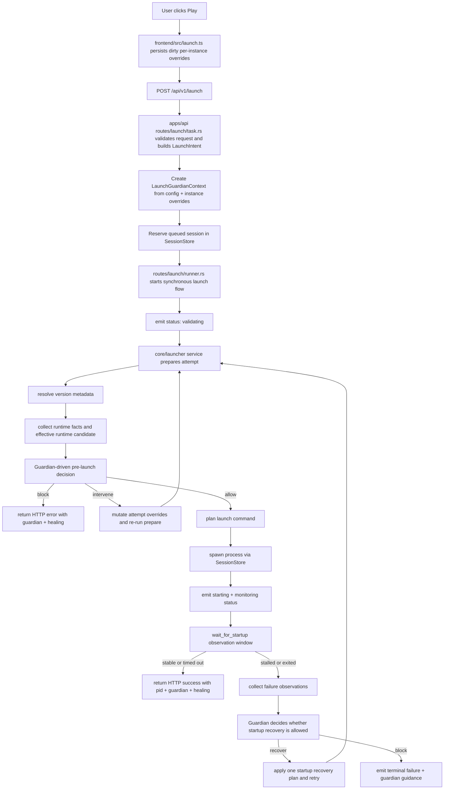
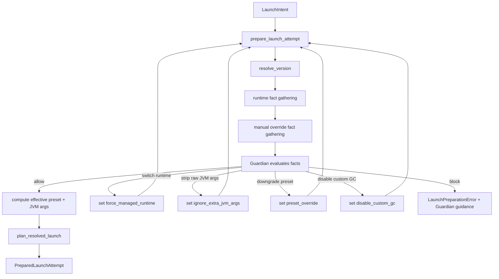
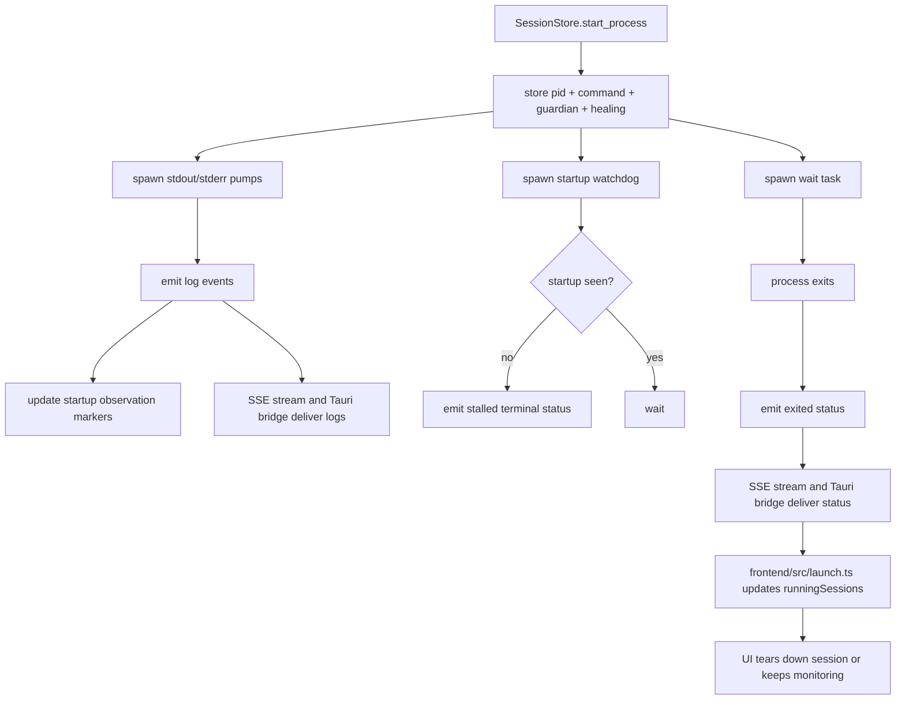
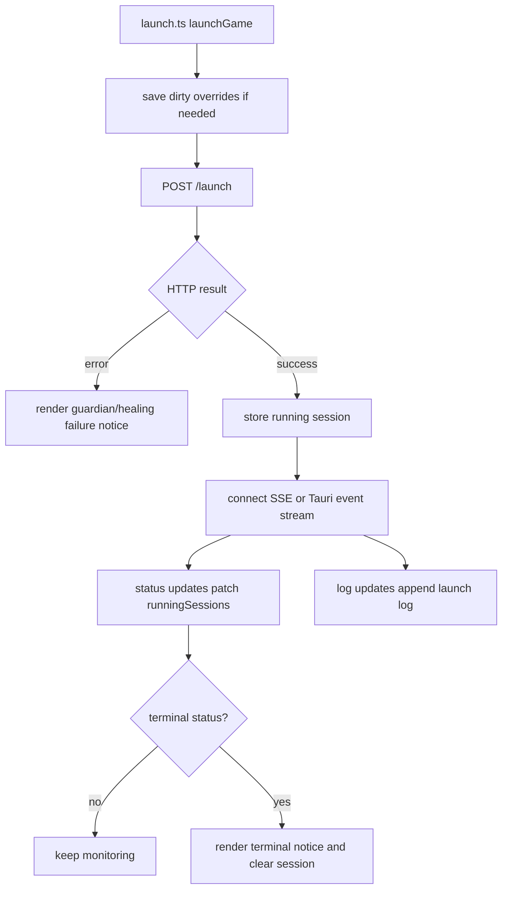
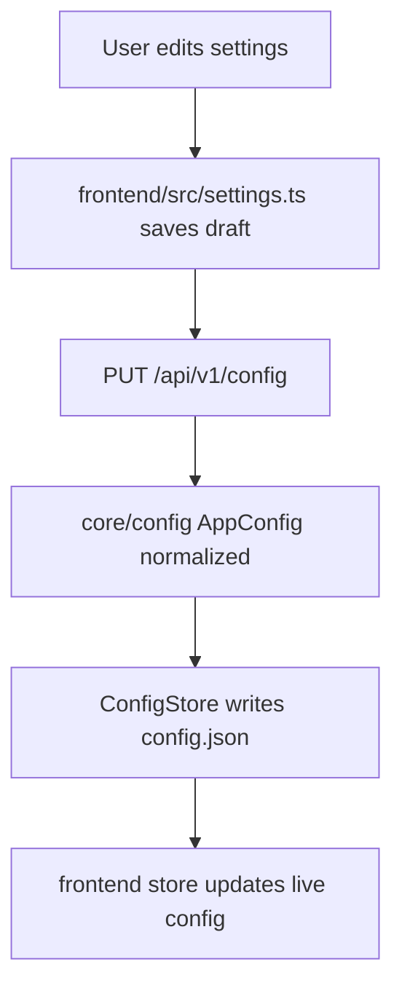
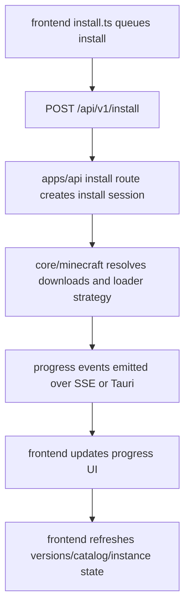
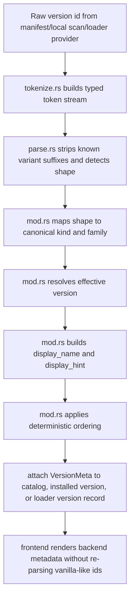

# Architecture
This is the current map of the launcher. Keep it accurate. If the architecture changes, update this file in the same change.

## Topology
- `frontend/`: Preact UI, state, launch/install workflows, browser + desktop runtime integration
- `apps/api`: local Axum HTTP surface and SSE endpoints under `/api/v1/*`
- `apps/desktop`: Tauri shell and native event bridge
- `core/config`: config model, normalization, persistence, path detection
- `core/launcher`: launch pipeline, Guardian, Healing, command planning, session/status mapping
- `core/minecraft`: version metadata, runtime discovery/install, download/install, loader strategies
- `core/performance`: managed performance planning/install

## Primary docs
- Docs index: `docs/README.md`
- Guardian architecture: `docs/GUARDIAN-ARCHITECTURE.md`
- Loader architecture: `docs/LOADER-ARCHITECTURE.md`
- Version metadata architecture: `docs/VERSION-METADATA-ARCHITECTURE.md`
- ADRs: `docs/adr/`

## Frontend map
- `frontend/src/main.tsx`: app bootstrap
- `frontend/src/store.ts`: runtime state
- `frontend/src/actions.ts`: state transitions
- `frontend/src/launch.ts`: launch request, status/log subscription, failure handling
- `frontend/src/install.ts`: install workflow
- `frontend/src/settings.ts`: settings draft + save flow
- `frontend/src/native.ts`: desktop event bridge
- `frontend/src/machines/`: workflow machines that should hold complex async state

## Backend map
- `apps/api/src/routes/launch/`: launch route, task assembly, streaming, runner
- `apps/api/src/state/sessions/`: live launch session store, subscriptions, process supervision
- `core/launcher/src/guardian/`: launch-safety authority and intervention model
- `core/launcher/src/service/`: launch preparation, mappings, Healing summary/recovery helpers
- `core/minecraft/src/runtime/`: runtime discovery and managed runtime installation
- `core/minecraft/src/version_meta/`: version classification, effective-version resolution, display metadata, deterministic ordering

## Full launcher pipeline

### High-level launcher lifecycle

### Launch pipeline: end-to-end

### Launch pipeline: backend detail

### Live session and event flow

### Frontend launch flow

### Config/settings flow

### Install flow

### Version metadata pipeline

## Launch authority boundaries
- Guardian is the authority for launch-safety policy.
- Healing is a capability used by Guardian, not the authority.
- Runtime/JVM/validation layers should produce facts and execution helpers, not user-policy decisions.
- Session heuristics are observations. They should not invent user-policy outcomes on their own.
- The frontend should render backend-authored Guardian outcomes, not reinterpret policy locally.

## Where to look
- launch behavior: `apps/api/src/routes/launch/`, `apps/api/src/state/sessions/`, `core/launcher/`, `core/minecraft/src/runtime/`
- config/settings: `core/config/`, `frontend/src/settings.ts`
- install flow: `apps/api/src/routes/install.rs`, `core/minecraft/`, `frontend/src/install.ts`
- version analysis: `core/minecraft/src/version_meta/`, `apps/api/src/routes/catalog.rs`, `apps/api/src/routes/versions.rs`, `core/minecraft/src/loaders/index/query.rs`
- desktop bridge: `apps/desktop/`, `frontend/src/native.ts`

## Current architectural pressure points
- Guardian authority is still being tightened across runtime, Healing, session heuristics, and frontend rendering.
- Session startup/failure inference still depends on log heuristics.
- Update flow exists but is still not a full native updater/distribution pipeline.
