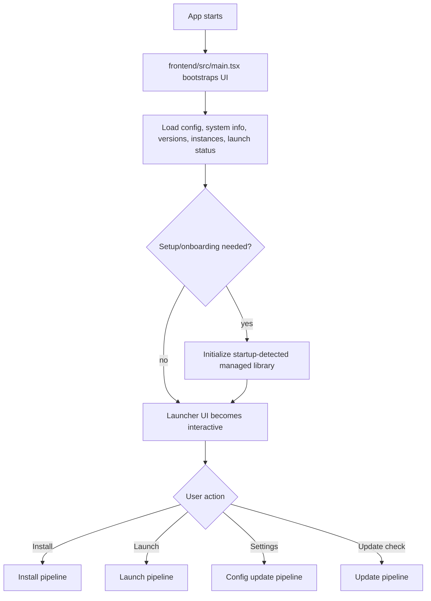
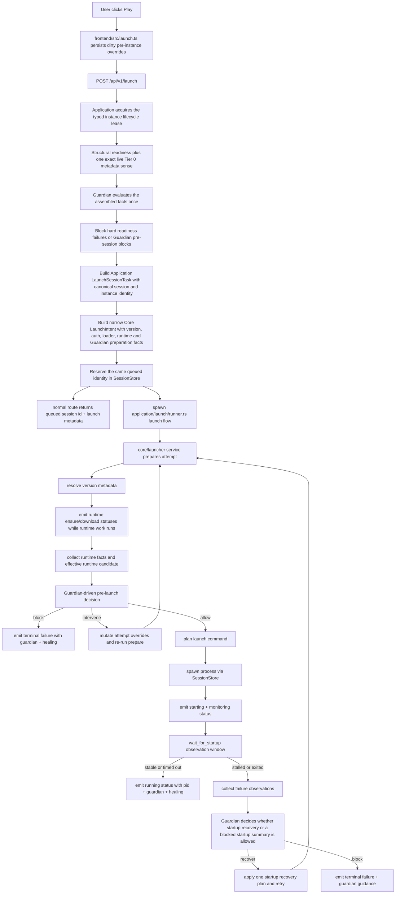
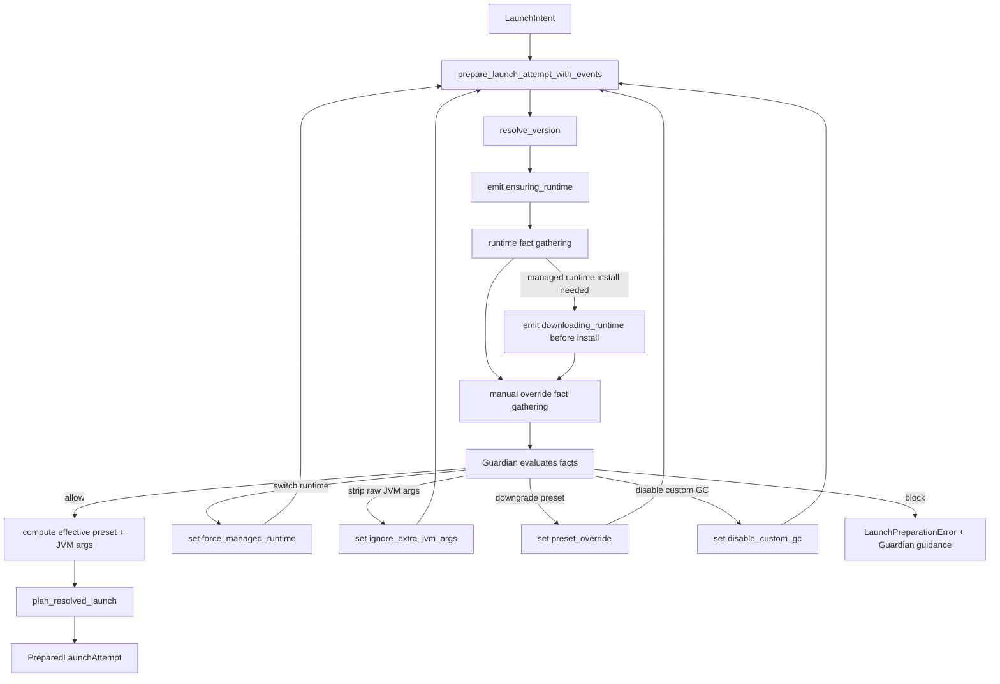
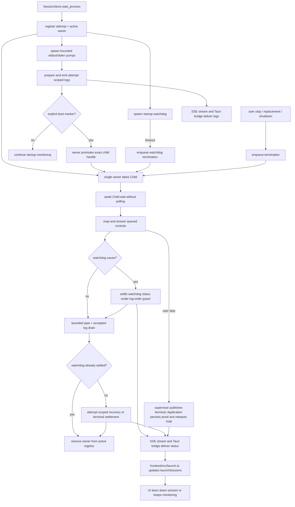
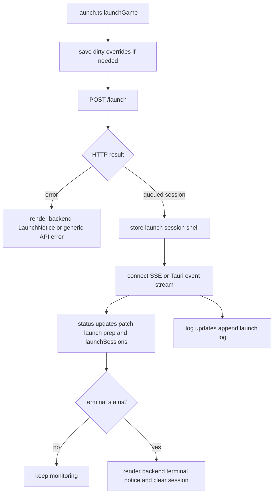
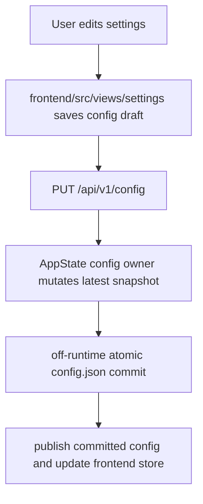
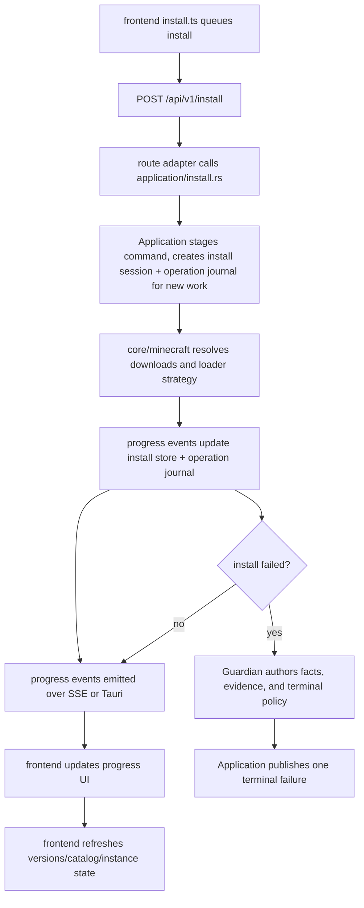
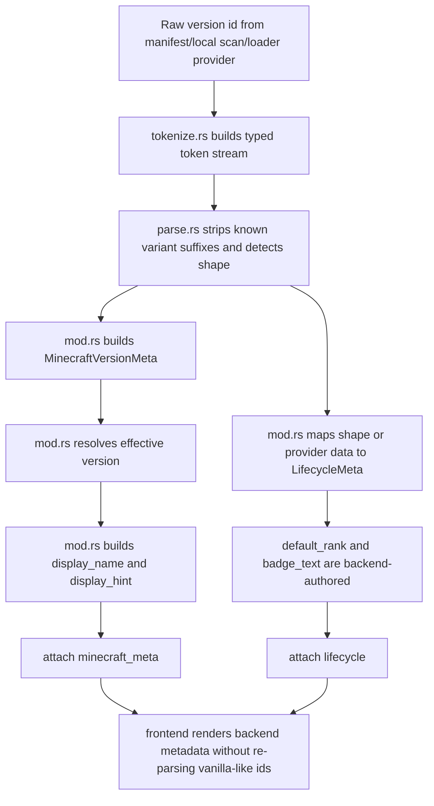
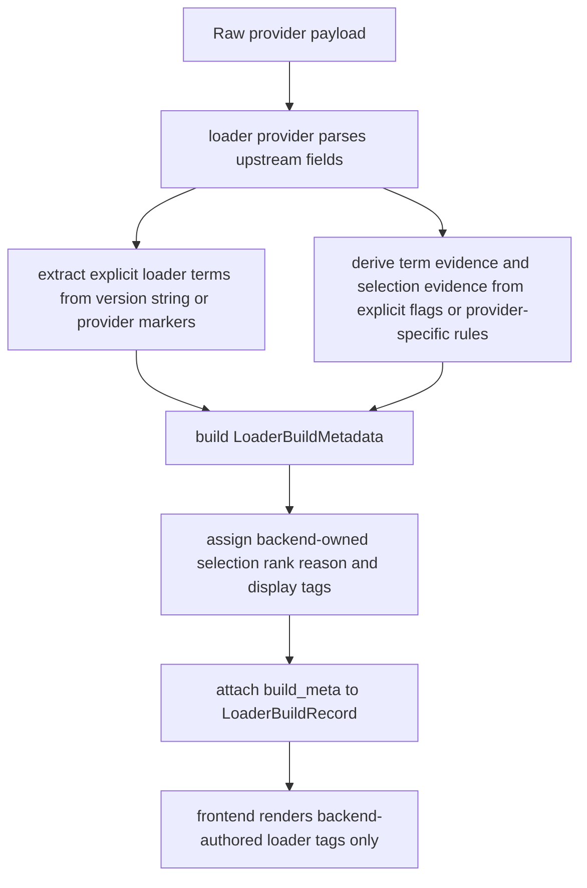

# Architecture
This is the current map of the launcher. Keep it accurate. If the architecture changes, update this file in the same change.

## Topology
- `frontend/`: Preact UI, draft/presentation state, backend-authored action rendering, browser + desktop runtime integration
- `apps/api`: local Axum HTTP surface and SSE endpoints under `/api/v1/*`
- `apps/desktop`: Tauri shell and native event bridge
- `core/config`: config model, normalization, persistence, and immutable application-path derivation
- `core/content`: provider-backed content discovery, compatibility, resolution, provenance, and transactional content installation
- `core/launcher`: launch command planning, Healing summaries, factual launch status/outcome vocabulary, and factual status snapshots
- `core/minecraft`: version metadata, runtime discovery/install, download/install, loader strategies
- `core/performance`: managed performance planning/install

## System ownership model
Axial is organized around backend-owned product decisions and frontend rendering boundaries. The source tree and technical identifiers still use the former `axial` name during the rebrand:

- Application owns workflow request/response contracts, operation identity, route orchestration, and backend-authored view models.
- Execution owns primitive effects and facts for files, JVM/runtime inspection, process launch, and process observations. Download facts remain primitive evidence, while managed network transfer and transient publication live in Core. Execution does not decide product safety policy.
- Guardian owns horizontal safety diagnosis, action selection, self-healing orchestration, failure-memory loop control, and backend-authored safety outcomes/notices. Self-healing is a Guardian subsystem.
- State owns live sessions, operation journals, install/performance operation state, failure memory, proof state, strict current-schema persistence boundaries, runtime admission/lifecycle coordination, the managed-library generation authority, and typed reconciliation attempts and terminals bound to an exact operation or registered instance incarnation.
- Observability owns evidence tiers, redaction, local proof records, and the consent-gated telemetry-safe export shape.
- Performance owns performance rules, declarative plan resolution, sealed managed-graph validation, composition health and state semantics, atomic graph publication/removal, exact rollback snapshots, and durable performance operations.
- Interface/API owns DTO and view-model boundaries that let the frontend render without reconstructing policy.
- Frontend owns draft form state, event wiring, subscriptions, and rendering backend-authored actions, notices, progress, and view models.

The frontend must not decide readiness, classify exits, infer install failure or retry policy, parse JVM args for policy, decide performance health, or choose Guardian/Healing precedence.

Launch status has one backend-authored public contract across the initial launch response, status polling, browser SSE, and Tauri events. State assigns a monotonically increasing revision to every public status transition and every successful public-field mutation, then retains the latest post-apply event. SSE and Tauri acquire one atomic snapshot-plus-event-cursor subscription that also retains the exact session generation against terminal eviction; buffered updates at or below the emitted revision are ignored. Broadcast lag atomically acquires a fresh retained snapshot plus fresh receiver and discards every pre-rebase buffered status or log, so replay cannot mix an old cursor with the new revision. Subscription release is generation-checked so an old stream cannot affect a reused session id. The Application projection supplies the same explicit-null DTO and process-state view model on every transport. The frontend validates that view model and its explicit terminal carriers before advancing the stored revision; it never mirrors or infers playing, process liveness, stop authority, or terminality from raw state names or PIDs.

## Runtime topology
- API bootstrap resolves one absolute application data root before any store is constructed. Production uses the platform local-data directory plus `dev.mateoltd.axial`: LocalAppData on Windows, XDG local data (or `~/.local/share`) on Linux, and Application Support on macOS. Development uses `dev.mateoltd.axial.dev`. Desktop selection is bound to the generated Tauri identifier; non-release builds compile the development identifier even when launched directly, and an explicit production/development environment mode must match it before path resolution. The standalone API retains environment selection and its production default. Test and portable modes inject a validated absolute root. `AppPaths` keeps that root private and derives immutable static purpose paths for config, instances, library, runtimes, accounts, skins, Guardian state, journals, known-good state, performance rules and operations, benchmark state, user-mod witnesses, and updater staging. Live managed filesystem owners receive exact purpose-scoped Directory capabilities minted by `AppRootSession`; music has no ambient path accessor. `AppRootSession` retains the startup-captured physical root, process-image proof, and process lease; terminal reset validates that proof before shutdown, asynchronously drains the sole capability authority after quiescence, clears anchored root children off the runtime, and releases the real retained lease receipt before relaunch. A failed clear retains its exact linear failure for the next same-intent reset; that retry preflight is accepted because the repeated clear itself revalidates the lease, root identity, and process image before mutation. There is no generic root getter, CWD fallback, legacy-root read, root-discovery canonicalization, or migration.
- State's managed-library owner binds a monotonically identified generation to its normalized mode/path fingerprint, process-local native physical-directory binding, and one Core root authority. Native inode/file-id text is never serialized or treated as durable authority across reuse, restore, or reboot. State serializes rotation and exposes only current-generation operations; publication blocks admission, replacement moves the prior generation into one retiring slot, and admission loss records a degraded state rather than manufacturing path authority. Core holds an exclusive physical-root lease for each `ManagedLibraryRoot`. Its cloneable `ManagedLibraryOperation` pins retirement, and managed directories, file identities, publication guards, and effect receipts that escape the immediate call retain the same pin until their work settles. A passive weak witness may re-acquire a still-current Core operation but does not keep a generation alive.
- Before runtime producers exist, startup derives the library selection from the committed config. Managed mode accepts only the immutable `AppPaths` library leaf, admits or creates it through the application-root session, and prepares the exact managed layout. Existing mode admits only an available absolute directory physically outside the application root. An unavailable existing directory starts State in a bounded degraded state with no current generation and emits a startup warning; invalid library configuration or failure to admit the application-managed directory fails startup.
- Each `AppState` owns one root-scoped music cache owner with an optional exact `music` Directory, one hardened Core transfer client, and one flight per fixed track. Status performs read-only exact inventory and revision checks and never creates the directory; its blocking capability lifetime is request-handoff producer-owned, so shutdown drains it before terminally releasing music directory authority. Track requests recheck an exact bounded capability before network work, coalesce only the same track, and start HTTP only after create-only destination admission. The producer-owned worker survives response cancellation, cancels and joins on request-drain shutdown, publishes monotonically without replacement, and reconciles each cleanup/publication obligation once off the async runtime. A still-unsettled effect falls back into root retention and permanently latches that track against further provider work; cached exact reads remain available. Production admits only GitHub and GitHub release-asset HTTPS origins, uses no retry, and caps a track at 32 MiB.
- Desktop builds use Tauri's atomically published frontend generation from `frontend/dist`; desktop dev uses Tauri `devUrl` at `http://localhost:1420` by default and `DEV_PORT` may override it. `frontend/static` owns only reviewed source assets. Successful production and watch builds publish one complete, budget-checked generation with a deterministic receipt; failed builds preserve the prior generation. Mutations hold one OS-released, portable case-folded loopback lease and contention fails closed. Standalone API builds serve only the independently verified embedded generation; desktop API builds have no frontend fallback, leaving Tauri as the sole payload owner.
- The desktop shell always starts its own Axum API on an ephemeral loopback port and exposes that address to the frontend through the `api_base_url` Tauri command.
- Native launch, vanilla-install, and loader-install event pumps use separate operation-keyed replacement coordinators, so a new bridge cancels the exact prior pump and stale owners cannot emit or retire their replacement. The frontend keeps a healthy native install bridge across a status-confirmed active silence. Native bridge startup failure closes and status-refreshes without reconnecting; unavailable silence reconciliation or invalidation of an established stream closes and reconnects it. Browser SSE retains its existing reconnect behavior.
- When desktop builds are compiled with `AXIAL_DISCORD_APPLICATION_ID`, the desktop shell also starts a custom Discord RPC worker. It speaks directly to Discord's local IPC socket or named pipe, consumes sanitized presence snapshots from the API state, and stays inactive when the build-time application id is missing or invalid.
- Browser dev runs the frontend dev server at `http://127.0.0.1:3000` and talks to the standalone API at `http://127.0.0.1:43430` unless `AXIAL_WEB_API_BASE` overrides it.
- The API only accepts browser CORS requests from local development and Tauri origins; production desktop traffic uses the bundled frontend plus the shell-provided loopback API address.

## Runtime shutdown
Every API request crosses one `AppState` lifecycle admission boundary. Shutdown rejects new requests first, while an admitted request keeps its lease until its response body finishes or is dropped. A request-specific producer handoff can transfer accepted work to a tracked producer while that exact request remains live, including during request drain; unrelated producer admission closes as soon as shutdown starts. Integrity foreground admission remains open while admitted requests drain. Instance create, duplicate, update, and delete claim their handoff, register foreground, and move the complete transaction to an Application-owned producer task before the caller waits. Managed-library setup follows the same ownership rule and keeps filesystem preparation, config publication, and cache fences inside its producer task. Rebuild, rollback, update enrichment, and response construction remain inside their transaction and reuse its foreground authority without reopening producer or foreground admission.

Guardian component rebuild consumes a State producer lease immediately after synchronous admission-shape validation. Guardian turns it into one joinable lifecycle-counted owner that retains memory reconciliation, attempt reservation, planning, mutation authority, Core preparation and publication, exact postcondition verification, and durable journal and failure-memory settlement. Caller cancellation drops only the waiter; producer drain still waits for the owner. Core performs the reconstruction directly and does not add a nested detached task.

Application-owned recursive filesystem inspection and resource mutation run on blocking workers behind one four-task process-wide admission boundary. Large copy and recursive-delete effects also hold a one-at-a-time heavy-operation permit while consuming one of those four global slots. Mutation routes acquire filesystem capacity before update, instance-lifecycle, or managed-artifact ownership; after worker start, the admission and semantic leases move into the same blocking task, so caller cancellation cannot abandon an accepted effect or make a queued effect block unrelated semantic work.

After request leases drain, the lifecycle broadcasts the shutdown signal and closes integrity foreground admission, cancelling any active sweep before effect settlement and producer drain. Shutdown then settles launch-session process owners and benchmark-suite driver effects and waits for every tracked producer lease to finish. Managed-composition admission closes and every admitted per-instance access drains. Shutdown retries each latched instance only after session settlement succeeds, and clears a latch only after exact recovery proves strict state, tracked artifact digests, rollback metadata/artifacts, and every current transaction obligation; ambiguity keeps shutdown incomplete. The instance registry cannot close until that managed-composition drain and recovery succeeds. A final pending-skin flush runs with debounce rescheduling disabled. Remaining store close follows dependency order while attempting independent chains together: driver state and launch reports precede benchmark-suite close, account state precedes secure auth, and performance rules close only after refresh producers have settled. Known-good, performance-rules, instance-registry, and config close retry exact retained bytes before releasing persistence ownership; instance close also settles pending managed-directory deletion intents. Config closes before the managed-library owner, so no retained config retry can publish another generation after library shutdown begins. The library close rejects new operations, retires its current generation, waits for every operation-derived pin, settles retained filesystem effects, and preserves an incomplete close for retry.

`AppState::shutdown()` owns this sequence for both the standalone API and desktop close/restart paths. Concurrent callers share one detached attempt, caller cancellation does not cancel it, successful steps remain complete, and a failed attempt returns a bounded step id while leaving admission closed for a later retry. The desktop also stops and joins its embedded API; it reports either API or application-state incompleteness instead of treating a partial exit as successful.

Desktop close, restart, and debug reset cross one terminal-action coordinator, so conflicting actions cannot race after shutdown begins. An accepted debug reset moves to a desktop-owned continuation: it validates the retained root, lease, process-image proof, and configured library ownership, completes embedded-API and AppState shutdown, drains the sole filesystem authority, then clears the anchored root children on a blocking worker. A preflight refusal reports to every joined caller and releases the terminal claim because no shutdown or reset effect has started; failures after quiescence remain latched to the accepted intent. Relaunch is requested through the Tauri main loop only after the real clear receipt releases the retained root session and process lease. Caller cancellation cannot abandon the accepted sequence, concurrent reset callers share its result, and a failed drain or clear returns a bounded error while retaining its exact authority for a same-intent retry. Existing libraries are admitted only when native ancestry identities prove that they are physically outside the application root, so user-owned library data is preserved. The default Microsoft system credential is also preserved because it is owned by the operating-system credential store rather than the launcher root. Explicit smoke isolation uses process-local volatile credentials and therefore has no reset-owned credential artifact. There is no HTTP reset or version-cleanup route, no browser fallback, and no live reset that can recreate closed state after clearing.

## Primary docs
- Docs index: `docs/README.md`
- Discord RPC setup: `docs/DISCORD-RPC.md`
- Guardian architecture: `docs/GUARDIAN-ARCHITECTURE.md`
- Loader architecture: `docs/LOADER-ARCHITECTURE.md`
- Version metadata architecture: `docs/VERSION-METADATA-ARCHITECTURE.md`
- ADRs: `docs/adr/`

## Frontend map
- `frontend/src/main.tsx`: app bootstrap
- `frontend/src/store.ts`: runtime state
- `frontend/src/actions.ts`: state transitions
- `frontend/src/launch.ts`: launch request submission, status/log subscription, backend notice rendering
- `frontend/src/install.ts`: install queue command submission, backend progress/status rendering, and install event subscription lifecycle
- `frontend/src/content.ts`: content discovery, compatibility, planning, install, update, and removal API commands
- `frontend/src/views/discover/`: target-aware content discovery, staging, detail, and modpack selection UI
- `frontend/src/views/settings/`: settings UI sections, config save commands, and Performance Lab rendering from backend DTOs
- `frontend/src/native.ts`: desktop event bridge
- `frontend/src/machines/`: workflow machines for UI state, not backend policy

## Backend map
- `apps/api/src/application/`: backend workflow contracts, launch session/runner orchestration, benchmark suite execution workflow, launch report/status/command/control response shaping, install operation orchestration and install/loader progress stream behavior, performance route orchestration, auth/account route orchestration, skin route orchestration, skin saved-library command orchestration, skin profile/media response orchestration, skin profile-change orchestration, skin bounded error/public-copy helpers, skin cache helpers, skin saved-state helpers, skin provider clients, and skin image normalization/rendering submodules, instance route orchestration, version/catalog route orchestration, update provider interpretation, and backend-authored workflow view models
- `apps/api/src/guardian/`: backend Guardian facts, ordered declarative diagnosis rules with phase-matched condition clauses, typed cross-family priority bands, closed per-mode action rules with typed context and ownership rejections, a kernel-owned launch-preflight disposition table, failure-memory-aware safety outcomes, managed-runtime repair execution, structured install failure evidence, install provider/network/interruption retry outcome authoring, install invalid-metadata/permission/temp-write/promotion/ownership/installer-execution blocking outcome authoring, persisted-state load warning and exact restart-record repair policy, proof/install projection copy, registered-artifact repair policy, and registered library/native leaf repair execution. Launch adapters emit facts and exact recovery-availability conditions; Guardian remains the single diagnosis, candidate-action, effective preflight-verdict, and Guardian surface-copy authority. Registered leaf repair is admitted only from the exact source-backed Tier 1 finding retained by State and the matching Managed decision target. Persisted-state repair is admitted only from State's move-only three-startup eligibility and the matching Managed decision. Neither flow accepts a caller path, provider, checksum, descriptor, authorization boolean, or suppression key. State admits every effect through exact journal-first durable intent.
- `apps/api/src/execution/`: backend Execution primitives for bounded file/JVM/launch/process/runtime effects and closed factual evidence. File capabilities include atomic launcher-managed writes, temp promotion, and launcher-managed file quarantine; the shared persistence coordinator owns exact anchored record lanes, serializes revisions, keeps accepted writes alive independently of callers, commits critical writes immediately, and coalesces ordinary progress. Execution has no generic path-based downloader: Core owns managed transfer, bounded response verification, transient staging, create-only publication, and typed cleanup obligations, while Execution retains only the download facts still emitted by live install owners. Tier 0 integrity sensing is a separate metadata-only capability: it performs bounded no-follow type, size, and link-target observations over an exact Core projection, emits redacted facts, and performs no content reads, hashes, network access, repair, or user-root traversal. On Windows, each Tier 0 leaf is opened relative to held no-follow directories with metadata-plus-execute/traverse access and read-only sharing, observed once for type and exact EOF size, and retained through root-identity and State-currency validation. A deterministic batch partitions at most 512 leaves over at most four joined OS workers; every worker performs the same one relative open and one metadata query per successful leaf, and results return in projection order. The execute/traverse bit exists only to engage read-class share enforcement; Tier 0 performs no content read or mapping call. The retained share contract excludes existing and subsequent data writers, writable mappings, deletion, and rename including POSIX replacement, stabilizing the observed type, size, and namespace through that validation window without establishing content integrity. After State currency is evaluated, the retained handles are synchronously released across at most four joined workers before sensing returns; last-write time is only a non-authoritative observation-presence counter. Tier 1 is a suspicion-gated content sensor after a preboot failure has been fused as launcher-managed artifact signature corruption, classpath/module conflict, or missing dependency. It hashes only the exact Core client/library/native projection through held no-follow handles, revalidates file and ancestor identity after reading, and emits bounded redacted facts. State may retain source-backed library/native observations as move-only exact findings; the raw report itself grants no mutation authority and cannot be reused.

Launcher-managed record persistence is rooted in one retained capability graph: `AppRootSession` supplies an exact directory, `AnchoredRecordDirectory` derives fixed portable leaves, and persistence owners claim exact record targets rather than storing reconstructable raw paths. Directory registries are keyed by platform-aware portable-name equivalence and confirm exact native identity before sharing an admission. Alias inventories are bounded and cached only for an unchanged directory revision; every rename, quarantine, deletion, displacement, and no-op write revalidates the affected generation, and post-mutation alias ambiguity latches the target. A record identity retains its directory and file capability through validation or retirement. Quarantine receipts retain both the original and parked bindings and refuse acknowledgement if a new equivalent alias appears on either side. Unknown, replaced, or ambiguous bytes are preserved.

Startup readers copy each bounded candidate's physical name and bytes, release its observation, and exact-reread only the capped records selected for live authority or cleanup. Terminal retention and resumable work have explicit independent bounds; excess nonterminal work remains on disk or is reconciled in bounded batches instead of accumulating one native handle per file. Cleanup proceeds one record at a time and retains at most one typed retirement carrier for retry. The persistence coordinator similarly keeps keyed owner lanes only while a writer, accepted ticket, worker, or unsettled effect owns them. Once accepted, work survives cancellation and dropped caller handles; flush and close retry exact bytes and effects before releasing ownership, then prune quiescent lanes for immediate reclaim. Config, instance-registry, and performance-rules startup mutation is admitted only when the fixed leaf is still exactly the accepted bytes, or is still absent when startup observed absence. Malformed, replaced, removed, or newly appeared sources fail closed. There is no raw-path fallback, migration reader, or compatibility admission.
- `apps/api/src/observability/`: evidence tiers, redaction helpers, local proof record vocabulary, and consent-gated telemetry-safe export boundary
- `apps/api/src/routes/launch/`: launch HTTP/SSE adapters for launch, benchmark, suite driver, qualification, report, status, command, and stop endpoints; launch preparation/session runner, benchmark execution workflow, benchmark suite-driver workflow/status view models, launch proof export view models, report/status/command response shaping, and stop workflow ownership live under `apps/api/src/application/launch/`; benchmark matrix, suite-run descriptors, and Family C qualification semantics/status view models live under `apps/api/src/application/performance/`
- `apps/api/src/routes/status.rs`: launcher status request adapter; status view-model shaping, startup warning exposure, Guardian persisted-state load warning adaptation, setup-required derivation, app/version labels, and library-mode fields live under `apps/api/src/application/status.rs`
- `apps/api/src/routes/content.rs`: content search/detail, compatibility, planning, install, update, removal, modpack target, and modpack file-selection adapters; provider interpretation, target resolution, setup planning, and install orchestration live under `apps/api/src/application/content/` and `apps/api/src/application/instances/setup.rs`
- `apps/api/src/routes/install.rs`: install queue/request/status/event adapter; deterministic install operation identity, backend queue state/action view models, duplicate suppression, retry placement, pending removal, one-attempt worker coordination, journal recording, progress redaction, Guardian install failure policy adaptation, and install event stream behavior live under `apps/api/src/application/install.rs`, `apps/api/src/state/installs.rs`, and `apps/api/src/application/install/stream.rs`
- `apps/api/src/routes/loaders.rs`: loader catalog query and loader-install request/event adapter; catalog lookup, loader install worker coordination, public loader install error/progress shaping, and loader event stream behavior live under `apps/api/src/application/install.rs` and `apps/api/src/application/install/stream.rs`
- `apps/api/src/routes/performance.rs`: performance status/refresh/plan/health/install/rollback/operation request adapter; performance route workflows live under `apps/api/src/application/performance.rs` and `apps/api/src/application/performance/workflow.rs`; benchmark matrix descriptors, suite-plan vocabulary, suite-run descriptor ids, and manifest run inputs live under `apps/api/src/application/performance/benchmark_matrix.rs`; Family C qualification semantics, target readiness checks, managed expected artifact checks, comparison requirements, and qualification payload/status assembly live under `apps/api/src/application/performance/qualification.rs`; plan/health response assembly, effective plan payloads, Guardian fact adaptation, performance health proof shaping, display view models, target descriptors, and installed-mod evidence live under `apps/api/src/application/performance/workflow/plan_health.rs`; managed-artifact install/remove/rollback orchestration, rollback response shaping, and bounded install errors live under `apps/api/src/application/performance/workflow/mutation.rs`; all managed state, health, evidence, rollback, and mutation access enters the State-owned runtime authority with a registered instance id rather than a caller-supplied path; durable operation identity/resume/status, backend-authored operation status view models, progress events, public operation status redaction, and operation journal step vocabulary live under `apps/api/src/application/performance/workflow/operations.rs`; queued and direct requests both hand execution to a detached durable owner, while direct requests wait for that owner's final synchronous payload when persistence remains healthy
- `apps/api/src/routes/instances.rs`: instance CRUD/resource request adapter; instance response enrichment, version scan interpretation, resource listing and mutation, log tailing, folder-opening semantics, and bounded instance/resource error shaping live under `apps/api/src/application/instances.rs`
- `apps/api/src/routes/accounts.rs`: account list/create/update/select/remove request adapter; launcher account response shaping, auth-store reconciliation, account selection/removal semantics, config sync, and bounded account errors live under `apps/api/src/application/accounts.rs`
- `apps/api/src/routes/auth.rs`: auth status/refresh/profile-sync/logout request adapter; Microsoft/Minecraft readiness, provider failure mapping, skin action state, account-store sync after refresh, and bounded auth response shaping live under `apps/api/src/application/auth.rs`
- `apps/api/src/routes/skin.rs`: skin/profile/saved-skin request adapter; saved-skin library list/upload/normalize/save-from-profile/save-from-username/update/delete/replace/file-response orchestration, request DTOs, and response DTOs live under `apps/api/src/application/skin/library.rs`, with saved-library behavior proof in `apps/api/src/application/skin/tests/saved_library.rs`; online/offline skin selection, profile lookup DTOs, profile/head/cape media responses, active profile skin/cape selection, and offline identity/head rendering live under `apps/api/src/application/skin/profile_media.rs`, with profile/media behavior proof in `apps/api/src/application/skin/tests/profile_media.rs`; saved-skin apply/upload/cape-sync/reset, pending apply scheduling/flush, account readiness for skin changes, current-profile preservation before mutation, and immediate skin-change response assembly live under `apps/api/src/application/skin/profile_change.rs`, with profile-change behavior proof in `apps/api/src/application/skin/tests/profile_change.rs`; bounded skin API error shape, provider failure mapping, status ids, and user-safe provider copy live under `apps/api/src/application/skin/errors.rs`; profile skin/cape texture cache paths, cache keys, cache-control constants, cache reads/writes, and cache validation hooks live under `apps/api/src/application/skin/cache.rs`; saved-skin validation, store access, and pending saved-skin apply queue state live under `apps/api/src/application/skin/saved.rs`; Minecraft provider lookup/download/upload/reset/cape-sync clients, provider DTO parsing, provider cache state, provider response limits, and texture URL validation helpers live under `apps/api/src/application/skin/provider.rs`; PNG normalization, cache validation, texture keys, and rendered skin-head PNGs live under `apps/api/src/application/skin/image.rs`; `apps/api/src/application/skin.rs` wires the submodules and hosts the shared skin behavior fixture/mock servers used by the split proof modules
- `apps/api/src/routes/catalog.rs`, `apps/api/src/routes/versions.rs`, `apps/api/src/routes/version_info.rs`: catalog/version request and SSE adapters; version scanning, manifest enrichment, catalog interpretation, version info, folder open, and version deletion workflows live under `apps/api/src/application/version.rs`
- `apps/api/src/routes/update.rs`: update status and update-flow request adapter; GitHub release fetch, provider payload interpretation, asset selection, update response shaping, and the short-lived check cache live under `apps/api/src/application/update.rs`; in-app update staging (checksum-sidecar verification, bounded asset download, archive extraction into `<app_data_root>/updates/`, self-replace apply, and static user-facing failure copy) lives under `apps/api/src/application/update/flow.rs`. State owns one atomic update-apply admission boundary: launch, vanilla/loader install, queued install start, queued content operations, and direct instance-mod mutations retain shared admission for their complete operation lifetime; apply succeeds only when that count is zero, closes new admission through the self-replace outcome, reopens it after failure, and leaves it closed after restart-pending. The admitted apply request transfers replacement and authority settlement to a tracked producer before waiting, so request cancellation cannot reopen admission while the blocking replacement still runs. Flow state remains owned by `apps/api/src/state/updater.rs`.
- `apps/api/src/state/journals.rs`: State-owned bounded current operation journals for staged Application operations and Guardian/Healing repair evidence, persisted as strict launcher-managed snapshots under `<app_data_root>/state/operation-journals.json`; critical transitions remain hidden until their exact revision is physically committed, while ordinary progress may be accepted and coalesced before flush
- `apps/api/src/state/failure_memory.rs`: State-owned Guardian failure-memory contracts and strict current-schema snapshot persistence under `<app_data_root>/guardian/failure-memory.json`; Guardian records/consumes entries for suppression, while State owns validation, retention, restart survival, and atomic startup reconciliation of the complete active install-Retry carrier set without capacity-order eviction
- `apps/api/src/state/managed_library.rs` and `apps/api/src/state/installed_versions.rs`: State-owned managed-library generation selection, fingerprinting, physical binding, serialized publication/rotation, current-operation admission, degraded availability, and retirement; installed-version scans are keyed by the State library generation plus the cache invalidation generation, retain the State operation in each returned lookup, coalesce one producer-owned refresh, and cap generation churn. Cached snapshots retain only passive directory/file revision facts plus a weak Core witness, so they can prove a hit against a live generation without pinning retirement. Core bounds each scan to 4,096 root entries, 64 entries per version directory, and 16,384 aggregate work units.
- `apps/api/src/state/known_good.rs` and `apps/api/src/state/known_good_rebuilds.rs`: State-owned known-good authority has two deliberately separate forms. A final Core receipt can only be consumed into a move-only `KnownGoodActivationSource`; State immediately consumes that source behind a private boundary, then may share its inventory only across the frozen, registry-bounded set of currently matching instance incarnations. Each activation candidate freezes and independently revalidates the exact canonical instance id, version id, registration timestamp, and normalized configured library root under its lifecycle gate before persistence and live activation. The registration timestamp is part of the live-only authority key, so a same-id replacement neither inherits an older inventory nor loses its new inventory to stale cleanup; it is intentionally absent from the rebuildable persistence schema. Candidate failure does not block later candidates or undo earlier valid activation. Instance identity changes, library-root changes, retirement, and shutdown remove exact live authority. State's private rebuild entrypoint derives one exact `(version id, normalized library root)` flight key under its lifecycle gate. At most 1,024 keys remain in flight and two distinct source owners reconstruct concurrently; the source permit is released as soon as Core reconstruction returns, before receipt validation, activation, or persistence. Same-key callers share only the active source attempt, completion removes the entry before waking, and neither success nor failure is cached. Exact incarnation-bound live authority may satisfy a caller under the lifecycle gate, but persisted snapshots and installed files never suppress fresh reconstruction or hydrate runtime authority. Source and receipt failures are shared only with current waiters; after an activation attempt every caller rechecks its own exact live target, and a late follower that missed the frozen fanout may claim one fresh follow-up flight with its retained source closure. The strict v4 snapshot under `<app_data_root>/state/known-good/<instance-id>.json` is only rebuildable evidence: missing, malformed, stale, v3, and incomplete-integrity bytes are unsupported and replaced silently from a fresh exact receipt through the atomic persistence coordinator, with no compatibility reader. Every regular-file entry requires a numeric size. Application startup must claim the exclusive persistence owner; there is no volatile store. A live inventory activates only after persistence is reconciled and any required exact snapshot revision is admitted, exact failed revisions remain retryable, and startup never hydrates live authority from disk. Every vanilla and loader install retains the exact State `LibraryOperation` from admission through Core persistence and progress/final-result fanout. Before captured terminal success can be published, State validates that operation before known-good reconciliation, each candidate validates its generation and root before persistence and again after live activation, and final validation of the exact State managed-library generation deactivates only candidates activated by that stale attempt, using the frozen incarnation tuple plus pointer-exact inventory identity without re-observing a missing or replaced filesystem root. A direct catalog install with no registered target still materializes the global version, while root drift, persistence admission failure, or missing live activation becomes a bounded install failure. Instance deletion reserves non-destructive exact Known-good and Performance retirements, then commits them only after the registry proves the instance absent. Registry failure with the instance still present drops both reservations, reopening Performance admission and leaving live and persisted Known-good authority untouched. Once absence commits, live authority is removed; snapshot-writer settlement or exact snapshot deletion failure retains one bounded cleanup obligation for close, while restart rediscovers an absent instance's canonical snapshot and retries it without hydrating runtime authority. `apps/api/src/application/known_good.rs` wires reconstruction without exposing receipts: API and desktop startup snapshot the bounded registry, group matching version ids onto one shared State flight, and run at most two source groups concurrently as best-effort work. Ready create and duplicate operations rebuild after the registry effect and before returning success; queued create performs no rebuild, and any rebuild failure compensates only the newly created instance. Application retains each accepted transaction's producer and same-State foreground across the registry effect, rebuild, or targeted rollback, while each effect acquires its exact instance lifecycle locally. Caller cancellation cannot abandon the transaction, and queued create transfers retained foreground directly into install reservation and terminal ownership without opening an idle epoch. Responses use static bounded error copy. For launch sensing, State alone mints an owned, non-clone `KnownGoodVerificationLease` that privately retains the held typed instance lifecycle gate; it binds the exact canonical id, version id, registration timestamp, normalized expected launch root, and pointer-current live inventory, and State revalidates all five after sensing before observations can escape.
- `apps/api/src/state/installs.rs`: live install sessions, install progress subscriptions, active install counts, and the in-memory backend install queue snapshot used for queue duplicate suppression, retry front-placement, pending removal, active queued install tracking, and queue view-model state. Application serializes every production reserve/start attempt through one State-owned gate. Direct request starts register their own integrity foreground. A create continuation transfers a retained existing foreground directly into install reservation and terminal ownership, so the handoff opens no idle epoch. An active queue entry is committed only after its install worker and monitor ownership are established, so caller cancellation cannot leave an ownerless reservation or stranded successor.
- `apps/api/src/state/performance_operations.rs`: strict current-schema per-operation Performance status, durable journal identity, fail-safe resume/reconciliation, bounded load diagnostics, an absolute 32-record recent terminal horizon with nonterminal and retry obligations protected, and public operation redaction
- `apps/api/src/state/performance_managed.rs` and `apps/api/src/state/performance_rules.rs`: the sole runtime authority for managed composition state; they bind canonical registered instance ids to registry-derived instance storage, serialize coherent per-instance inspection, mutation, and exact recovery, retain accepted work beyond caller cancellation, keep ambiguous effects latched, and recover/drain only after session settlement before instance-registry shutdown. Every managed install records the exact prior managed state before its first artifact effect. A first install records a strict current-schema `managed_state_absent` rollback target rather than a synthetic empty composition; that snapshot survives restart and remains listable and selectable. Restoring it verifies and removes only artifacts owned by the current composition and its identity-bound pending additions, removes the managed lock, and leaves unknown or user-owned files untouched. Rollback list DTOs expose the absence target explicitly, while a successful rollback result reports inactive managed state with no fabricated composition id or tier. Previous rollback snapshot schemas are unsupported and are not compatibility-parsed.
- `apps/api/src/state/sessions/`: live launch session store, exact process-attempt supervision, monotonic revisioned status retention, unretained internal observers, generation-bound public snapshot-plus-cursor subscriptions, terminal eviction holds, and internal process-settlement handoff to Application
- `apps/api/src/state/presence.rs`: privacy-bounded launcher presence snapshots for desktop Discord RPC
- `apps/desktop/src/discord_presence/`: crate-free Discord local IPC client, reconnect loop, and activity update worker
- `core/launcher/src/guardian/`: factual Guardian mode, override-origin context, and resource constants only; Guardian summary/decision/intervention transport and copy live in `apps/api/src/guardian/`
- `core/launcher/src/service/`: launch preparation, mappings, Healing summary/recovery helpers
- `core/content/`: one direct Modrinth-backed `ContentService` with provider-neutral content and target models, compatibility and dependency resolution, modpack interpretation, strict v3 SHA-512-plus-size provenance manifests, and transactional instance-local content mutation. Schema v3 encodes pathless provenance with an absent typed filename rather than an empty-string sentinel; schemas v1 and v2 are rejected without a compatibility reader. Manifest state is private, provider fields enter through checked constructors, pack entries remain typed pending records until authenticated positive sizes exist, and batch transitions validate atomically; transient upstream SHA-1 never becomes manifest ownership
- `core/minecraft/src/portable_path.rs`: the single cross-platform filename and relative-path admission owner. It stores NFC spelling, derives collision keys with full default non-Turkic Unicode case folding followed by NFC, enforces UTF-8 and UTF-16 bounds plus Windows device/character rules, and exposes the narrow managed-content reservation policy. Raw filesystem, archive, manifest, and API spellings must either match the admitted NFC spelling exactly or be replaced immediately by the typed normalized value before I/O.
- `core/minecraft/src/runtime/`: runtime discovery and managed runtime installation. State injects the single `AppPaths` `runtimes/` child when it constructs Core's process runtime cache. There are no independently discovered, library-local, nested Mojang, Microsoft Store, or configured compatibility roots. Production acquisition accepts only HTTPS source and redirect URLs, bounds catalog and component-manifest bodies, and verifies the catalog-declared component-manifest size/SHA-1 before parsing it. One typed runtime-source carrier preserves the exact closed component and one of `unavailable`, `metadata_invalid`, `integrity_mismatch`, or `policy_rejected` through acquisition, file transfer, materialization, and downloader conversion; only `unavailable` is retryable. Private source detail never defines retry policy. Local create, read, write, rename, flush, staging, verification, and publication failures remain install failures. Streaming LZMA materialization tracks compressed-input and destination-output I/O independently so local read, write, permission, and capacity failures cannot be reported as provider failures, while decoder and authenticated-content integrity failures remain typed source failures. The resulting source receipt drives both installation and known-good derivation. Runtime staging cooperatively cancels HTTP and file lanes: the first failure cancels siblings, but every in-flight lane is drained before sidecar cleanup or lease release. File-lock contention uses cancellation-polled nonblocking acquisition with a joined owner, and decompression, link creation, filesystem completion, and tree verification are awaited to completion while their blocking workers observe the same cancellation state. Managed publication materializes one fixed sibling stage, proves its exact manifest, marker, file, link, and tree shape under the component and filesystem locks, then rename-displaces the canonical tree before promotion. Ordinary install and refresh finalize the displaced quarantine under those same locks after the exact canonical postcondition; Guardian rebuild retains it as a sealed rollback obligation. Interrupted staging and quarantine remain bounded to fixed sidecars and later publication rotates them instead of creating per-attempt trees. Ordinary discovery and launch admission are structural: canonical manifest proof, ready marker, and the platform Java executable must be present with the required shape, and an admitted ready runtime is reused without provider I/O. Source acquisition and full manifest-content hashing are reserved for missing-runtime installation, install reuse, and explicit repair verification, not the launch hot path.
- `core/minecraft/src/download/`: Minecraft version, library, asset, log-config, and launcher-managed cache acquisition/install primitives. Vanilla installation starts from a fresh fixed Mojang manifest and authenticates bounded version JSON and asset-index response bytes against selected metadata before parsing or filesystem effects. The authenticated version, client, log-config, asset-index, library, and asset-object bytes remain move-only retained sources through planning and known-good derivation instead of being reread from writable destinations. Client and log-config declarations require strict positive sizes; asset objects require explicit authenticated sizes and may be exactly zero bytes. A shared exact-cache capability reuses a Libraries or Assets row only after a guarded full SHA-1 observation with the expected size; same-size corruption is not a hit. One aggregate retained component-source spool owns monotonic capacity, append rollback, bounded replay, and corruption poisoning, while bounded acquisition permits prevent in-flight asset-object bodies from bypassing the memory budget. Library acquisition separately validates and rewinds non-empty JAR content before generic admission. Each move-only component source binds its safe relative path, closed kind, observed size, and SHA-1. Client/log limits plus library and asset pools/cache admission complete before concurrent work starts. One coordinator checks ready client/log completions and ready library failures in deterministic precedence, then consumes ready asset/runtime terminals before buffered library success or ordinary progress; after any blocking event it checks terminal readiness again before consuming another event. The first observed failure remains primary, acquisition-only siblings are cancelled and drained, partial retained sources are released before settlement, and queued progress is suppressed after failure. Exact-cache hashing, JAR validation, and retained spooling register synchronously in a shared attempt scope; cancellation closes registration, blocking loops poll the same signal, every waiter observes the zero-worker terminal, and cloned reconstruction contexts serialize attempts before returning. A runtime owner is cancelled only before it atomically claims publication settlement; after that boundary it is awaited through its exact terminal postcondition. Sparse transaction planning drops a supplied source only when the corresponding canonical row is still exact under the publication lease and otherwise requires the retained bytes before effects. Normal installation writes no canonical Libraries, asset index, asset object, or virtual-asset copy during acquisition; one detached owner publishes Assets, then Libraries, then VersionBundle under the same root lease. Launch-time legacy virtual-asset repair remains the sole virtual-copy path. Persistent manifest and provider catalog caches retain their generic temp/promote/fact writer, but no selected install artifact uses a standalone materializer.
- `core/minecraft/src/known_good.rs`: known-good artifact inventory derivation consumes sealed Core producer inputs: authenticated vanilla metadata, sealed profile declarations, exact installer declarations bound to their complete component-source union, a checksum-validated asset index, and a checksum-validated managed-runtime component manifest. Closed artifact-kind, root, and expected-integrity types produce bounded, deterministically sorted and deduplicated safe-relative entries with no provider URLs, absolute paths, timestamps, or provider-controlled error strings. Every regular-file entry carries an exact SHA-1 and mandatory `u64` size; authenticated retained bytes, authenticated declarations, or the same full-hash observation that established the digest are the only size sources. Required client metadata, producer identity, unsafe paths, missing or invalid checksums or sizes, conflicting contracts, impossible runtime ancestor trees, and malformed or oversized inputs fail closed. Runtime entries include canonical manifest proof bytes, the ready marker, executable semantics, files, directories, and safe link targets. Fabric/Quilt receipts consume the opaque authored profile contract, require exact child/base recombination, and reuse base inventory only for inherited entries. Forge/NeoForge receipt derivation consumes one combined authenticated carrier that owns the installer source and the sealed selected-plan declarations with every exact/fresh network, selected embedded, and terminal component source. It retains installer-only processor libraries in inventory without inserting them into the launch classpath and binds the exact derived child client bytes. The resulting pending authority and source union move together into one detached owner, which settles Libraries, hands the same lease to VersionBundle settlement, and seals the final receipt only after both commit. The receipt exposes no raw inventory conversion: its only public consuming transition produces an unforgeable, non-cloneable `KnownGoodActivationSource` carrying the exact version identity and inventory for State. Raw inventory derivation inputs remain Core-private. Core owns the deterministic launch-critical Tier 0 projection, capped at 512 entries and scoped to the selected runtime, and a borrowed Tier 2 projection over every exact inventory entry. Tier 2 rejects unsupported root/kind or integrity shapes and is capped at 200,000 entries, 512 MiB per file, and 16 GiB of expected content without allocating a second entry list. Physical mapping keeps version, library, and asset entries under the configured library root and runtime entries under the injected `AppPaths` runtime cache; asset objects and bulk runtime entries remain excluded from Tier 0 but are included in Tier 2.
- `core/minecraft/src/known_good_libraries.rs`: vanilla library expectation is sealed before library effects from the consumed, manifest-authenticated unmaterialized version source. Profile expectation enters the same move-only typestate only through the fresh provider proof: Fabric contributes no exact declarations, while Quilt contributes only unique required primary coordinates with a paired valid SHA-1 and positive size. Raw profile integrity is erased before planning; every other required, extra, primary, or native path is classified for a fresh bounded stream. The typestate retains exact path/kind/SHA-1/positive-size declarations, the complete selected plan, the exact rule-selection environment, and either the normalized vanilla model or the full validated stripped profile fragment. Every required coordinate must resolve one applicable primary, and every selected primary/native must expose its exact metadata authorship slot before effects. It synchronously consumes and validates the complete destination-free job vector, including provider URL, original contract, and native kind, before unordered acquisition can run. Only a one-to-one merge of streamed proofs can author every selected profile contract and produce the opaque set accepted by known-good inventory derivation. Installer typestate classifies the selected plan exactly once into exact-network, fresh-network, embedded, or terminal producers while retaining workspace-only embedded sources separately. Network completion consumes retained sources and validates their explicit origin and observed identity against the selected plan. Terminal sealing consumes selected embedded and terminal bytes into the same component carrier, excludes workspace-only and intermediate outputs, and validates the complete source union one-to-one against the sealed projection before authority can leave the typestate.
- Source reconstruction is an effect-free Core primitive exposed only through `reconstruct_known_good(version_id)`. The exact `loader-v2-` namespace is reserved for strict loader identity decoding with no vanilla fallback; all other ids enter vanilla validation. Its closed public error identifies only the reconstruction class, while the former split producer methods remain Core-private. Vanilla reconstruction consumes the fresh fixed Mojang manifest and its authenticated unmaterialized version source, then authenticates the asset index, managed-runtime component manifest, and incomplete libraries without preparing destinations. Profile reconstruction derives the provider contract internally and obtains fresh fixed Fabric or Quilt proof and profile sources plus fresh vanilla reconstruction authority. The exact profile declaration typestate classifies every selected library before acquisition: complete proof-bearing declarations remain exact, while only incomplete required, extra, primary, or native declarations are streamed sequentially through bounded anonymous delete-on-close scratch so each retained source and budget permit is released before the next. It never prepares a library destination.
- Earliest Forge reconstruction obtains the fresh fixed client or universal archive with its strict SHA-1 sidecar and a fresh authenticated base-client source, then derives the overlay in bounded memory. Installer-era Forge and NeoForge authenticate a fresh fixed installer plus sidecar and bind the typed installer plan. No-work processors and plans with exact terminal SHA-1 and positive size reconstruct declaratively. Plans with authenticated terminal SHA-1 but missing size execute under one cancellation-owned ephemeral owner that streams the required proof/input union, materializes a fresh source-authenticated runtime, contains and reaps the processor tree, observes terminal bytes, rescans, and tears down before sealing. Processors without authenticated terminal outputs remain unsupported. All loader reconstruction paths use the same private inventory derivation as install, so identical authenticated inputs produce identical inventories, but emit a distinct move-only `KnownGoodReconstructionReceipt`; an install receipt still requires completed destination effects. Reconstruction takes no catalog or cache authority, caller build record, installed file, persisted known-good evidence, or repair input, and writes no durable version, client, library, asset, log, runtime, profile, marker, work, catalog-cache, or State destination.
- `core/minecraft/src/version_meta/`: Minecraft version interpretation, lifecycle classification, effective-version resolution, display metadata, deterministic ordering
- `core/minecraft/src/lifecycle.rs`: launcher-owned lifecycle model for Minecraft versions
- `core/minecraft/src/loaders/types.rs`: loader build metadata contract, explicit upstream terms, evidence, backend display tags, and default-selection policy

- core/minecraft loader managed-filesystem and workspace cleanup modules: loader installation filesystem capabilities use no-follow directory capabilities for canonical relative reads, bounded streaming imports, and exact writes. Unix traversal is descriptor-relative; Windows path opens are guarded by held parent handles that deny namespace deletion plus identity revalidation. Processor execution owns a fresh anonymous temporary root with fixed stage, runtime, library, version, processor-data, home, and temp children plus an optional installer file; no reusable managed work root remains. The owner enforces one 4096-entry, depth-16, 128 MiB-per-file, 512 MiB aggregate budget across stage and runtime. Runtime manifests are preflighted for exact raw and compressed proofs before file requests and materialized sequentially. A 100 ms no-follow size/shape watcher terminates the contained process tree on overflow, while exact before/after snapshots hash and authorize only declared stage changes. Unix uses a dedicated process group; Windows assigns a suspended child to a kill-on-close Job Object before resuming it. Every exit path terminates descendants, reaps the leader, proves containment empty, drains bounded pipes, and only then tears down scratch; an unproven reap quarantines rather than racing deletion. Installation seals observed outputs into retained publication sources, while reconstruction seals them without publication. This is not a network or filesystem sandbox, but its temporary filesystem and complete process-tree lifecycle are owned and bounded.
- World backup uses `ManagedTreeDirectory` capabilities from the admitted instance root through `saves/<world>` and `backups/worlds`; the copy implementation never reconstructs those capabilities as ambient paths. Public world and backup names use the portable filename authority, while internal world entries remain opaque `OsString` components and are traversed only through no-follow child handles. One operation is bounded to depth 64, 100,000 entries, and 50 GiB; links and special files are refused. Files are copied and synced, directories are synced bottom-up, and one immediate source/target identity, shape, timestamp, size, and SHA-256 proof precedes an atomic no-replace directory promotion. Cleanup is receipt-bound and never deletes an entry it cannot still prove it owns; outcomes distinguish refusal before movement, retained cleanup, and indeterminate post-move settlement. Unix uses descriptor-relative operations, macOS fails closed if exclusive rename is unavailable, and Windows uses root-relative NT opens plus exact-handle rename; Windows cannot provide a documented directory flush, so durability is limited to flushed files and revalidated namespace settlement.

## Instance Isolation

Instances are direct Minecraft game directories under `<app_data_root>/instances/<instance-id>/`. Launch requests are instance-scoped: the API resolves the instance, uses that directory for Minecraft's `--gameDir` and process working directory, and resolves shared immutable launcher material such as `assets/`, `libraries/`, and `versions/` from the startup-detected managed library directory. Managed runtimes come only from Core's canonical global runtime cache. The current Rust model does not create symlinks or junctions inside instance directories.

The mutable game-state boundary is instance-local. Explicit instance creation and duplication prepare user-visible folders such as `mods/`, `saves/`, `resourcepacks/`, `shaderpacks/`, `config/`, `screenshots/`, and `logs/` under the instance directory. Launch preparation only validates that the exact registered instance root is a real directory; it does not create missing user-owned paths, restore deleted user files, or mutate unknown nested content. The folder-opening API accepts an omitted `sub` query to open the instance root, or one of those explicit subfolder names; any other `sub` value returns a bounded JSON `400` instead of falling back to the root. Resource listing APIs scan fixed instance-local subdirectories and never accept caller-provided paths. Direct log tailing accepts only a single safe filename and rejects traversal, hidden, separator-containing, and control-character names.

Instance list/detail responses are readiness-verified at the Application boundary. `/api/v1/instances` and create both read the State-owned immutable installed-version snapshot and use the same metadata-only summary readiness to author `launch_action` or install intent. Launch and standalone preflight instead hold the same typed instance lifecycle lease, run structural version/incomplete-install readiness, and perform exactly one live Tier 0 metadata sense before one Guardian preflight evaluation. State mints the owned, non-clone verification lease only for the exact current instance id, version id, registration timestamp, normalized captured launch root, and pointer-current live inventory. Persisted snapshots and installed files never mint or substitute for that authority, and a final currency check discards observations after identity, root, or inventory drift. Version routes and watches, instance/create views, POST create, presence, launch preflight and repair re-preflight, and Performance health and target staging share the current-library snapshot; refresh scans are lifecycle-owned and singleflight. POST create threads one snapshot through selection, stale-catalog policy, summary readiness, queueing, and final enrichment. Launch rejects a snapshot whose captured library root differs from its preflight root. Missing or size-drifted launch-critical managed files become backend-authored readiness and Guardian facts; same-size content drift is intentionally outside Tier 0 and remains deferred to suspicion-triggered verification.

Instance chrome does not serve screenshot or world imagery. The frontend renders deterministic `art_seed`-derived identity tiles with loader-specific SVG masks and plain themed banner surfaces. Screenshots remain available only through the instance Screenshots tab file endpoint, which is scoped to the fixed `screenshots/` subdirectory and validates screenshot filenames before streaming.

## Full launcher pipeline

### High-level launcher lifecycle

### Launch pipeline: end-to-end

### Launch pipeline: backend detail

Effective launch memory selection is backend-owned at launch request time. Per-instance memory values remain the highest-precedence explicit selection, explicit launch request memory remains next, and customized global config memory remains the global default. Fresh instances whose global config still has the built-in memory pair use launch-time host total RAM and the current version target to derive defaults before the Guardian/resource-budget snapshot is recorded: legacy vanilla targets use a smaller allocation, modern vanilla targets use the standard allocation, and loader/modded targets use a larger allocation, all bounded by the launcher OS-headroom policy when host memory evidence is available. Normal launch preparation requires a canonical registered instance identity and an existing non-symlink game root, then rejects blocking structural or Tier 0 readiness before inserting a session and returns bounded readiness reasons without paths. It never repairs the instance layout. Structural readiness resolves effective version metadata under shared VersionBundle publication admission and never walks install markers; Tier 0 observes the exact launch-critical client, library, native, asset-index, log-config, ready-marker, manifest-proof, and selected-runtime executable entries from live authority. The projection is capped at 512 before I/O, facts are capped and redacted, and authority failure, projection overflow, permission denial, or confinement revalidation failure closes admission. Asset objects and bulk runtime contents are not walked, and no launch-preflight or healthy-launch content hash is performed. Missing managed runtime structure remains recoverable so the normal runner can ensure/download it, while an explicit Custom Java override is checked separately and the unused preferred managed runtime is excluded from its Tier 0 projection. Full manifest/file checksum verification remains an explicit install or repair postcondition. If Guardian attempts a pre-session managed-runtime repair and that repair is blocked, failed, or suppressed by failure memory, the launch is stopped before session creation with a Guardian-authored `422` response. Normal launch responses return as soon as a queued session exists and include the session id, `state: "queued"`, `pid: null`, launch timestamp, Guardian summary, and the effective `max_memory_mb` and `min_memory_mb` selected by backend preparation. The frontend subscribes before runtime preparation starts and retains only the backend view model and revision for live session behavior; it does not keep a second allocation-policy mirror. Benchmark launch routes still await the runner and return the normal post-spawn success payload plus benchmark metadata.

When a process fails before a boot marker, Core Launcher first fuses the terminal evidence into the closed failure-class vocabulary. Only `launcher_managed_artifact_signature`, `classpath_module_conflict`, and `missing_dependency` trigger Tier 1 integrity sensing. Application retains the exact typed instance lifecycle lease while Execution moves the bounded hashing work to a blocking worker, so caller cancellation cannot detach the work from its live incarnation-bound authority; State revalidates that authority before any result escapes. Core supplies an exact client, library, and native projection capped at 512 entries, 512 MiB per file, and 2 GiB in aggregate. Execution reads each selected regular file through held no-follow handles, bounds every read by the expected size, and revalidates the final file plus the held ancestor chain after hashing. It returns capped redacted facts such as a content mismatch, size drift, absence, permission denial, or primitive refusal. For source-backed library/native observations, State also seals the exact incarnation, inventory ordinal, roots, expected contract, and physical observation into move-only findings that retain the live authority. Those facts join the already-assembled startup facts before Guardian's sole startup-failure evaluation; only a matching Managed decision target may consume a finding into exact registered repair admission. Tier 1 is not cached or reused across attempts and never runs during preflight or a healthy launch.

User-owned active-mod drift is a separate pathless witness, not Tier 0 or repair authority. After an existing successful-startup terminal, a producer-owned child observes at most 1,024 direct UTF-8 `.jar` leaves under the exact registered `mods/` root. Execution uses the shared held-directory authority, rejects links, reparse points, special files, hard links, namespace drift, and byte-budget overflow, and streams SHA-256 plus SHA-512 without exposing bytes or names. A file is excluded as CompositionManaged only when its held SHA-512 matches the strict Performance state proof for that filename; a same-name user replacement remains in the user witness. State persists only a strict current-schema per-incarnation multiset of opaque name-and-content-bound digests, sizes, and modification times. On missing-dependency, mod-transformation, mod-attributed-crash, classpath/module-conflict, or loader-bootstrap preboot failure, Application compares the current observation with the last successful baseline and may add one generic condition fact before the existing Guardian evaluation. The fact changes only bounded copy, creates no diagnosis or action, and grants no mutation authority. Instance deletion removes the launcher-owned witness only after registry absence; user files are never written, snapshotted, restored, or deleted by this path.

Tier 2 is the full-instance data-plane primitive for the stable-idle scheduler. State owns one global foreground-versus-sweep epoch authority because versions, libraries, assets, and the managed-runtime cache are shared across instances. Launch/preflight, managed-library setup and root transitions, instance create/duplicate/update/delete transactions, install workers, performance operations, known-good rebuild/activation, and installed-version scans register before lifecycle or shared-root work, cancel an exact active sweep, and wait for its physical settlement. Move-only foreground leases can be explicitly retained without implementing `Clone`; Application-owned setup and instance transactions, producer-owned refresh, Java probe, runtime repair, Tier 1 hashing, successful-launch proof and metadata persistence, install terminalization, deferred launch terminalization, queued/direct/restarted performance execution, and cancellation-owned known-good source/fanout work keep the same foreground count live until their last child or blocking worker returns. A queued create transfers retained foreground directly into install reservation and terminal ownership without an idle epoch. Performance reserves its exact durable operation id before start persistence, requires the same-State foreground capability at managed-composition admission, and retains both producer and foreground authority through exact terminal journal/status publication; unresolved publication retries fail closed until terminal authority or coordinated shutdown. Known-good source singleflight moves its exact owner, producer child, and retained foreground authority out of caller ownership before reconstruction; receipt activation and every exact candidate lifecycle require the same State capability before terminal success or live authority can be published. State briefly acquires the instance lifecycle gate to mint a move-only Tier 2 ticket containing the exact incarnation, normalized library root, runtime cache, pointer-current live inventory, and a cloneable read-only authority for the exact coordinator, sweep id, epoch, and cancellation token, then releases that gate. The ticket also captures State's process-local managed-artifact mutation epoch, but only while the coordinator has no active mutation admissions. Every admitted launcher-managed filesystem or live-authority mutation advances that global epoch before its first possible effect and increments the active count until its move-only admission drops; overlapping writers therefore cannot create a false quiescent capture window. Failure or cancellation never rolls the epoch back. Ticket currency requires the captured epoch to remain exact both before sensing results can be sealed and under the later incarnation check, so a mutation to any shared managed root invalidates existing tickets even when their instance identity is unchanged. Epoch overflow is sticky and permanently makes mutation admission and Tier 2 freshness unavailable for the process. This epoch is a freshness fence only; it does not enable a scheduler result cache. Current authority requires an uncancelled idle admission; exact active authority remains valid after cancellation only until the move-only reservation settles, so later admitted effects can publish truthful terminals without reopening admission. The reservation alone owns its producer lease, cancellation capability, and settlement transition. Execution accepts a ticket and reservation only when their exact sweep capabilities match, moves the entire work unit onto one named dedicated OS thread, enters per-thread low disk-I/O priority, performs the bounded sensing, restores the exact prior priority, and returns the report together with the ticket and still-unsettled reservation. Windows uses current-thread background begin/end, Linux and Android round-trip the exact `ioprio` around the idle class, macOS round-trips the exact thread disk policy around throttled I/O, and unsupported targets use an explicit successful no-op. Priority admission failure senses nothing and refuses with bounded evidence; restore failure retries once through RAII drop, discards artifact findings, preserves honest counters, and refuses. Dropping the blocking-worker waiter cannot stop the dedicated thread; if its result can no longer be delivered, dropping the returned carrier abandons the exact reservation only after physical thread exit. During shutdown, foreground admission remains available to admitted requests until request drain completes, then closes before effect settlement and producer drain.

Sealed Tier 2 registered findings retain the captured managed-artifact epoch after the ticket is consumed. Their admission and live checks require that expected generation until an exact State-owned repair or component-rebuild admission advances the epoch and hands the retained carrier to that newly admitted generation before effects; any intervening writer still makes the evidence stale.

Managed-library root and mode publication is capability-gated before config persistence accepts new bytes. The generic config mutation surface rejects newly authored identity changes; only the setup target that retained foreground and filesystem-preparation authority may publish one. A failed physical setup write may outlive that target as a retained retry candidate, so the next mutation or close path reacquires managed-artifact admission before retrying those exact bytes. The commit observer invalidates derived caches after publication but never creates a late or duplicate epoch bump.

The instance registry applies the same retained-write rule. Under its mutation gate, it compares any retry candidate with visible instance id, version, creation identity, and pending deletion obligations; a later metadata mutation or shutdown close reacquires managed-artifact admission before publishing an identity change or settling physical deletion. Metadata-only retries do not advance the epoch. Request-facing create, duplicate, update, delete, setup, and queued-install removal paths move the complete transaction into producer-owned tasks before awaiting it, so disconnecting a caller cannot release mutation admission while filesystem or durable cleanup continues.

Execution verifies every projected file, directory, and link through the shared no-follow reader, recreates and revalidates the reader after at most 128 entries or a 64 MiB content threshold, and discards all observations if authority changes. One stream is limited to 8 MiB/s with a 64 KiB burst and 64 entries/s with a one-entry burst; cancellation is checked before every entry and content chunk and during throttle sleeps of at most 10 ms. Reports contain only bounded counters and at most 64 redacted facts. Application owns a private move-only Tier 2 transaction: it rejects noncanonical or unregistered instance ids before writing anything, durably plans one `ValidateInstance` operation before reservation, and synchronously transfers the reserved transaction into a detached producer-owned task before returning the scheduler's cancellable waiter. That owner mints the exact State ticket, starts the dedicated worker once, and seals the report, exact findings, and reservation into one opaque settlement carrier. For one source-backed selected candidate, Application asks Guardian policy once using the exact bound fact and target, chooses State's Fresh Assets admission or exact canonical Resume continuation, and awaits the separately identified leaf and component journals, failure memory, and exact postcheck before consuming the carrier. Tier 2 performs no process retry, second projection, Tier 1 pass, or second policy decision. The sole settlement discards a complete report if authority was superseded and is followed by one atomic parent terminal transition. Authoritative completion can persist bounded counter, Guardian fact-id, and diagnosis-id tokens; supersession or cancellation persists zero findings, and refusal uses the static `tier2_integrity_refused` failure class. Terminal journal persistence reconciles while the detached producer-owned transaction remains alive, after sweep settlement has reopened foreground admission. A producer-owned supervisor starts after startup known-good rebuild admission at both API and desktop surfaces and first reconciles every exact interrupted Tier 2 plan even when idle integrity is disabled or Guardian is not Managed; a non-shutdown recovery failure stops scheduling. It then admits one canonical registered instance only after the setting and normalized global Managed mode remain enabled for five uninterrupted minutes in one exact State idle epoch. Every actual config commit advances that epoch, wakes the supervisor, and cancels an active sweep; foreground activity, config events or lag, disablement, and shutdown reset pre-transaction admission without active-count polling. Selection uses a wrapping lexical cursor, advances only after terminal execution, runs at most one instance per full threshold, and makes an empty registry consume its threshold. Config or foreground invalidation after planning keeps the accepted transaction owned until its durable cancellation or terminal transition completes. Dropping the scheduler waiter, including during coordinated shutdown or before its first poll, detaches only observation of the result: the producer-owned transaction continues through reservation settlement and durable terminal publication before releasing shutdown ownership. A sweep never enumerates directories or classifies unexpected files.

Version JSON resolution is centralized in `core/minecraft/src/launch`. Launch, install, readiness, runtime repair, runtime selection, JVM validation, installed-version scanning, and known-good inventory derivation consume the resolved effective model rather than independently interpreting raw child manifests. Resolution merges inherited manifests before validation, treats missing `assetIndex` as inheritable, prefers child download artifacts when present, falls back to a parent client jar only when the child has no client artifact, and normalizes legacy `minecraftArguments` into the modern argument flow when profiles mix both formats. Library resolution applies OS rules before artifact de-duplication and resolves legacy native classifiers before skipping duplicate classpath artifacts, because Mojang manifests can list the same `group:artifact` once for classes and again for platform natives. The inventory reuses this effective model plus the same pure library planning outputs; it does not reparse installed files or infer expected integrity from them. Effective Java metadata is finalized in the same model: missing `javaVersion` on pre-1.17 releases resolves to `jre-legacy` Java 8, 1.17 resolves to Java 16, 1.18 through 1.20.4 resolves to Java 17, and 1.20.5 and newer resolves to Java 21 unless the manifest declares a more specific component or major version. Module-bootstrap Forge/NeoForge launch plans still keep the resolved game jar on the classpath.

Launch planning owns hardcoded version quirks that affect command correctness. Offline/local launches targeting exactly Minecraft `1.16.4` or `1.16.5`, including inherited loader profiles whose explicit target version is one of those ids, receive the `authlib` offline-multiplayer workaround before user JVM arguments are appended: Axial sets `minecraft.api.env=custom` and redirects the Mojang auth/account/session/services API hosts to `https://nope.invalid`. This avoids the old `authlib` 2.1.28 path that disables Multiplayer and Realms when an offline token is used. The workaround is gated by `LaunchAuthContext::is_offline()` and is never applied to authenticated Microsoft launches.

Loader install prewarm is a best-effort readiness optimization after the loader build has been installed. A prewarm failure can emit progress evidence, but it does not turn a completed loader install into a terminal install failure.

Launch preparation emits live status observations on the existing session stream. The runner starts the backend-authored preparation stream at `planning`, emits `ensuring_runtime` after version resolution and before runtime selection begins, emits `downloading_runtime` immediately before the task that owns a missing managed Java runtime install enters the install path, emits `validating` while runtime and manual override compatibility checks run, and emits `preparing` before command planning and launcher-managed launch artifact preparation. After process spawn, the runner allows a bounded startup observation window before treating no-output startup as stalled; the longer supervisor watchdog still owns final no-boot-marker termination. These are launch-stage status events, not a new frontend workflow or per-file runtime download progress channel. A concurrent launch waiting on the same runtime install lock can remain at `ensuring_runtime` until the owning install completes.

When Guardian blocks a launch before a process is available, benchmark launch and benchmark suite launch routes return HTTP `422 Unprocessable Entity` with the normal bounded launch-error JSON (`error`, optional `healing`, optional `guardian`). Normal launches have already returned the queued session response by that point, so the runner emits the same bounded Guardian/Healing failure through the session log/status stream and leaves a terminal session snapshot available through `/api/v1/launch/{id}/status`. Pre-session validation errors from the normal launch route still return their route-level HTTP errors before any session id is created; Guardian-visible readiness blocks remain `412` readiness responses with an added bounded `guardian` payload. This keeps a deliberate Guardian safety block distinct from an internal API failure, while non-Guardian launch request failures remain HTTP `500` unless a more specific route-level status applies.

Launch request responses, launch pre-session error responses, status snapshots, browser SSE status events, and desktop status events can carry an optional backend-authored `LaunchNotice` view model: `message`, optional lead `detail`, ordered `details`, and `tone`. The apps/api Guardian copy authority builds the notice from Guardian, Healing, and failed/unknown session outcomes, enforces user-visible redaction and the 180-byte message, 240-byte detail, and eight-detail bounds, and owns precedence so the frontend does not reconstruct it. Core snapshot construction is factual and leaves `notice` empty; every API snapshot consumer, including the desktop initial bridge, crosses one Application enrichment helper. Actionable Guardian messages/details own the notice; allowed/no-op Guardian summaries are diagnostic state only and do not become user notices. Healing contributes recovery/failure-class detail only when Guardian has not already authored an actionable blocked/warned/intervened notice; failed or unknown session outcomes can create terminal notices; clean or stopped outcomes do not. In particular, closing the game outside the launcher after startup is a clean `ExternalUserClosed` outcome and remains log-only unless the backend explicitly sends a notice.

The API exposes `GET /api/v1/launch/preflight/{instance_id}` as a read-only backend-authored Guardian preflight. Standalone preflight and direct launch enter the same builder under the same typed instance lifecycle lease, assemble structural readiness and exactly one metadata-only Tier 0 report, and then invoke Guardian policy once. The endpoint validates the configured library and instance existence, captures launch-preparation facts for Guardian mode, override origins, effective memory, selected-memory bounds, resource pressure, Custom-mode risky overrides, explicit executable Java override probe facts, and no-download local launch-readiness diagnostics, then lets Guardian produce the warning or blocked summary and copy. Explicit Java override probes are bounded so a hanging `java -version` attempt becomes a redacted probe-failure fact instead of a stuck preflight. A successful direct-launch preflight carries one opaque, non-serializable executable receipt into launch preparation and any repaired re-preflight; every use revalidates the exact requested alias and executable targets, and any mismatch performs a fresh bounded probe. Standalone preflight responses and Guardian managed-Java interventions discard that receipt. AppState coalesces only neutral probe failures for a few seconds under a bounded executable-snapshot and runtime-requirement key; it never caches healthy verdicts, receipts, target facts, or compatibility failures. It returns only bounded JSON facts: Guardian summary, effective memory, override origins/booleans, scalar resource pressure, additive readiness state with stable reason ids such as missing installed version metadata, publication or integrity authority still in progress, client jar, libraries, asset index, managed runtime, or explicit Java override, and Guardian facts for every current readiness class. Tier 0 maps missing and size-drifted launch-critical entries into the existing public readiness vocabulary without feeding those compatibility reasons back into Guardian; Guardian consumes the direct `artifact_missing` and `artifact_size_drift` facts. Explicit Custom Java absence, probe failure, wrong Java major, or too-old Java 8 update are user-owned runtime facts with no raw path. Guardian converts the readiness carrier to typed ready/blocked admission from `launchable` plus typed blocking severity and resolves the effective preflight verdict in its ordered decision table. Until the deferred confirmation surface exists, one boundary adapter blocks an `AskUser` verdict while retaining its confirmation copy. When Guardian selects a safe one-attempt launch intervention, the preflight outcome carries typed directives such as `UseManagedJavaForAttempt` or `StripExplicitJvmArgsForAttempt`; Application executes those directives directly instead of re-deriving the action from diagnosis ids. It never creates a launch session, starts Minecraft, installs files, ensures instance layout, writes proof state, or exposes filesystem paths, command lines, raw JVM args, account names, usernames, or tokens. The current InstanceDetail overview does not render a persistent preflight panel; it keeps launch safety user-facing through launch/install affordances and backend-authored launch outcome notices.

Effective JVM preset selection is backend-owned. With no explicit preset override, HotSpot runtimes select from the current presets using explicit target Minecraft version, loader/modded state from installed version metadata, detected Java distribution, and host CPU/RAM evidence: supported GraalVM runtimes use the GraalVM preset, Java 8 legacy targets use the specific legacy preset for 1.8.9 PvP and modded 1.12.2 heavy launches when applicable, other Java 8 legacy targets use the conservative legacy preset, modern modded launches use the performance preset, high-end modern vanilla Java 21+ launches with at least 8 logical cores and 8 GiB total RAM use the ultra-low-latency preset, and other supported modern vanilla launches use the smooth preset. OpenJ9 and other unsupported HotSpot-tuning targets receive no Axial GC flags. Launch preparation and startup recovery must not infer loader identity or base Minecraft versions from composite installed version ids.

Native library extraction is launch-planning owned in `core/launcher`. When a resolved launch includes native libraries, the planner extracts them into the Axial natives cache under the OS cache directory, writes through a process-local staging directory, marks completed directories with `.ready`, and only reuses a cached extraction when the cache key still matches the version id plus native artifact identity and current file metadata. This keeps interrupted or repaired native artifacts from being treated as ready launch input.

### Live session and event flow

`SessionStore` owns the live stage history for each launch session. Each registered process has one owner task that exclusively owns the Tokio `Child`, awaits its cancel-safe `wait()` future, and serializes termination and exact-handle priority commands through a per-process mailbox. No other task polls, waits, kills, or borrows the child. An attempt-id registry retains current and superseded owners until their output drain and attempt-scoped settlement finish, so replacement stays nonblocking. HTTP launch, vanilla-install, loader-install, and versions/watch SSE routes claim their admitted request handoff as a producer and end the stream at request-drain start; their response-held request leases therefore release before session settlement begins. Application shutdown then latches session admission, requests every live owner, and proves reap while retaining all session records. It drains the remaining Application producer ownership so an available process settlement can be claimed and every launch-failure, user-stop, or process-settlement proof owner can finish; only afterward does State reacquire the session lifecycle transition and clear the records. Ordinary status and event subscriptions are not producer ownership and never delay that final clear. Successful stop acknowledgement follows physical reap; accepted output is then drained with bounded pipe waits before final owner completion. User stop holds the global lifecycle transition through accepted stop and the sole terminal publication, then returns an exact-attempt retention lease for proof persistence outside that global boundary. This prevents proof I/O from delaying unrelated sessions while cancellation and duplicate admission still cannot retarget the stopped attempt. The startup watchdog publishes its stalled recovery status while its log-order guard is held, then releases the guard for bounded output drain.

Status transitions update the stored `LaunchSessionRecord.stages` array and every status payload can include the current stage records. Each stage record carries the backend stage id, label, start timestamp, optional end timestamp, optional duration, optional result, warnings, and fallback reason. Guardian owns the bounded `guardian_launch_safety_decision` stage-evidence projection from typed mode, effective verdict, and diagnosis count; Application composes it with separately authored Performance evidence instead of formatting Guardian stage copy. When a status payload carries Guardian data, non-allowed Guardian outcomes (`warned`, `intervened`, or `blocked`) contribute bounded unique Guardian-authored `details` to the stage warnings before Healing warnings are appended without duplicates; Healing `fallback_applied` remains the source of stage fallback reasons. Benchmark launches also attach bounded benchmark metadata to the live session record so active status can be correlated before proof persistence. Startup-failure log signals are stored as unique per-class timestamped observations rather than a last-line value. At a process exit, only fresh candidates enter the one Core Launcher fusion call with exact exit status and optional typed crash evidence; the result is independent of log order, while stale signals cannot turn a later clean close into a crash warning. Process lifecycle observations also attach redacted Execution stage evidence for process spawn, boot marker, process exit, exit code, launcher stop intent, watchdog kill, and watchdog action, so status snapshots and proof records preserve useful facts without exposing command lines or raw process output. The startup watchdog remains active until an explicit boot marker is observed; ordinary output alone is not enough to mark startup complete, and a process that never reaches a boot marker is reported as a stalled startup instead of being treated as healthy. The route snapshot at `/api/v1/launch/{id}/status`, browser SSE stream, and desktop Tauri bridge all expose the same additive `stages` data and optional benchmark metadata. `GET /api/v1/launch/{id}/command` is a local diagnostic endpoint only: it returns the launch command with credential-looking values redacted, reports whether redaction changed the command, and does not expose the raw Java path or act as an online credential channel. On Windows, the session process helper starts the game process below normal priority and promotes it back to normal priority after an explicit boot marker is observed; setup and promotion failures are logged as warnings and never fail launch status. Other platforms intentionally no-op this priority sandwich until Axial has a reliable restore design. The live session record keeps bounded priority-management evidence for later proof persistence, but status events do not expose this evidence.

A natural preboot exit or startup-watchdog settlement publishes the explicit nonterminal `recovering` state while Application owns startup recovery, closes the failed startup stage, and keeps the HTTP, SSE, and Tauri session observers attached. It carries factual failure and process evidence but no logical outcome, live PID, or automatic terminal notice. The exact recovery scope waits for that process owner to leave the active registry, requires the session to be the sole nonterminal session, and refuses unrelated active processes before shared component mutation. Application then either starts the one allowed replacement attempt in the same session and stream or authors one final `failed`/`exited` status. It releases recovery ownership before publishing a stable launch; a later exit from an accepted no-boot-marker process is therefore terminal instead of opening an orphaned recovery. Same-attempt process events cannot advance `recovering` back to a live state, and a terminalized session cannot spawn a replacement. User stops do not enter recovery and publish their sole terminal under the lifecycle transition. Natural postboot exits publish nonterminal `settling`, then Application authors the sole terminal after Guardian evidence and proof work complete.

Natural failed process exits also run one best-effort crash-artifact observation before recovery or terminal publication. The process owner uses the command's actual game-directory working directory and exact process-start/exit timestamps, scans only `crash-reports/crash-*.txt` and root `hs_err_pid*.log` modified during the current process within the shared correlation window, and bounds roots, entries, time, concurrency, bytes, lines, and public fields. Raw artifact text, stack traces, paths, JVM arguments, usernames, and address offsets remain local. Core Launcher parses only source-coherent typed evidence and fuses it with fresh stdout classes and exit status. Exact evidence can produce `out_of_memory`, `graphics_driver_crash`, `missing_dependency`, `mod_transformation_failure`, or `mod_attributed_crash`; generic driver/mod/dependency prose stays on existing fallback classes or `unknown`. Missing, saturated, unreadable, replaced, malformed, or unparseable artifacts produce no evidence and never prevent process-attempt settlement. The same optional `crash_evidence` record and fused class reach live events, `/api/v1/launch/{id}/status`, and strict launch-proof schema v3; startup and post-boot paths do not rescan or reclassify. For a postboot exit, State changes the exact session/generation/attempt settlement from available to claimed under the brief global lifecycle transition, leaves that claimed tombstone in the session, then releases the global guard before Guardian copy, failure-memory, and proof I/O. Only the exact claim may consume the tombstone and publish the first terminal; launch failure reports a claimed settlement and waits, while stop, process replacement, and a second observer are refused. The Application-owned terminal observer authors bounded class-specific Guardian copy for accepted post-boot crashes, records one instance-keyed failure-memory observation, replaces the initial `running` proof, and releases its session hold.

When launch orchestration fails after a JVM has been spawned, the session remains active and retains its admission/retention ownership until process termination is confirmed. A rejected termination request is observed by a detached exact-attempt finalizer; only that attempt may publish the launch failure after the child settles, and a replacement attempt cannot be overwritten by stale terminalization.

The desktop Discord RPC worker subscribes to `SessionStore` change notifications and also performs a bounded snapshot poll so user settings apply even when no launch status changes. Presence text is backend-authored in `apps/api/src/state/presence.rs`: idle shows only launcher-level activity, one active session shows broad Minecraft/loader/performance context, and multiple sessions collapse to an aggregate count. The desktop payload maps those snapshots to Discord activity fields: `details`, `state`, elapsed timestamps for active game sessions, large/small rich-presence assets, and a party count only for multi-session activity. Instance names, account names, world/server names, paths, commands, mod lists, tokens, UUIDs, and raw custom version identifiers are not included. Discord RPC updates use no buttons or join secrets, and connection failures remain quiet diagnostics.

Launch completion also writes a local proof record under `<app_data_root>/benchmarks/launch/` through one AppState-owned `LaunchReportStore`. AppState loads benchmark suites before proofs in one off-runtime persisted-state startup task, then proof startup performs one bounded admission pass and exposes rejected-input counts through persisted-state status; route exports, comparison derivation, and qualification thereafter read only the admitted committed memory index. Current proof files are capped at 256 KiB and the index/directory at 1,024 admitted records. Committed suite session mappings claim their exact proof IDs before a proof can exist; suite reservation rejects claim overflow before acceptance, and report cleanup holds the suite mutation gate while rechecking a prune target. Suite-claimed proofs are retained first and newest ordinary proofs fill the remaining horizon. Oldest unclaimed cleanup physically deletes the canonical launcher-managed file before removing memory, stays owned after waiter cancellation, and retains an exact retry obligation that blocks later mutation and close after failure. Mutations otherwise serialize through the store owner, commit exact canonical bytes before publication, remain owned after waiter cancellation, retry an exact failed revision before deriving a successor, and prevent a terminal proof from being downgraded by a late running revision. Shared AppState shutdown closes the report owner after producer settlement and requires both launch reports and driver state to close before benchmark suites; a retained report obligation returns the bounded launch-report shutdown step for retry. Proof failure remains independent from launch and benchmark-suite outcome settlement. Proofs include session, instance, version, launch timestamps, outcome, scenario metadata, conservative local device metadata, launch-time resource budget snapshot, pid/exit/failure data, optional typed crash evidence, optional boot-marker-derived boot duration, optional priority-management evidence, Guardian, Healing, and stage history, while avoiding full command-line, Java-path, raw crash-artifact, and raw process timestamp persistence. Priority proof evidence records bounded scalar modes only: startup mode, optional sanitized setup error, optional post-boot promotion outcome, and optional sanitized promotion error. Non-Windows launch sessions record explicit `noop` priority evidence because process priority restore is intentionally not attempted there. Proof JSON uses strict schema v3 local state: canonical filename/body identity and UTC-millisecond timestamps, typed outcome/crash-evidence coherence, scenario/evidence bounds, and self-contained comparison-baseline dimensions must match current semantics; unknown nested fields, missing structural fields, symlinks or changed file identities, oversized files, malformed values, and legacy schemas are rejected without migration or rewrite. Any startup rejection latches proof mutation closed for that process so unadmitted or hostile files cannot later be overwritten. Optional evidence remains optional only where the current writer intentionally omits unavailable data, such as crash evidence when no correlated artifact exists, boot duration, priority evidence before a process launch attempt exists, benchmark tags on normal launches, comparison data, or host measurements that the OS did not expose. The boot duration is recorded only when the backend observes an explicit game boot marker after process spawn; timeout-based running transitions do not synthesize it. The resource budget snapshot is captured before the new queued session is inserted and records scalar pressure evidence such as active launch/install counts, active launch memory allocation, requested memory, signed estimated remaining memory, headroom threshold, and memory/CPU/install pressure booleans, plus best-effort measured memory evidence for host available memory, host used memory, and launcher process memory when the host exposes those values. It also records best-effort CPU load-average evidence, launch-relevant free disk space, and a conservative disk-pressure flag without storing filesystem paths.

When a previous local proof matches the same known launch mode, version target, requested memory, device tier, and any present benchmark profile/run-type/mode dimensions, the new proof also stores an additive comparison summary, but only when both the current proof and the baseline candidate have comparable outcomes (`running`, `exited`, or `completed`). The comparison carries a strict self-contained snapshot of the baseline dimensions, timestamp, metric, and value, so a later baseline revision or ordinary retention does not invalidate the proof on restart; Family C qualification still verifies that snapshot against the exact committed suite baseline proof. Managed proofs may also compare against matching vanilla baseline proofs and prefer a matching vanilla baseline over a matching managed baseline when both exist; vanilla proofs compare only to vanilla proofs, custom proofs compare only to custom proofs, and unknown or empty modes do not compare. Failed, error, blocked, unknown, or empty outcomes are not compared and are not selected as baselines. Empty or `unknown` benchmark profile/run-type/mode values are treated as absent for normal launch comparisons; if either proof has a real value for one of those benchmark dimensions, both proofs must carry the same value. Client-controlled benchmark id/profile/run-type values cross the exportable-proof token boundary before session status or disk persistence. Benchmark id is persisted as an opaque stable run descriptor but is not required for reusable baseline matching. Proofs with boot-marker-derived `boot_duration_ms` compare only against matching proofs that also have `boot_duration_ms`; proofs without boot duration retain the total completed launch-stage duration comparison. `POST /api/v1/launch/benchmark` reuses the normal launch path, returns the normal launch response plus bounded benchmark metadata, attaches the same sanitized metadata to the active session status, and tags the resulting proof scenario with sanitized benchmark profile/run-type/mode/id fields. Benchmark mode metadata accepts the current `development`, `qualification`, and `release_validation` ids only. `GET /api/v1/launch/benchmark/matrix` exposes the backend-authored local benchmark descriptor for stable `development`, `qualification`, and `release_validation` modes, run types, benchmark profile ids, and representative target descriptors; it is descriptor-only and never exposes paths, commands, account names, or runtime arguments. `POST /api/v1/launch/benchmark/suite` expands those stable ids into a deterministic bounded suite plan and launches one selected suite run through the same benchmark launch path, returning selected and remaining run metadata, including descriptor target ids where a suite run is tied to a representative target, plus an opaque stable `suite_id` derived from a fixed mode token and hash, never instance text, for an advanced caller to drive the suite one run at a time. When `run_index` is omitted, the suite endpoint resumes the first planned run in the persisted manifest without a session id; a complete suite returns a JSON conflict instead of relaunching run 0, and an existing non-terminal suite run returns a JSON conflict instead of overlapping runs. `POST /api/v1/launch/benchmark/suite/tick` is a polling-safe driver primitive for background orchestration: it returns `active` or `complete` as HTTP 200 non-error states when no run should start, or launches exactly one next pending run through the same suite path when the suite can advance. `POST /api/v1/launch/benchmark/suite/driver` starts one durable suite driver per suite, clamps the polling interval to safe bounds, and reuses the tick decision path until stopped, complete, or failed; `GET /api/v1/launch/benchmark/suite/drivers/{id}` reports bounded driver state, `GET /api/v1/launch/benchmark/suite/drivers` lists a bounded set of recent driver states, `POST /api/v1/launch/benchmark/suite/drivers/{id}/stop` cancels future driver iterations without killing a launched game session, and `POST /api/v1/launch/benchmark/suite/drivers/{id}/resume` explicitly starts a fresh driver from a persisted terminal/interrupted record when its suite manifest still has a pending run. Driver status records persist under `<app_data_root>/benchmarks/suite-drivers/` through State-owned per-id coordinator writers: start, terminal, and restart-handoff checkpoints remain hidden until their exact revision is physically committed, ordinary progress is debounced, and retained failures are retried before later lifecycle settlement. Application detaches start-and-loop ownership before replying, records the exact run index returned by the committed suite reservation instead of a prior polling snapshot, and a single live-effect lease per suite blocks successor admission until the current loop actually exits even when stopped status has already committed. API and desktop startup parse only canonical strict current-schema driver records, reject invalid timestamps/public fields/coherence and conflicting nonterminal obligations with bounded load issues, and run one bounded automatic resume pass. Restart handoff commits the fresh scheduled successor before advancing its queued predecessor to the started checkpoint. Numeric driver ordering and those queued/started checkpoints resolve crash gaps to at most one replay candidate: a queued predecessor alone is recoverable, a started predecessor alone is consumed, and when a successor exists only that successor can replay; terminal and consumed history remain visible. The selected queued predecessor remains an exact retention obligation across ready-list drain and successor start until its STARTED or failed consumption checkpoint commits. Ordinary terminal driver history has an absolute 32-record horizon: State protects nonterminal records, exact critical retries, the selected handoff obligation, and exact canonical records from an ambiguous startup cohort, then prefers the newest committed terminal per distinct suite before filling remaining slots by global recency. Terminal cleanup starts only after the terminal checkpoint commits, settles the exact writer, deletes its canonical launcher-managed file off the async runtime while the path reservation remains held, then releases writer/path ownership and removes unchanged memory last. Typed cleanup failures retain exact retry ownership and keep flush or close from reporting success; older exact driver IDs can age out of status routes. Stopped, failed, complete, excess, and consumed records remain visible within that horizon but are not auto-resumed; malformed, noncanonical, unsafe, or ambiguous inputs are never retention-delete candidates. Suite manifests live in an AppState-owned committed State store under `<app_data_root>/benchmarks/suites/`, with one coordinator owner, one mutation gate, canonical per-suite writers, and publish-after-physical-commit visibility. Runtime suite-manifest lookup for manifest routes, drivers, and qualification uses admitted committed memory and never rescans suite files; qualification separately reads bounded local launch-proof records from its existing proof store. Each run records its profile, run type, target id when present, benchmark id, launch mapping, and state; matching suite outcomes are attempted independently of launch-proof persistence, so a proof write failure cannot strand a live reservation. The detached Application launch owner remains subscribed to the exact session after replying, commits its natural terminal status to the suite store, and releases the live reservation so the next auto selection can advance. `GET /api/v1/launch/benchmark/suites/{id}` returns that manifest with planned runs and launched session mappings. `GET /api/v1/launch/benchmark/qualification/family-c-1-12-2/{suite_id}` is a local-only evidence check for the Family C Forge 1.12.2 release-validation pair: it reads the strict current-suite manifest plus bounded local proof records, reports `ready` or `incomplete` with per-target missing reason ids for the vanilla baseline and managed Family C Forge core target, and never launches Minecraft, installs files, or exposes paths, commands, accounts, tokens, Java arguments, or runtime arguments. `GET /api/v1/launch/benchmark/qualification/family-c-1-12-2/preview` is the no-launch preview boundary for the same pair: it expands the current `release_validation` suite plan in memory, returns an `incomplete` descriptor-only qualification shape without requiring a suite id, and does not read or write suite/proof state. The API exposes recent proofs through `GET /api/v1/launch/reports` and individual proofs through `/api/v1/launch/reports/{id}` using a sanitized export shape: unbounded failure detail, priority setup errors, arbitrary provider payloads, command fragments, Java paths, JVM arguments, usernames/account ids, token-like strings, and suspicious stage/Guardian/Healing free text are dropped or redacted at the API boundary while scalar proof evidence, bounded Guardian/Healing summaries, stage timing, resource budget, scenario metadata, and comparison evidence remain available. Settings Performance renders the recent proof history with benchmark metadata, comparison text, compact resource-budget evidence, sanitized proof-copy support, and a bounded advanced benchmark-driver block with instance, suite-mode, interval, start, refresh, stop, and resume controls.

Benchmark suite launch normalizes the request and selects a committed store generation before launch preparation, then transfers the continuation to an Application-owned task before preparation starts. The owner attaches benchmark metadata to the prepared session, checks the exact displaced SessionStore record, commits the compare-and-swap suite reservation before process spawn, and either launches or terminalizes the prepared session even if the HTTP waiter is canceled. Pre-accept conflicts return bounded reason-specific responses after terminal proof and hold release. A write failure after reservation acceptance returns bounded storage copy only after terminalization, retains the session hold while exact compensation settles, then releases it; Minecraft never starts without a committed reservation.

Corrupt or unreadable strict-schema performance operation, benchmark suite manifest, and benchmark suite driver status records produce bounded State load diagnostics at startup. `/api/v1/status` adapts the aggregate diagnostics through Guardian as the path-free `persisted_state_schema_invalid` warning. Directory, enumeration, open, topology, unsafe-name, duplicate, relational-conflict, and over-budget failures remain warning-only and never mint repair eligibility. Performance-operation and suite-driver records rejected for exact local schema, identity, size, or semantic failures remain excluded from runtime resume and keep one identity-bound rejection streak. Only the same launcher-owned physical record rejected on three consecutive authoritative startups yields a move-only eligibility after the new streak snapshot commits.

One shared async Application startup barrier drains those eligibilities serially in a joinable producer-owned task before known-good rebuild, idle integrity, Performance-operation resume, benchmark-driver resume, rule refresh, or telemetry export starts. Guardian evaluates the exact Startup policy once per eligibility. Custom and Disabled both return payload-free `NoEffect`; neither allocates an operation, journal, reservation, or effect. Managed State admission revalidates the current mode and physical identity under the retained config-mutation gate, reserves one exact store/record-id/physical-identity/mode key per 24-hour window, durably commits a unique path-free operation plan, and only then invokes confined quarantine. The exact `Quarantined`, `Refused`, or `AppliedUnverified` terminal commits to the journal before identical failure memory becomes visible. Journal and memory settlement retries are bounded; an unsettled plan, terminal, or memory makes the shared barrier fail, so no background supervisor starts. Startup reconstructs missing active memory from one exact terminal without replaying the effect. A nonterminal plan can become `Quarantined` only when anchored inspection proves the canonical source absent and the operation-derived canonical quarantine destination present with the attempt's exact restart-stable physical identity. Every other nonterminal, orphan, duplicate, or conflicting shape stays ambiguous and fails closed before rejection-streak progression. The operation-journal store accepts only strict v6 and the failure-memory store accepts only strict v5; every other schema is rejected unchanged, with no migration, compatibility reader, quarantine, or cleanup path.

Guardian failure memory is persisted as launcher-managed State data under `<app_data_root>/guardian/failure-memory.json`. Runtime repair, launch startup recovery, artifact repair, persisted-state repair, and install provider retry suppression use the same State-owned memory store, so suppression windows and occurrence counts survive API/desktop restart. Registered-reconciliation suppression or pre-effect blocks remain journal-only and preserve the last attempted `Failed` or `Repaired` memory entry; a persisted-state repair instead records every exact terminal outcome after journal settlement so `Refused` and `AppliedUnverified` remain distinct restart-stable evidence. State validates the strict snapshot shape, keeps descriptors redacted and bounded, protects active durable terminals from pruning, and persists through the Execution atomic write capability; Guardian still owns whether an ordinary persisted entry suppresses, allows retry after cooldown, records only, blocks, repairs, or degrades. Each accepted terminal launch-crash class contributes one instance-keyed observation under its stable class name and occurrence count only, with no action, repair, suppression, fallback, or user-decision claim.

Operation journals are persisted as launcher-managed State data under `<app_data_root>/state/operation-journals.json`. Startup reads the file through a bounded no-follow identity and accepts only the strict current v6 snapshot. Every older or future schema and malformed current data remain fatal and untouched; there is no migration, compatibility reader, quarantine, or cleanup path. The store keeps a bounded current-state snapshot with strict schema validation, structured-id checks, redacted target descriptors, retention pruning, and one exact-path writer in the shared Execution persistence coordinator. Critical candidates become publicly committed only after their exact revision reaches disk; accepted ordinary progress may debounce, and store-owned observers finish promotion even when callers are cancelled. Application and Guardian write operation facts, diagnosis ids, outcomes, and workflow progress into the journal, but State only stores and validates the shape; it does not decide repair, retry, block, degrade, proof, privacy, or telemetry policy. Observability can compact a terminal operation journal into a redacted `OperationProofRecord` that carries command/status/outcome, target descriptors, failure point, Guardian diagnosis ids, journal counts, latest step evidence, and generated Guardian facts. Install status and install event replay can reconstruct bounded terminal progress and Guardian outcomes from a restart-loaded journal when the transient install session snapshot no longer exists; install status also includes the journal-derived proof for terminal journal-backed installs. Queued and direct Performance operations link a durable per-operation status id and immutable journal identity, so terminal status responses can attach only matching Observability-bounded proof and restart can fail closed rather than replaying an uncertain effect.

For the Performance-owned Family C qualification route, `ready` additionally requires each target proof to carry backend-authored Guardian decision evidence and resource-budget memory, CPU, install, and disk evidence; the managed target also requires local `family-c-forge-core` composition state with expected managed artifacts, composition-managed ownership, Modrinth provenance, verified SHA-512 integrity, and a compact comparison against the vanilla baseline proof from the same suite using a supported launch-duration metric with non-empty samples and positive values. Missing evidence is reported through per-target descriptor-only reason ids.

### Frontend launch flow

Before `/launch` returns a session id, the frontend uses a bounded local launch-stage placeholder sequence from the same stage vocabulary. Those placeholders are conservative estimates only; the initial request state is indeterminate until the backend provides a real progress view model. The normal route now returns immediately after the queued session is inserted, and backend status events advance each launch session's stored view model and revision from that point forward. Normal frontend launches post the instance id, username, and client start timestamp; memory warnings and effective memory selection are backend/Guardian authority. `frontend/src/launch.ts` validates and displays backend `LaunchNotice` payloads and logs their ordered details, but it does not classify failure classes, choose Guardian-versus-Healing precedence, author online-auth recovery copy, infer terminal-warning tone, or synthesize a crash warning for clean external process closure.

Instance list, get, create, duplicate, and update responses expose enriched instance DTOs for UI-bound consumers. The DTO keeps the older scalar `launchable`, `status_detail`, and `needs_install` fields, and also carries backend-authored `launch_action` with `state_id`, `label`, `tone`, `launchable`, `primary_action`, and optional `disabled_reason`. List/get/create enrichment uses summary launch readiness only: under shared VersionBundle publication admission it checks coherent version metadata, required client/index/library file presence, cheap size-obvious client/index/library corruption, and missing explicit Custom Java overrides, but it must not walk install markers, asset objects, hash client jars, hash libraries, hash asset indexes, verify managed runtime manifests, or count instance resource folders on the hot path. Launch preflight adds structural readiness and Tier 0 metadata sensing without content hashing. Install and repair flows authenticate their own effects, suspicion-gated Tier 1 hashes only launch-critical files after a qualifying failure, and the stable-idle supervisor schedules full-instance Tier 2 away from foreground work. Detailed saves/mods/resourcepack/shader counts belong to resource endpoints and views that actually need them, not the instance list route. The instance split button consumes `launch_action` for the Launch versus Install command state, while transient install queue/progress and launch-prep progress remain presentation overlays from backend operation/session streams.

The create flow is backend-authored and source-scoped. `GET /api/v1/instances/create-view` without a source returns the vanilla source only; `GET /api/v1/instances/create-view?source=<source-id>` returns rows for that one source, where `<source-id>` is `vanilla` or a loader component id such as `net.fabricmc.fabric-loader`. For staged content, `POST /api/v1/content/compatibility` ranks targets and includes the create view for its preferred target, avoiding a second source-discovery round trip and keeping loader choice backend-owned. Loader create-view rows are Minecraft-version rows, not eagerly resolved build rows: their opaque `selection_id` identifies the component plus Minecraft version, and the exact preferred loader build is fetched and validated only when `POST /api/v1/instances` submits that selection. Version-level loader selections prefer stable defaults, fall back to provider-ranked unstable builds when no stable build exists, and render beta-only targets with backend-authored row tags instead of disabling selection. Provider-unlabeled non-beta builds such as Quilt remain valid stable defaults, and exact `loader_build` selections still work for deliberate build selection. Provider failures disable only the affected source and produce one backend notice for that source, never one notice per Minecraft version and never a global frontend-authored blocker. `download_state: full` means the exact loader build is installed when exact build identity is known; lazy loader rows stay conservative and can report base availability until submit-time build resolution proves the exact target. Application revalidates vanilla selections against the backend manifest, resolves lazy loader selections through build catalogs and the loader policy layer, rejects unknown, incompatible, or stale uninstalled loader selections, owns duplicate-name suffixing, applies initial settings, normalizes JVM presets through Guardian, and queues any required install before returning the create result. The frontend may request a source, filter/search returned rows, and submit draft values, but it does not choose install intent, preferred loader builds, provider failure policy, loader catalog freshness policy, or JVM preset safety.

Deliberate loader-build selection is also backend-classified. `GET /api/v1/instances/create-view/loader-builds?source=<component-id>&minecraft_version=<id>` returns a backend-authored view: an "Automatic" option carrying the lazy `loader_version` selection id plus its explanation, and one option per provider build with label, Stable/Beta channel classification, recommended flag (the same preferred-build policy used at submit time), installed state, and disabled reasons for known-incompatible builds or stale uninstalled catalogs. The frontend renders these options verbatim and submits the chosen `selection_id`; it never parses build ids or ranks builds itself. The create view also carries an `optimize_option` view model (id, label, detail, default state) that the frontend renders as the Auto-optimize toggle; `POST /api/v1/instances` accepts the resulting `auto_optimize` flag and persists it on the instance as the opt-in for the launcher-owned instrumentation layer (plans/03.4), which current launches do not yet consume.

Instance update persists explicit Java path and raw JVM argument overrides when the user saves them, but the update response redacts those raw strings before serialization. Launch preparation reads the stored values on the backend and turns bad, empty, missing, or unsafe overrides into Guardian facts/notices without requiring the frontend to re-echo paths, command fragments, or tokens.

`instances.json` is a bounded strict current-schema registry containing the live instance records, the optional last-launched instance id, and durable launcher-managed directory deletion intents. API and desktop startup read it on a blocking worker and admit only a regular file with canonical path-safe ids, unique ids and names, bounded fields/counts, valid references, and no unknown or missing fields. Missing state starts as a mutable empty registry. Unreadable, non-regular, oversized, malformed, legacy, or semantically invalid bytes remain unchanged; startup exposes a bounded warning and latches registry mutation closed for that process instead of overwriting unadmitted state.

AppState owns the only runtime registry writer. Every update derives from the latest committed snapshot under one async gate, encodes off-runtime, physically commits through the shared atomic snapshot coordinator, and publishes memory only afterward. Production create, duplicate, update, and delete move into an Application-owned task before the caller waits; State validates their same-State foreground authority and directly awaits each registry effect without spawning another owner. Update accepts only a semantic patch that cannot replace identity, version, or registration timestamp, holds the target lifecycle through commit, and retains foreground authority through response enrichment. An exact failed revision retries before later derivation or close. Successful launch history and last-instance selection share one registry commit under the existing launch foreground and exact target lifecycle; the launch retains that foreground through Running proof, instance history, and the independent config metadata attempt. Create holds its target lifecycle while preparing the managed directory and publishing one fully initialized record. Duplicate generates its target id first, takes source and target lifecycle gates in lexical order, copies only regular non-symlink content off-runtime, and publishes once. Delete holds its target lifecycle through registry and filesystem settlement. Delete-with-files first commits absence plus a durable deletion intent, removes the canonical managed directory off-runtime, then commits intent removal; failures remain visible and retry on later mutation or close. Keep-files deletion commits registry absence without claiming the retained directory. Launch preparation through queued-session insertion, instance update, duplicate, delete, and successful-launch metadata serialize their target-scoped lifecycle and registry effects; launch and delete also repeat session-activity checks after acquiring their lifecycle, so neither can pass a stale check concurrently.

### Config/settings flow

Startup admits `config.json` only as a bounded regular-file snapshot that parses and validates as the strict current `AppConfig` schema. A missing file starts with mutable defaults. An unreadable, non-regular, oversized, malformed, or invalid snapshot instead starts with safe defaults and a bounded status warning, preserves the unadmitted bytes unchanged, and latches config mutation closed for that process so unknown state cannot be overwritten.

All runtime config changes enter one AppState-owned async mutation gate and derive only their owned fields from the latest committed snapshot. Normalization runs under that gate, encoding runs off the async runtime, and the exact snapshot is atomically persisted before memory publication and config-change notification. A library identity change additionally retains the managed-artifact mutation epoch and a prepared State library change while persistence is pending. Once physical persistence succeeds, State commits the new runtime authority under a publication barrier before publishing the visible config and notifying observers, so a newly admitted operation cannot pair that visible config with the pre-commit runtime authority. A failed persistence revision retains only the candidate and re-derives its admission on retry; a failed post-persistence rebind publishes the config with an explicit degraded library authority. Accepted work survives waiter cancellation. AppState shutdown closes the config owner only after producers settle; close cannot report success while a retained write remains incomplete.

The config schema includes disabled-by-default `telemetry_enabled` consent and `telemetry_install_id`. The config owner creates an identity only inside a committed mutation when consent is enabled and telemetry export is configured; without both gates and a committed identity, telemetry does not queue or send. Disabling consent commits removal of the identity and clears the telemetry queue. Work admitted with the exact current identity before revocation may finish, but revocation admits no new telemetry work. See `docs/TELEMETRY.md` for the public data inventory. Config also includes `discord_rpc_enabled`, enabled by default for builds that provide a Discord application id, and `discord_rpc_onboarding_seen`, which records that onboarding already offered the public Discord activity choice. On a fresh user profile where status reports no configured library, the frontend initializes the backend-managed library through `POST /api/v1/setup/init` before loading versions and instances; the legacy blocking setup overlay is not part of the current startup path.

The setup route extracts the admitted request's producer handoff. Application claims it, registers integrity foreground before any effect, and moves the whole accepted transaction into producer-owned execution before the caller waits. After exact active-sweep settlement, State derives an opaque same-State target from immutable startup `AppPaths`, validates the foreground, and acquires the config mutation gate. Setup holds the managed-artifact mutation epoch while Core prepares `versions`, `libraries`, `assets`, and `cache/loaders/catalog` capability-relative to the retained managed-library operation; it never reopens the configured path or writes launcher-profile compatibility files. When setup selects a new library identity, the prepared layout and generation enter the config publication sequence described above. When the same managed identity is already current, State prepares the layout under that current operation and validates the generation again before success. The installed-version cache and matching create-view cache are fenced after every settled setup attempt, including partial layout, join, I/O, and config-persistence failure, before the response propagates the result. Existing filesystem effects are not rolled back after a later config failure, and the retained config attempt remains retryable.

Installed-version lookups acquire a State library operation before consulting the cache and return that operation with the snapshot, keeping its configured path paired with the exact generation. A cache entry is valid only for the same State generation and cache-invalidation generation and after its passive dependency stamp revalidates the root publication binding plus recorded directory and file revisions. The stamp stores only facts and a weak Core witness, so a cached snapshot cannot delay generation retirement. Refresh work is producer-owned and coalesced; State revalidates the operation after lookup and performs at most one fresh-generation retry instead of returning a stale generation.

### Feature flags

Feature flags start in the static `FEATURE_FLAGS` registry in `core/config/src/flags.rs`. User overrides live on `AppConfig.feature_overrides` and persist through the same AppState config mutation owner as the rest of `config.json`; normalization prunes overrides whose registry entry no longer exists. `GET /api/v1/flags` and `PUT /api/v1/flags/{key}` expose Application-owned flag view models with either the user override or registry default as their source, and dev-only registry entries are omitted from release builds. The frontend keeps flag access in `frontend/src/flags.ts`: the Dev Lab loads flags lazily when opened, renders every visible flag, writes overrides through `setFlagOverride`, and gates the state inspector tab behind `dev.state-inspector`. Application startup and Settings do not fetch flags.

There is no live HTTP development reset or version-cleanup surface. Destructive reset remains unavailable until a terminal desktop-owned flow can stop and join the embedded API, complete AppState shutdown, delete only proven launcher-managed roots, and restart the process.

### Install flow

Vanilla and loader install entrypoints are wrapped in the Application `InstallVersion` command shape before the install worker starts. Public install requests identify a catalog-backed vanilla version or a canonical loader component/build pair; callers cannot provide a manifest URL or alternate version JSON. Vanilla install execution resolves the exact version entry from a fresh fetch of the fixed Mojang HTTPS manifest before any version publication effect. Persistent, stale, and process-memory catalog caches remain rebuildable UI/catalog inputs and never grant vanilla install authority. `apps/api/src/application/install.rs` derives a backend operation id from the install session id, creates an operation journal for newly inserted sessions, returns the operation id with the install id, owns one-attempt worker coordination, and records phase-change progress plus terminal success, failure, or worker interruption in the journal. `routes/install.rs` and `routes/loaders.rs` parse requests, call Application entrypoints, serialize backend-authored responses, and stream sanitized progress events. Duplicate active install requests return the existing install id and derived operation id without creating a second journal. Journaled install evidence is bounded to sanitized phase/fact records and does not store raw filesystem paths, provider payloads, tokens, usernames, command lines, or raw error text. If the process restarts after a terminal install journal is written and the transient install session snapshot is gone, install status/events can replay bounded terminal progress and Guardian outcomes from the persisted operation journal. Terminal install status also carries an Observability-bounded operation proof derived from the journal so support/debug surfaces can connect the operation id, command, status, failure point, Guardian diagnosis ids, and latest generated facts without exposing raw provider or filesystem material.

Core publishes the exact version JSON, client JAR, and optional inherited logging configuration for every normal vanilla version and loader child as one `VersionBundle`. Publication runs through a persistent transaction that can finish or roll back after interruption; a final known-good receipt is sealed only after the transaction reaches and durably settles a committed terminal. Base-version and loader-child publication are independent obligations, so a child failure does not invalidate a successfully committed base. A bounded canonical-namespace gate serializes the same loader child while allowing different children to prepare concurrently. The prepared authority and its sparse retained sources move into one cancellation-owned publisher, which acquires the root lease once and durably settles Assets, Libraries, and VersionBundle in that order before sealing install success. No broader base-version mutex or direct component writer remains. Version scanning and launch readiness use shared persistent publication admission and revalidate before accepting observations, so they cannot accept a split publication while an exclusive writer is active. Structural launch readiness no longer walks install-marker paths, and version bundles have no direct writer or install-marker compatibility path.

Vanilla selected-source acquisition returns bounded fact reports internally and produces private move-only proofs that own the exact response bytes, observed size, SHA-1, kind, and logical identity after checking the provider contract. It accepts only a precomputed redacted target and performs no filesystem work. Installation retains the version JSON, client, logging, asset index, and required asset-object proofs until their component transactions stage the exact bytes; known-good sealing consumes the same authenticated observations. Client and logging entries require strict positive sizes from authenticated version metadata, while exact asset-object declarations may be zero. Facts-only install surfaces emit redacted callbacks without changing `DownloadProgress` or exporting a destination/provider/checksum carrier that could authorize repair. Loader provider catalog/index cache writes and the persistent Minecraft version-manifest cache still use the generic temp/promote/fact capability. Loader profile JSON, legacy archives, and installer JARs remain live operation inputs rather than durable cache artifacts; version-manifest bodies are parsed before becoming persistent cache state. Existing provider resolution, progress phases, public error shapes, concurrency limits, body caps, bounded primitive retries, catalog TTLs, presentation-only stale fallback, manifest in-memory fallback, and cache-warning copy remain normal install behavior. The Application worker consumes the Core result and facts once, records bounded Guardian fact and diagnosis ids into the operation journal on failure, and emits one sanitized terminal failure. Guardian maps checksum, size, metadata, provider, network, permission, temporary-write, and promotion evidence into bounded install outcomes without parsing route error text; it does not mutate an install artifact or resume the worker. Install status, events, queue, retry, removal, and failure view models remain backend-owned; terminal operation evidence comes from the persisted journal, while the live queue is in-memory state. The frontend renders those view models and does not infer install health, duplicate behavior, retry placement, provider policy, queue labels, or action availability.

Core also exposes distinct source-only managed-component rebuild boundaries for `VersionBundle`, `Libraries`, and `Assets`. Each opens and binds the caller-authorized managed root before acquisition and reconstructs the exact final vanilla or loader known-good authority. VersionBundle reconstruction retains the exact final version JSON, client JAR, and optional inherited logging configuration through vanilla, profile, earliest-archive, declarative-installer, and runnable-processor shapes; it publishes only through the existing crash-recoverable VersionBundle transaction. Libraries and Assets retain only their selected component's sparse authenticated sources. Assets always retains the authenticated index that derived its unique object jobs and omits an object only after a guarded full-SHA cache hit; Libraries applies its corresponding exact-cache and processor-source rules. One detached owner acquires the existing root publication lease and runs the sole matching lifecycle. Libraries and Assets recheck final source/cache coverage under the held lease; VersionBundle durably settles its exact transaction classification before returning. Opaque commit or rollback receipts retain publication exclusion and expose only version, guarded-root, exact component-projection, rollback-effect, and committed postcondition validation. Reconstruction never prewrites canonical files, activates inventory, or creates an alternate install writer; normal install remains the immediate `Assets -> Libraries -> VersionBundle` consumer.

Each vanilla, content, or loader install worker invokes Core once. A failed attempt records evidence and then crosses one Application settlement path. Failure-memory-backed settlements move into producer-owned tasks, are serialized by the failure-memory store, and reread the journal under that coordination. Exactly one marker-bearing step must contain a complete canonical outcome group; partial, malformed, duplicate, or cross-step groups fail closed without policy reassessment. A persisted Retry carries its canonical UTC observation and exact five-minute deadline plus a domain-separated SHA-256 binding over those values and its exact validated failure-memory key. Replay may backfill missing memory only while that original window is active and current evidence derives the same key; it never increments an existing entry, refreshes a deadline from replay time, or recreates an expired window. A new assessment commits its terminal journal before it submits an immediate failure-memory write and waits for physical persistence. Retryable persistence failures use a bounded retry budget while the coordination guard remains held. Permanent failures and exhausted retries return a typed failure with the candidate hidden, and a later settlement must recover it before assessment. Concurrent matching provider failures therefore open one fixed cooldown window and cannot publish a second Retry while the first memory record is unresolved. Caller cancellation cannot abandon an admitted settlement between terminal and memory publication; a coordination waiter that is cancelled cannot retain the guard. The failed worker is never resumed by Guardian; a later user retry is a new queued operation governed by backend-authored retry policy. Loader strategy library downloads emit the same redacted factual evidence as vanilla library downloads, but neither path exports repair authority.

Loader installs resolve strategy data in `core/minecraft/src/loaders/strategies/`. Every direct or queued install resolves the exact selected build from a fresh live provider index; cached loader catalogs are presentation inputs only and never install authority. Production loader JSON and byte acquisition requires HTTPS for the initial and final redirect URL, bounds redirects and response bodies, and applies bounded transient retries. Profile JSON, legacy archives, and installer jars remain in memory for the operation and are never accepted from or promoted to a persistent source-artifact cache. Fabric/Quilt fetch an independent move-only live install proof and require the exact canonical profile id, parent, client main class, release type, and unique mandatory Maven coordinates. Raw profile SHA-1, SHA-256, checksum-list, and size fields are structural input only and are erased before library planning. Fabric live proofs grant no exact library contracts; Quilt grants exact reuse only to required primary coordinates carrying a live paired SHA-1 and positive size. Every other current-environment profile path is freshly streamed, including raw exact-looking extras and native classifiers, and the observed contracts are authored back into the profile before composition. Only authenticated SHA-1-plus-size contracts can use the full-hash exact-reuse branch; SHA-only, size-only, and metadata-free contracts always acquire a fresh bounded anonymous source and validate it as a usable archive before prepared publication. A consuming one-to-one sealer rejects missing, duplicate, extra, contract, rule, or shadow drift and writes the sealed SHA-1 and size into the exact top-level, artifact, or classifier locations before composing the child version. The known-good receipt consumes that sealed authority, requires exact authored profile/base composition, reuses base proofs only for inherited entries, and is minted before child version, client, or finalization effects. Readiness accepts only authored exact hashes; missing checksum metadata blocks without a State or disk-derived exception. Profile attempts to override authenticated assets, client downloads, Java, or logging fail closed. Loader-owned version, embedded Maven, and workspace mutation is rooted in held exact directory capabilities: Unix uses no-follow descriptor-relative operations; Windows holds no-delete-share directory handles and rejects reparse points. Temporary writes are verified through their open handles before relative promotion, and success revalidates the full directory identity chain. Cleanup preflights one aggregate tree budget, walks only admitted children through held handles, rejects post-plan additions, and retains empty admitted directory shells where unlinking a pathname could target a replacement. Canonical temp names identify their process owner; live-owner temps are preserved, dead-owner temps are swept within one bounded namespace, and malformed reserved names fail closed. The child client is copied only from authenticated bytes read through the admitted base-version capability and verified again at the destination. Forge/NeoForge installer parsing runs through bounded blocking extraction, and profile JSON entries, embedded Maven entries, and processor data entries have explicit decompressed-size ceilings before they can become memory buffers or capability-materialized files. Installer processor orchestration transfers the bound graph and exact source authorities to one cancellation-owned task that creates no managed work root, materializes authenticated inputs and runtime under a bounded temporary root, contains and reaps the complete process tree, observes only declared outputs, and tears the root down before returning. Only the resulting move-only observed-output carrier can enter known-good sealing; ambient processor paths cannot mint authority. Strategy installs write the backend-authored canonical `LoaderBuildRecord.version_id` as both the installed directory and version JSON id, retain the exact decoded Minecraft target in `inheritsFrom`, and set `axialMaterialized = true`; one shared validator protects scanning and materialized launch resolution. No duplicate loader identity sidecar is written. Legacy archives are structurally opened before use.

Loader provider connectivity is not a route or frontend policy concern. Core loader HTTP code classifies network failures, timeouts, HTTP status families, rate limits, oversized provider bodies, schema drift, and missing artifacts into boundary-specific structured kinds with bounded primitive retries only for transient provider/network/server failures. Loader catalog stale-cache fallback exposes a safe pre-operation failure kind in availability metadata so stale data does not silently hide provider failure. Pre-operation resolution returns before install-session and operation-journal allocation. Once a loader worker starts, Core returns one closed typed result containing either an active-install failure or an owned base-install or artifact fact payload. Application exhaustively consumes that result once and sends every lower-level payload through the facts-only Guardian evidence path without reclassification or mutation. A pre-operation source that defensively reaches worker conversion is normalized to an active `install_execution_failed` failure instead of becoming an impossible branch. Stale build catalogs cannot authorize new loader installs or create selections unless the exact selected build is already installed and can be reused without downloading. Create-view source switching uses supported-version metadata and fresh cached build metadata for build-level row tags or guards, avoiding live build-provider calls during row rendering; known build-level exceptions can render conservative non-blocking tags when build metadata is deferred. Create-view source-row cache stores static catalog facts only when the supported-version catalog is fresh enough to avoid stale-catalog gating, while installed-state-dependent stale-catalog gating is applied when rows are materialized. Create-submit and install still perform authoritative build resolution and stale-catalog validation. Application adapts active loader provider failures into Guardian evidence as part of the failed operation journal, and Guardian and State decide retry guidance, repeated-failure suppression, and public copy without parsing raw provider URLs, response bodies, network errors, filesystem paths, Java paths, JVM args, or command lines.

Loader base-version dependencies follow the same split. If a loader strategy has to install a missing base Minecraft version and that lower-level install fails, Core returns a bounded `BaseInstallFailed` error carrying redacted vanilla install facts. Application adapts those facts into the normal Guardian install evidence; when no lower-level facts exist, the dependent loader operation records `install_dependency_failed` and Guardian authors the public block outcome. Routes and frontend surfaces never infer base-install safety from raw errors.

Selected version JSON and asset-index sources have no standalone materialization path. Their exact authenticated bytes move respectively into the VersionBundle and Assets transactions, whose intent, staging, promotion, rollback, recovery, and durable settlement run under the shared root lease. Caller cancellation before publication aborts acquisition; cancellation after ownership transfer cannot abandon an admitted transaction. Foreign pathname substitutions are never removed, and verified/promotion facts appear only for effects that have actually reached their authenticated postcondition.

### Version and lifecycle pipeline

### Loader metadata pipeline

Staged-content compatibility is derived from actual published content-version records with downloadable files. A loader and Minecraft version are compatible only when the same installable published version declares both; project-level loader and game-version summary arrays are not combined independently. Explicitly pinned content versions are evaluated only against that selected version. Core Content owns one bounded dependency-graph resolver for selected content and composition-managed callers. It caps selections and unique nodes at 256, depth at 32, dependency rows at 256, total edges at 4096, pending queue work at 4352, conflicts at 256, encoded structured output at 4 MiB, and both individual artifacts and aggregate graph bytes at 512 MiB. Exact requirements discovered in one pass are sorted and replanned together; cycles terminate on canonical project identity, dependency rows are sorted before traversal, and version choice is independent of provider order through release-channel, publication-time, and version-id ranking. Provider JSON is streamed through a Content-Length precheck and a hard limit-plus-one read: ordinary metadata is capped at 4 MiB, detail records at 8 MiB, and rendered detail bodies at 4 MiB. Unknown or identityless dependencies fail decoding. Resolution rechecks the exact Minecraft and loader declarations locally and admits only one unambiguous provider file with a valid basename, an HTTPS URL, a lowercase exact SHA-512 digest, a positive bounded size, and a JAR filename for mods. The installer repeats artifact and aggregate-plan validation before staging. Limit failures carry structured Core facts while Application emits only fixed bounded public copy. `POST /api/v1/instances/setup/plan` resolves the selected draft target, pins exact selected project versions, rejects dependency and availability conflicts, and stores a five-minute backend plan under an opaque ID. `POST /api/v1/instances/setup` consumes that ID once, re-resolves and compares the plan fingerprint before mutation, creates the instance through the normal create policy, and enqueues the pinned content through the shared install queue. Content operations carry semantic ids and policy flags, never provider URLs; the worker re-resolves the plan immediately before mutation. A setup-owned operation removes the new instance if queueing, execution, or the worker itself fails. The frontend only submits selections, settings, and the plan ID. Content resolution uses the instance's persisted loader key and Minecraft target immediately rather than waiting for queued loader installation to make an installed version profile discoverable. An instance without that current identity fails closed and must be recreated before its managed content can change.

Mods, updates, removals, modpack imports, and modpack cherry-picks use the same `InstallQueueSpec::Content` lane as Minecraft and loader downloads, so Downloads has one active-operation representation and the existing SSE/desktop bridge carries progress for every content mutation. Before a queued content effect starts, Application durably commits its `ModifyInstanceContent` plan and transfers queue initialization, worker execution, queue settlement, and terminal publication to a producer-owned task. Caller cancellation cannot strand the queue between those stages. Guardian evidence and outcome facts commit before terminal progress becomes observable; journal persistence failure leaves the operation nonterminal until owned reconciliation either publishes the exact recovered terminal or durably terminalizes a late plan. Content interruption records only factual interruption state and never invents a provider or network diagnosis.

Every admitted instance-content filesystem operation starts from a move-only State-issued admission that retains the exact registered `Instance` generation, its opaque lifecycle-gate incarnation, and its `InstanceLifecycleLease`. Admission centrally rejects active launch sessions after lifecycle acquisition. The async phase performs no filesystem work; activation occurs only inside an admitted blocking-filesystem worker. State alone asks the registry store to mint an operation-scoped `ManagedTreeRoot`, `EffectOwner`, and pinned Core operation rooted at that exact instance directory. Application receives only App-owned directory wrappers whose children share the complete authority context, never a raw path or `ManagedTreeDirectory`. The final context drops every directory and operation pin before retiring the root. State retains the retirement until a per-root single-flight cleanup drains its pins and completes synchronous settlement in a small bounded blocking lane; cancellation before that worker starts releases the single-flight gate, while cancellation after start leaves the worker owning both the gate and retirement. The root pool has a hard 64-root capacity below Core's EffectOwner ceiling, so a cleanup burst fails admission with bounded backpressure instead of exhausting lower-level owners. A retained retirement blocks a new same-instance root, deletion, or shutdown until settlement succeeds. Core separately exposes asynchronous pin drain and synchronous drained settlement so filesystem cleanup never resumes on an async runtime thread. Successful deletion settles the content root before Performance or known-good retirement, then removes the registry entry and retires the lifecycle incarnation, so a waiter queued on the old gate must retry on a fresh incarnation before same-id recreation. Multi-file downloads land in an instance-local staging directory. Before effects, a transaction freezes a bounded inventory of every touched managed-content parent under the shared portable parent/name identity, including enabled, disabled, repeated-disabled, case-folded, and Unicode aliases; arbitrary override parents freeze only their touched keys. Declared additions and removals update that expected inventory deterministically, and the manifest save runs its final inventory comparison inside the immediate pre-publication hook. A transaction claims each existing managed destination into a unique backup, validates the claimed bytes against current provenance, and publishes verified replacements without clobbering a path that appeared concurrently. Removal claims revalidate the exact manifest owner. Rollback removes only unchanged launcher-published bytes, restores claimed files only into still-absent destinations, and retains recovery bytes when newer filesystem changes make exact restoration unsafe. `POST /api/v1/instances/modpack` combines instance creation and full-pack queueing under backend ownership; later worker failure removes that setup-owned instance. `GET /api/v1/content/modpack/files` offers only provider-identified pack files whose exact published version supports the target instance. Public file options, install requests, frontend state, and queue view models carry bounded opaque selection ids rather than provider-authored archive paths. Cherry-pick never applies pack overrides; execution re-downloads the pinned pack version, recomputes the selection-id map from its normalized internal paths, revalidates compatibility, and translates ids back to private paths only for the core content operation.

## Performance Program

`core/performance` owns the bundled managed-performance manifest, remote-manifest verification, declarative plan resolution, sealed managed-graph validation, bundle health vocabulary, emergency-disable evaluation, local rules-cache status, atomic composition-owned graph installation/removal, and exact local rollback snapshots. Strict manifest schema v3 is the only supported shape; older manifests and rules caches are rejected without a compatibility reader. Current-schema manifests must declare `minimum_app_version`, `rule_channel`, the required top-level `artifacts` list, and the required `emergency_disables` list; validation rejects malformed app versions, manifests that require a newer running `axial-performance` crate version, unknown rule channels, duplicate or empty artifact ids, artifact and inline Modrinth project identities that are not canonical eight-character ASCII alphanumeric ids, blank or padded display slugs, composition mods that do not reference a declared artifact, composition mods whose inline Modrinth project identity or display slug disagrees with the declared artifact, malformed non-empty managed-mod version ranges, out-of-range or oversized hardware requirements, and blank, padded, oversized, or duplicate managed-mod mutual exclusions. A managed mod may declare either a non-empty `version_range` or a bounded `exact_game_versions` allowlist, never both. Exact allowlist entries are non-empty, unpadded, control-free, bounded, parseable Minecraft version roots, unique as exact strings, and selected only when the requested game version is an exact member; no parent-minor inference expands the declaration. Each declared managed artifact has a stable id, `type: "mod"`, an immutable Modrinth project id, a display-only slug, `checksum_policy: "provider_sha512"`, and `ownership_class: "composition_managed"`. All bundled authorities use audited immutable project ids, and provider lookup and qualification compare only those project ids. Every returned Modrinth version record must carry the exact requested project id before compatibility selection or download. The ModernFix authority uses project id `nmDcB62a`, display slug `modernfix`, and an explicit stable-release allowlist rather than a range that would admit unverified future roots. Emergency artifact disables match only the declared artifact id or immutable Modrinth project id; display slugs never participate in policy identity. API and desktop startup read `<app_data_root>/performance/rules-cache.json` once on a blocking worker with a 1 MiB limit, require `<app_data_root>/performance` to be missing or a real non-symlink directory, require an existing cache to be a regular file with the strict current schema, and never create a redundant built-in cache or rewrite a load timestamp. Missing cache state admits later refresh; malformed, oversized, nonregular, symlinked, or semantically invalid cache bytes or parent state fall back to built-in rules with bounded diagnostics and latch cache mutation closed for that process without replacing rejected bytes. Remote rules require `AXIAL_PERFORMANCE_RULES_ED25519_PUBLIC_KEY`, a hex-encoded 32-byte Ed25519 public key. Remote responses must include `x-axial-rules-signature-ed25519`, a hex-encoded 64-byte detached Ed25519 signature, and may include an unpadded diagnostics key id header `x-axial-rules-key-id` of at most 64 characters. Publishers sign the deterministic current-schema manifest payload: parse a `Manifest`, validate it with `validate_manifest`, serialize that same current-schema manifest with `serde_json::to_vec`, and sign those bytes. Accepted remote cache snapshots persist the manifest plus detached signature metadata, and cached remote snapshots are revalidated and signature-verified against the currently configured public key before startup can activate them. Built-in bundled rules remain offline and unsigned. `AppPerformanceStore` wraps the sole active `PerformanceManager`, exclusively claims the exact rules-cache path admitted at startup, serializes manual and periodic refresh, encodes off-runtime, persists before publishing active rules, owns accepted work after caller cancellation, and retries exact failed bytes before a successor or close. Provider, validation, signature, and durability failures are typed failures and leave the previous active rules unchanged. After `AppState` exists, API startup and desktop startup each spawn one detached periodic background task that performs an initial bounded remote refresh soon after startup and then repeats at a bounded interval through the same refresh path used by the manual endpoint. The default interval is six hours; `AXIAL_PERFORMANCE_RULES_REFRESH_INTERVAL_SECONDS` can override it and is clamped between 15 minutes and 24 hours. Launch preparation never waits on remote rules network work, and the shared mutation gate prevents refresh attempts from overlapping.

Managed composition state has one State-owned runtime authority. Production callers provide only a canonical registered instance id; State resolves the current registry entry and binds that identity to its exact registry-derived storage instead of accepting a caller-supplied `mods/` path. The authority serializes state inspection, health, installed-mod evidence, rollback list/preflight, install, remove, and rollback per instance while allowing different instances to progress independently. Reads use the managed per-instance gate without taking the launch lifecycle gate, so health remains available while Minecraft is running. Mutations reject an active session, acquire the shared instance lifecycle gate before the managed gate, resolve and validate the registry entry again, and recheck session state before effects. Launch and deletion use that same lifecycle boundary, so they cannot overlap those effects, and queued or resumed work cannot recreate a deleted instance. Deletion's move-only Performance retirement reopens its exact entry on pre-commit failure; after registry absence, commit pointer-checks and removes only the reserved entry from the owner map instead of retaining a tombstone, keeping create/delete churn and shutdown scans bounded. Once accepted, a mutation is transferred to an App-owned task before the caller waits; dropping the caller cannot abandon or overlap the effect. An indeterminate effect latches that instance fail-closed. A later admission may clear the latch only after bounded exact recovery reconstructs or compensates strict state publication or deletion, anonymous addition obligations, identity-bound removal obligations, an empty settled cleanup quarantine, rollback publication, restore, or retention, strict metadata, and every tracked artifact digest without claiming divergent user files. The complete instance-local `.axial-performance/**` tree is launcher-owned owner-only reserved state; user-controlled content remains in the live `mods/` namespace, where unknown files and exact replacements are preserved. Successful same-process cleanup rechecks the original admitted handle immediately before anchored no-replace parking and classifies the result as pre-move, applied, or indeterminate. A wrong residual-window move is restored only into an absent live name; otherwise the live occupant and quarantine entry are both preserved and the instance remains latched. Move durability faults require both retained directory anchors to be resynchronized before settlement. Same-process cleanup may reclaim an identity- and digest-proven park only through its live file and reserved-directory capabilities, then must prove the entire quarantine empty with a bounded anchored scan. Any displaced identity or restart residue remains preserved and latched rather than being silently deleted; the latch is rechecked before publication, commit, rollback restore, and external target effects, and a normal successful transaction leaves the quarantine empty. Active sessions block recovery, ambiguity remains latched, and shutdown stays incomplete. Core path-taking state and mutation helpers are not production entrypoints.

The API exposes this through `/api/v1/performance/*` routes that parse requests and call Application performance entrypoints. `apps/api/src/application/performance.rs` and `apps/api/src/application/performance/workflow.rs` own performance route orchestration: HTTP-facing typed workflow responses, status/refresh error shaping, plan and health response shaping, Guardian performance fact adaptation, proof/view-model construction, rollback list/restore semantics, and queued operation creation/resume/status. Application validates typed workflow requests and orchestrates direct operation results; State admits coherent inspection or mutation, and core Performance performs the domain operation only through that claimed identity authority. Performance health view models include backend-authored action entries for applying/repairing and rollback availability, and public Performance descriptors are bounded before they leave Application-owned health/proof/rollback DTOs. Routes do not own sealed-graph or performance health policy, rollback eligibility, operation journal/status semantics, or backend-facing performance safety copy.

- `GET /api/v1/performance/status` reports the currently active rule source, channel, cache state, validation state, remote-refresh availability, and last successful remote refresh time when a cached or freshly accepted remote manifest is active. It also includes an Application-authored `view_model` with source/channel labels, validation label/tone/icon, summary copy, refresh/cache/generated labels, warning display copy, emergency-disable summary, and coverage labels so Settings does not derive Performance rule-status copy or tone from raw tokens. The status also includes per-family coverage diagnostics so older families can be distinguished between launcher-only vanilla-enhanced coverage and richer managed-mod coverage. Manifest-level emergency disables are exposed as public diagnostics with ids, target type, target id, reason, and optional family/loader/tier bounds. Local rules-cache diagnostics report whether the active rules snapshot was recorded, invalid, or unavailable.
- `POST /api/v1/performance/rules/refresh` is the explicit remote refresh trigger. It requires `AXIAL_PERFORMANCE_RULES_URL`; when unset it returns HTTP 400 JSON `{ "error": "performance remote rules url is not configured" }`. When configured, it performs a bounded-time, bounded-body fetch, parses a `Manifest`, validates it with `validate_manifest`, verifies the detached Ed25519 signature over the deterministic current-schema payload, persists the accepted manifest and signature metadata as the active remote rules cache, swaps the in-memory active rules, and returns normal performance rules status. The startup periodic background task reuses this same path. Fetch, parse, size, validation, signature, or key-configuration failures leave the previous active rules unchanged, record a compact status warning, and return bounded provider failure. Cache-write failure also leaves active rules unchanged and returns a bounded local-persistence failure, but does not claim a newly recorded status warning before durability exists.
- `GET /api/v1/performance/plan` resolves the effective composition for a game version, loader, mode, and detected hardware profile. Resolution skips emergency-disabled compositions, drops emergency-disabled managed artifacts from selected plans, enforces exact allowlist membership or the mutually exclusive managed-mod version range before hardware requirements, and adds bounded declarative-selection advisories without touching user-managed mods. When an optional `instance_id` query parameter is present, the route validates that registered identity and obtains coherent mod and tracked-project evidence through the managed runtime authority, so manifest mutual exclusions can drop managed artifacts such as Nvidium when a user-installed Iris jar is already present. Without `instance_id`, the route remains request-only and does not inspect instance files. The response exposes only `active`, the canonical effective plan, and Guardian facts; the former flattened composition fields are deleted rather than retained as compatibility aliases.
- `GET /api/v1/performance/health` obtains one coherent managed-state, filesystem-evidence, health, warning, and rollback view for a registered instance through the managed runtime authority. Instance-scoped health and install plan resolution use that same admitted evidence. Health responses include a backend-authored summary view model with health copy, tone, bounded composition descriptor, managed artifact count, apply/repair action availability, and rollback action availability. Health and install/remove/rollback responses include a bounded `managed_artifacts` summary with project id, version id, filename, graph role, exact size, ownership class, and source provider; summaries never expose filesystem paths or full hashes.
- `GET /api/v1/performance/rollback` lists compact Application-authored rollback snapshot metadata from the identity-bound runtime authority with bounded ids, timestamps, composition descriptors, counts, ownership, latest marker, and rollback availability instead of exposing Core snapshot records directly. `POST /api/v1/performance/install` submits a typed workflow request that applies, removes, or rolls back only Axial-tracked composition-managed files after registry, session, lifecycle, and managed-authority admission.
- For install, Application resolves every selected root and required dependency through Core Content before recording `performance_effect_started`. Resolution pins the exact game version, loader, Modrinth project and version ids, safe JAR filenames, HTTPS download URLs, positive bounded sizes, provider SHA-512 digests, graph roles, and dependency edges. Performance then seals one canonical plan whose digest binds the composition, family, tier, target, sorted nodes, aggregate bytes, and sorted edges. Application durably records a `performance_plan_resolved` checkpoint containing that graph digest, node count, and aggregate bytes before the effect checkpoint. Provider lookup, dependency resolution, or sealing failure is therefore pre-effect and leaves the exact prior managed graph unchanged, or leaves managed state absent on first install. Install never retries a lower tier, publishes a partial graph, or creates a degraded/fallback state.
- Core stages and verifies every sealed artifact before publication, then publishes the complete graph and strict state as one recoverable transaction. The schema-v2 state records composition, family, tier, exact game version and loader, graph SHA-512, sorted dependency edges, and sorted installed nodes. Each node records project/version identity, filename, `root` or `required_dependency` role, exact size, `composition_managed` ownership, `modrinth` source, and exact SHA-512 integrity. State validation recomputes graph reachability, dependency-version agreement, aggregate limits, canonical ordering, and the graph digest. Unknown, legacy, partial, or internally inconsistent state is invalid; there is no compatibility reader. Health has only `healthy`, `disabled`, and `invalid`: a published managed graph is healthy only when its state and every tracked byte match exactly.
- Files outside the strict composition state remain user-managed and are never deleted, snapshotted, or restored by Performance. An untracked destination collision fails before replacement. Before an admitted graph mutation, the schema-v3 rollback store captures either exact prior managed-state absence or the exact prior managed state plus every tracked artifact byte; it retains latest plus a bounded history of five identified snapshots. Rollback is all-or-nothing: it restores the complete selected graph or exact absence, verifies every restored byte and state digest, and otherwise fails or latches the instance indeterminate for exact recovery. It never reports a partial/degraded rollback as success.
- Requests may opt into queued execution with `queued: true`; queued Performance operations return an install progress id and emit bounded progress through `/api/v1/install/{id}/events`. Queued and direct execution both persist strict current-schema per-operation status with a bounded payload and immutable journal identity under `<app_data_root>/performance/operations/`; direct callers wait for the detached owner's final payload, while queued callers receive the operation id immediately. Operation records store the target `instance_id`; resumed execution derives current instance mode and target from the registry instead of trusting duplicated caller fields. Restart may resume only a plan-resolved operation whose exact journal/status checkpoint proves the effect never started. Effect-started, committing, invalid, conflicting, or journal-only operations terminalize without effect replay. The operation store prevents overlapping durable commands for one instance, while the managed runtime authority remains the final serialization boundary.

Performance operation terminal history is an absolute 32-record retained horizon: State protects every nonterminal or retry-obligated record, prefers the newest committed terminal status per distinct instance, then fills remaining terminal slots by global recency. Older exact operation ids may age out, and per-instance latest lookup is scoped to this retained horizon. API and desktop startup apply the same bound only to valid canonical terminal status files; malformed, noncanonical, and unknown-owned inputs are never retention-delete candidates.

Managed artifact promotion fails with a bounded artifact error when an untracked target filename already exists and does not match the expected provider SHA-512, so a same-name user mod is left in place; a same-name file from the previous strict composition-managed lock can be replaced by the new managed artifact.

The bundled manifest declares launcher-only vanilla-enhanced compositions for Families A-D, plus a conservative Family C Forge core composition for 1.12.2; Family C non-Forge loaders and Family D remain launcher-only. Families E-F declare independent extended, core, and vanilla-enhanced compositions. Resolution selects one declarative composition and may report a bounded tier-selection advisory before graph resolution; those alternatives are not an install retry chain and never authorize partial/degraded publication. Performance owns the benchmark matrix descriptor, suite-plan vocabulary, suite-run ids/descriptors, and Family C qualification payload/status semantics used by the launch benchmark endpoints; Launch Application still orchestrates sessions, suite driver loops, launch reservations, and active-session checks. Qualification responses include Performance-authored top-level and per-target view models for status tone, target/suite/schema labels, missing-evidence summaries, suite/evidence summaries, and per-target role/required/suite/proof/missing copy. Suite-driver responses include a Launch Application-authored workflow view model for state tone and stop/resume/qualification-check action availability. Launch proof exports include a Launch Application-authored proof view model for outcome tone, comparison copy, Guardian/Healing evidence precedence, and resource-budget pressure/details. The frontend Settings Performance section displays the active mode, rule-source status, and recent local launch proof history from `/api/v1/launch/reports`, including benchmark metadata, baseline comparison text, optional boot duration, and compact resource-budget evidence when proof records contain it; it renders proof outcome/comparison/Guardian evidence and resource-budget summaries from the backend view model instead of reclassifying proof internals. It also renders the backend-authored benchmark matrix descriptor from `/api/v1/launch/benchmark/matrix` as an advanced reference, including compact representative target coverage, and lets advanced users start a background benchmark suite driver for an existing instance with a selected suite mode and bounded polling interval. Instance Settings uses `/api/v1/performance/health?instance_id=...` as the per-instance performance notice boundary: the backend resolves the instance target, effective performance mode, bundle health, runtime label, memory label, and mode/source label, then returns the backend-authored `view_model` that Settings renders when the tone is warning or error. The frontend no longer calls `/performance/plan` or derives loader/game-version/mode/runtime copy locally for the steady-state health summary. Lifecycle actions still use queued performance operations for observable progress, and per-instance policy editing remains in instance Settings.

## Accounts And Skin Identity

Native skin picker and drag ingress establish filesystem authority while the Tauri
callback still owns the OS-selected path. The desktop splits the absolute path into
its parent and portable leaf, admits the parent through the process `AppRootSession`,
and opens one `axial-fs` `FileCapability` with its initial `FileRevision` before the
callback returns or any async yield. Picker admission moves that capability directly
to its bounded reader. Drag admission moves it behind a 30-second, one-shot opaque
token; one replaceable timer owner promptly drops an expired capability without
accumulating detached expiry tasks. The renderer never supplies a pathname and
cannot reuse a consumed token.

Desktop restart, close, and reset claims share one lifecycle gate with native skin
filesystem ingress. Claiming a terminal action closes picker, drag, and token
consumption admission, invalidates drag publication, drops the pending token, and
then waits for the bounded ingress counter to reach zero before reset preflight or
application shutdown begins. Each callback-time admission or revision read owns one
typed single-flight permit for its complete filesystem interval; an idle native
picker does not.
A reset-preflight refusal releases its terminal claim and reopens ingress under the
same gate because it made no terminal effect. Every later terminal outcome keeps
ingress closed.

One revision-pinned capability operation reads the exact admitted length, capped at
256 KiB, and proves the same revision and binding through completion. Application
then fully decodes one static 64x32 or 64x64 PNG under a tight decoder allocation
budget, ignores compressed text and profile metadata, rejects APNG and trailing bytes
after `IEND`, and only then returns bytes to the renderer. Explicit user selection may
target a remote volume when the shared filesystem authority can admit it; desktop
skin ingress has no local-volume policy. Callback-time admission can still block
inside an operating-system filesystem call, so this boundary claims synchronous
authority capture, not a hard kernel I/O deadline.

Axial has a backend-owned launcher account store in `apps/api/src/state/accounts.rs`, persisted as non-secret account metadata under `<app_data_root>/accounts.json`. Records have stable `account_id`s and `kind` values of `microsoft` or `offline`. Microsoft records carry the associated auth `login_id`, current Minecraft profile id, and display name; offline records carry an explicit local display name and deterministic offline UUID. The active account is stored once as `active_account_id`. `config.username` and `config.launch_auth_mode` remain validated launch-facing projections of the selected account, but they do not create account rows. Updating `config.username` renames or selects the active offline account when one is selected, and launch preparation repeats that reconciliation before using an active offline account so persisted account metadata cannot stale the Settings player name. Fresh Microsoft sign-in creates or updates exactly one Microsoft account record; offline accounts exist only after `POST /api/v1/accounts/offline`.

`GET /api/v1/accounts` is the normalized account-list boundary for the frontend. `apps/api/src/application/accounts.rs` owns the account response model and mutation semantics; `apps/api/src/routes/accounts.rs` only adapts HTTP requests to those Application entrypoints. Before returning, it reconciles valid current Minecraft accounts from `AuthLoginStore` into `LauncherAccountStore`, so a restored Microsoft session cannot be invisible to the account switcher, rail user head, or skin UI just because `<app_data_root>/accounts.json` is empty or stale. It returns `active_account_id` plus bounded Microsoft readiness/profile facts joined from `AuthLoginStore`, backend-authored `online_action`, `refresh_action`, and `profile_sync_action` state, backend-authored account detail view-model copy, and explicit offline account records from `LauncherAccountStore`. Account action states carry stable ids, labels, enabled flags, optional disabled reasons/details, and success summaries so the frontend does not recompute online launchability, refresh availability, profile-sync availability, or row detail copy from raw auth fragments. Account list order is stable by kind and creation time; selecting or refreshing an account does not move rows. `POST /api/v1/accounts/{account_id}/select` first validates the requested account's auth boundary, then persists the secure auth selection, launcher account selection, and synced config projection. Selecting a Microsoft account switches the matching auth login id only after the exact secure snapshot commits; a secure-store failure leaves the previously committed auth selection visible and returns bounded failure copy. Selecting an offline account only switches the active launcher account. `POST /api/v1/accounts/offline`, `POST /api/v1/accounts/{account_id}/select`, `PATCH /api/v1/accounts/{account_id}`, and `DELETE /api/v1/accounts/{account_id}` return backend-authored command summaries for user-facing result copy. `PATCH /api/v1/accounts/{account_id}` currently renames offline accounts. `DELETE /api/v1/accounts/{account_id}` removes the account by stable id; Microsoft removal commits deletion of that account's auth material before removing its launcher metadata and pending skin apply state, while offline removal removes only that explicit offline record. Same display names are valid across account kinds because identity is account-id based. Account mutation goes through `/accounts`.

Launch preparation resolves the active backend account before using config fallback. A selected offline account validates that account display name and builds `LaunchAuthContext::offline(...)` with its deterministic offline UUID, dummy access token, empty client/XUID fields, and launch-compatible user type. Offline detection in launch planning and Healing uses `LaunchAuthContext::is_offline()` rather than the `userType` argument string. A selected Microsoft account switches `AuthLoginStore` to the account's `login_id` and then requires the current Minecraft account to be present, unexpired, Java-owned, and to contain a non-empty Minecraft profile id/name plus Minecraft access token. A Minecraft account is current only when it belongs to the selected MSA login id and was authenticated no earlier than that MSA token, so an older preserved Minecraft account is not reused after an MSA-only refresh. If those facts are unavailable, launch preparation may make one just-in-time refresh attempt through the same native refresh boundary used by `POST /api/v1/auth/refresh`; it requires a stored nonblank MSA refresh token and uses the desktop-native Microsoft refresh path. There is no public-client-id or browser sign-in fallback. Refresh writes are bound to the login id whose refresh token was used, so selecting another account during provider network work cannot overwrite the newly active account's MSA token or Minecraft profile. Active refresh work is serialized by `AuthLoginStore`: after entering that guard, the shared refresh helper re-checks whether another caller already stored a launch-ready Minecraft account for the current MSA refresh generation and reuses it instead of spending the same refresh token again. Missing refresh material, refresh-token rejection, token endpoint failures, Xbox/Minecraft failures, or refreshed account facts that are still not launch-ready fail before creating a runnable command with bounded JSON using the `auth_mode_incompatible` failure class and optional bounded refresh status/reason ids. Public launch errors/status do not expose raw tokens, command lines, account ids beyond bounded profile fields, or provider payloads.

The desktop shell exposes a native `microsoft_sign_in` command as the product sign-in boundary. The API-side `microsoft_auth` module generates a proof-of-possession P-256 Xbox device token, starts Sisu authentication with PKCE and `prompt=select_account`, and returns a Microsoft auth request URI. The desktop command opens that URI in a dedicated Tauri webview, watches only for the `https://login.live.com/oauth20_desktop.srf` redirect, closes the window when it receives an authorization code, and hands that code back to the API module. Finish exchanges the code at `login.live.com/oauth20_token.srf`, authorizes through Sisu, XSTS, Minecraft `launcher/login`, `entitlements/license`, and `minecraft/profile`, then stores or updates a backend Microsoft account record in `AuthLoginStore`, deduped by Minecraft profile id when possible, and selects it as the active online account. The frontend calls this native command for desktop account and onboarding sign-in; it never asks the user to copy a URL, owns raw token material, or provider payloads.

`GET /api/v1/auth/status` remains the bounded active auth/readiness status boundary. `apps/api/src/application/auth.rs` owns the readiness calculation, provider failure mapping, profile sync/logout semantics, and backend-authored auth copy; `apps/api/src/routes/auth.rs` only adapts HTTP requests to those Application entrypoints. It reports effective identity mode/provider/verified fields, `online_mode_ready`, HTTP sign-in unavailability for non-desktop callers, bounded active MSA sign-in facts, current Minecraft profile id/name with typed skin/cape metadata, Java ownership verification, Minecraft token expiry seconds, and backend-authored `online_action`, `refresh_action`, and `profile_sync_action` state. The frontend renders those action states and may send explicit user refresh/profile-sync commands, but it does not automatically refresh auth, decide when profile sync is meaningful, or reconstruct refresh need from profile, ownership, token-expiry, or refresh-token fragments. Account lists are not duplicated on this route; the frontend account switcher consumes `/accounts`. `POST /api/v1/auth/refresh` is the explicit backend refresh boundary for the selected Microsoft login, and launch preparation calls the same crate-internal typed refresh helper for selected-online recovery instead of round-tripping through HTTP JSON. On success it replaces the stored refresh token when Microsoft returns a nonblank new one, preserves the old refresh token when Microsoft omits one, commits the exact aggregate secure snapshot before publishing memory, updates the account-store Microsoft metadata, and returns refreshed Minecraft readiness metadata plus a backend-authored command summary without raw tokens. Persisted secure snapshots restore all valid MSA accounts and ignore expired Minecraft-account rows or rows whose MSA token is expired and non-refreshable without rewriting credential storage during a read. Production and normal debug startup store secure snapshots only in the OS credential store. Debug/test builds may opt into a process-local volatile credential backend only with the exact `AXIAL_SECURE_AUTH_VOLATILE=1` hook; any other present value fails startup without constructing or falling back to the keyring backend. Volatile credentials use the same bounded head/chunk/tombstone protocol in memory, are intentionally non-durable, and disappear when the process exits. `GET /api/v1/status` exposes only `secure_auth_persistence` as `os_keyring` or `isolated_volatile`; release builds compile out the hook and volatile backend and remain fixed to `os_keyring`. The async AppState loader performs every secure-auth storage call on a blocking worker and admits only the strict current schema. A malformed, unavailable, or ambiguous authoritative head produces bounded State load evidence and latches credential mutation without deleting or replacing unknown bytes. Because no mutation was admitted, shutdown closes that startup-rejected in-process store without invoking persistence flush or touching the unknown credentials. Post-start commit or cleanup ambiguity still blocks close and keeps persistence ownership retryable. A valid snapshot is encoded as bounded chunks in one of two slots; each staged chunk is read back, a SHA-256 digest covers the exact encoded bytes, and a generation-bearing head is verified last as the sole commit point. The authoritative head is never bypassed by falling back to an older slot. After validating a live snapshot, startup reconstructs cleanup ownership for the inactive slot and the unused tail of the active slot without touching committed chunks; retained deletion failures remain observable through close. Store mutations are serialized, survive caller cancellation after acceptance, reconcile exact retryable candidates before later derivation, and publish memory only after the authoritative head commits. Shared AppState shutdown performs the final skin flush, closes launcher account state, then closes secure auth; incomplete cleanup returns the bounded failing step, prevents a false successful standalone or desktop exit, and leaves the sequence retryable. Missing refresh material returns bounded sign-in-required JSON without clearing active state. OAuth refresh-token rejection reports sign-in-required; request, upstream, and parse failures leave existing refresh material intact.

The auth status response also carries backend-authored `skin_action` state for online profile actions: stable `state_id`, label, enabled flag, optional disabled reason/detail, and success summary. The account/skin UI consumes that action state for online skin/cape affordances instead of recomputing readiness from Microsoft account kind, profile presence, ownership flags, and `online_mode_ready` locally.

`POST /api/v1/auth/profile/sync` is a narrower explicit Minecraft profile sync boundary: it requires the selected active current Minecraft account and a non-expired, nonblank Minecraft access token, calls the injectable auth-chain client for current Minecraft profile and Java ownership checks with that current Minecraft bearer token, commits the updated stored Minecraft profile plus Java ownership flag while preserving login id, access token, expiry, and MSA refresh material, and returns bounded `profile_synced` readiness metadata only after persistence. It never posts a Microsoft refresh-token grant, stores new token material, or clears auth state when Minecraft Services rejects the current token; rejection returns bounded auth-chain failure JSON so the user can refresh credentials or re-verify. `POST /api/v1/auth/logout` is the explicit all-Microsoft-auth cleanup boundary: it clears Microsoft launcher account records first while preserving offline identities, then commits a generation-bearing tombstone as the authoritative secure-auth head, publishes empty auth memory, retries deletion of both stale credential slots, clears all pending saved-skin applies, and finally syncs config back to Offline mode with a backend-authored result summary. Account cleanup failure stops before the tombstone. A tombstone prevents credential resurrection even when stale-slot cleanup must be retried; incomplete cleanup returns bounded auth-clear failure rather than falsely reporting `logged_out`. Narrower active-auth cleanup commits removal of the matching login before clearing its pending saved-skin apply state.

The API crate still has an internal tested auth-chain client boundary in `apps/api/src/auth_chain.rs` for the MSA-access-token-to-Xbox/Minecraft exchange and for injectable endpoint tests around bounded provider failures. Current desktop sign-in and refresh use `apps/api/src/microsoft_auth.rs` instead, because that module owns the Sisu/launcher-login protocol, proof-of-possession device signatures, Microsoft OAuth code/refresh exchange, Minecraft launcher token, entitlement, and profile verification boundary. Both boundaries map failures into bounded categories/messages without exposing tokens, usernames, commands, or raw provider payloads.

The API also exposes `GET /api/v1/skin/profile` as the local skin-profile boundary. Without an explicit `username`, it first uses the active current Minecraft account state from `AuthLoginStore` when available and returns the Minecraft profile name/id plus bounded skin metadata. It reports `online` auth mode for that path, selects the active Minecraft skin record when present, falls back to the first stored skin record otherwise, normalizes the variant to `classic` or `slim`, and exposes a public skin texture URL only when it is a strict HTTPS `textures.minecraft.net/texture/...` URL. With `username=...`, or when no current non-expired Minecraft account is available, it keeps the offline behavior: validate the selected/local username, return the deterministic offline UUID, report a deterministic default `classic` or `slim` variant hint, and include a local head URL. `GET /api/v1/skin/head` returns a deterministic offline `image/svg+xml` player head with bounded size and private cache headers. These endpoints do not fetch Mojang skins, store tokens, expose provider payloads, or contact Microsoft services.

Frontend account switching renders only `/accounts` records and backend auth action DTOs. It creates offline identities through `/accounts/offline`, selects accounts through `/accounts/{account_id}/select`, renames offline accounts through `/accounts/{account_id}`, and removes/signs out through `/accounts/{account_id}`. The switcher groups Microsoft and offline identities into separate sections and keeps add actions in one action area, so add controls do not split the account lists. It may keep dialog drafts, menu state, busy state, and native desktop capability checks, but it does not own online readiness, refresh/profile-sync action availability, account row detail policy, provider failure meaning, or post-command success copy. After account mutations, refreshes, and profile syncs that can update `config.username` or `config.launch_auth_mode`, the frontend refreshes the global config signal from `/config` so existing config readers do not display stale identity data. The old frontend local `offlineAccounts` preference path is removed, so `config.username` can no longer synthesize a duplicate offline row after Microsoft sign-in. The rail user head refresh also reads `/accounts` first so rebooted sessions show the selected backend account's cached/profile skin state before falling back to active auth status or deterministic offline heads, and skin refreshes keep the last known valid head until the backend account response updates it. Account-keyed skin selections use stable backend account ids. Microsoft profile head images use `/skin/profile/file?texture=...`, where the backend validates the requested Minecraft texture URL against the allowed texture prefix and caches by texture URL; without `texture`, the endpoint remains active-account-only.

Uploaded saved-skin applies are explicit and debounced. `POST /api/v1/skins/{texture_key}/apply?defer=true` records one pending skin change for the active Minecraft login, schedules a short backend flush, and lets newer queued choices replace older choices for the same login. `POST /api/v1/skins/flush` applies the active current Minecraft login's pending saved-skin change immediately, while launch preparation flushes the selected online account before building the launch command. Skin apply, profile-skin reset, cape reset, pending-clear, and flush responses carry backend-authored command summaries, and bounded skin provider failures come from backend error payloads rather than frontend status-code interpretation. Shared AppState shutdown disables further debounce scheduling and requires a final pending-profile flush before account and secure-auth close; provider failure returns the bounded skin-flush shutdown step instead of permitting a partial exit. Deleting or replacing a saved skin clears or retargets matching pending state, successful auth cleanup clears that login's pending state, and a failed provider flush requeues the pending change for retry.

`POST /api/v1/skins/from-profile` can save the active Minecraft profile skin with `mark_current: true`; that marks the saved skin as the current profile skin in the saved-skin store without uploading anything to Minecraft. The Accounts UI uses that backend-applied marker, plus stable account-id skin keys, to hide the duplicate "Current profile" tile when the current profile texture is already represented in the saved library and to suppress Apply on the active profile skin. Internal preservation saves made before changing/resetting a skin do not set `mark_current`, so preserved external profile skins remain normal library records and can still be deleted or edited according to the usual rules.

## Authority boundaries
Launch proof reports consume a sealed Guardian copy projection for tone, decision label, and the first bounded safe detail. Application serializes that projection without repeating Guardian label selection or proof-detail policy.

Install failure outcomes persist only a closed decision id plus the Guardian-authored summary and optional bounded detail. Restart replay validates those facts against the typed diagnosis/decision copy coordinate, regenerates guidance from the central Guardian table, and emits no Guardian outcome when required facts are missing, malformed, unsafe, or inconsistent.

- Guardian is the horizontal safety authority for safety-relevant launch, runtime, JVM, install/download, session, performance, ownership, repair, and redaction outcomes.
- Managed mode may enter an admitted automatic reconciliation effect. Custom mode is offer-first and never enters an automatic reconciliation executor; Disabled mode is witness-only and cannot mint a reconciliation attempt, while hard invariants may still block unsafe work.
- Self-healing is a Guardian subsystem. Registered Libraries/Assets leaf handling begins only when source-backed findings retain the exact live known-good and lifecycle authority and Guardian's Managed decision carries that same target. Libraries findings are produced by launch Tier 1; Assets findings are produced by the sealed Tier 2 projection and assessed once against their exact bound report fact. State mints a closed attempt binding rung, component, operation, target, mode, ownership, exact registered-instance incarnation, and a canonical full-inventory fingerprint. Every rung after artifact repair also persists the exact predecessor operation reference. The typed planned attempt must commit before the confined executor begins, and the exact terminal must commit before failure memory becomes visible. No install fact or caller-supplied descriptor can mint this authority.
- Persisted-state repair is a separate Startup hand, not a registered-instance reconciliation rung. State mints it only from the same identity-bound restart record rejected on three consecutive authoritative startups. Managed may quarantine through the path-free hand; Custom and Disabled each evaluate once, consume the eligibility, and produce `NoEffect` with no retained carrier or mutation. One producer-owned startup barrier settles the complete batch before any background supervisor starts. The journal plan precedes the effect and the exact terminal precedes failure memory. Restart never replays a nonterminal attempt: it may synthesize `Quarantined` only from anchored proof that the canonical source is absent and the exact operation-derived destination retains the attempt's physical identity; every other nonterminal remains ambiguous.
- Healing is a support capability used by Guardian-approved flows. It formats adjustment/retry/fallback detail but does not decide whether a recovery is allowed.
- Core owns the deterministic launch-critical Tier 0, suspicion-only Tier 1, and full-inventory Tier 2 projections and their mapping to the configured library root or canonical managed-runtime root. Execution owns bounded no-follow metadata observation for Tier 0 and bounded content hashing for Tier 1 and Tier 2; it cannot select inventory, enumerate unknown files, mint repair authority, or inspect user roots.
- Runtime/JVM/validation/download/process layers produce facts and execution helpers, not user-policy decisions.
- Performance owns declarative selection, sealed graph identity, strict health, exact rollback, and concrete composition mutation; Guardian consumes bounded Performance facts for invalid-state, ownership, rollback-safety, advisory, and public-guidance decisions without graph mutation authority.
- State owns journals, sessions, operation state, failure memory, proof persistence, typed reconciliation evidence, persisted-state repair evidence, and the identity-bound managed-composition runtime authority. It resolves registered identity, serializes access, coordinates lifecycle exclusion, owns accepted mutation continuation, and fails closed on indeterminate effects without inventing product policy. Registered reconciliation scope fingerprints the canonical instance id, version, registration timestamp, captured roots, and canonical exact known-good inventory. Durable successor attempts name their exact predecessor operation, and State owns the canonical component-rebuild journal plan and terminal validator. Quarantine evidence is one bounded typed collection of artifact targets or canonical Runtime component ids; it contains no paths and is identical in journal terminals and failure memory. Persisted-state repair instead binds the exact store, canonical record id, restart-stable physical identity, Managed mode, unique operation, and 24-hour window without exposing the record path. A process-local keyed reservation supplies only concurrent ownership; restart authority comes from the committed journal plus anchored proof of the exact operation-derived quarantine destination. Nonterminal attempts refuse effect replay and remain ambiguous unless the canonical source is absent and that destination retains the attempt's exact physical identity, while committed terminals reconstruct exact suppression across later operations and startup. State is also the only layer that can mint an exact live known-good verification lease or Tier 2 ticket, and it revokes the result when incarnation, root, or inventory currency changes.
- The reconciliation vocabulary is the closed two-rung ladder `RepairArtifact -> RebuildComponent` over `Runtime`, `Libraries`, `Assets`, and `VersionBundle`. Durable attempts are Managed-only. The effect surface implements exact source-backed registered Libraries/Assets/VersionBundle leaf handling, managed-runtime ready-marker repair, and rung-two component rebuilds for those four targets. Registered leaf capabilities are minted from the retained application-root session. Exact observations and successful publication are revision-bound proofs held through the terminal journal and immediate failure-memory settlement. Corrupt library/native-library leaves retain their park receipt until the typed quarantine checkpoint is proven visible, acknowledge it exactly once, and never claim rollback remains available afterward. Missing Libraries/Assets leaves use exact bounded download/verify/promote; corrupt Assets and missing/corrupt VersionBundle members commit no-mutation failed rung-one terminals and canonical memory before returning the one-shot verified continuation that alone can admit the adjacent component rebuild. Only a proven no-effect leaf failure can use that continuation; unresolved filesystem authority is retained in the propagated redacted persistence error. No whole-instance reconstruction, R3 offer, user-config snapshot, or restore authority exists.
- This pre-release schema break requires a full app-data flush when upgrading an existing development profile. The former `guardian-user-config-snapshots.json` file is neither read nor deleted at runtime; Axial adds no legacy cleanup or migration behavior.
- Runtime rung two starts only after the exact failed rung-one journal terminal and matching active failure-memory record prove the same registered-instance incarnation. A later lower-rung suppression can recover only one unique still-active persisted Runtime failure under that held lifecycle, allowing a temporary session refusal to retry without clearing cooldown evidence. State acquires shared session exclusion, refuses journal/memory disagreement and any active rung-two terminal for the same shared Runtime target across registered instances, and mints the move-only admission. Guardian reserves the attempt and durably records the plan before yielding an opaque capability whose component id comes only from that admission. Core fetches a fresh authenticated component source, validates strict entry, depth, path, per-file, and aggregate byte bounds before filesystem work, materializes and exactly verifies a sibling staging tree, then publishes under the component and filesystem locks through fixed bounded staging, quarantine, and lock sidecars. Canonical displacement is rename-first; promotion or postcondition failure restores the prior tree when possible, while sealed success/failure receipts preserve any remaining quarantine obligation and retain both publication locks. Guardian keeps that receipt through the quarantine checkpoint, typed terminal journal, and immediate failure-memory settlement; State revalidates it against the canonical runtime cache, current known-good inventory, and same incarnation before success. Application waits for settlement and performs at most one rebuilt launch-preflight pass. Nonterminal interruption is ambiguous and never replays the effect. No step accepts a caller path or touches user-owned or unknown-owned roots.
- Libraries and Assets rung two start only by consuming the exact failed registered leaf continuation, which retains the originating foreground-or-sweep verification and has no operation-id reconstruction path. State revalidates the same registered incarnation, normalized managed root, version, inventory, and verification around the config and shared component-mutation gates and mints a component-specific opaque capability whose Core request contains only the State-derived root and version. Cancellation blocks a not-yet-admitted next rung, while admitted work keeps live verification until sweep settlement. After Guardian has durably planned the Assets attempt, Guardian itself invokes Core reconstruction from that request; no caller can inject a precomputed Assets receipt. Core first settles any prior component transaction, then plans and hashes the complete projection once. When every canonical row is already exact, it validates and drops sparse sources, repeats a full guarded content-and-identity hash with root and lease revalidation, and returns a sealed committed receipt without creating a lane, table, or intent; a first-pass non-exact row continues through the recovery-capable transactional publication path, while second-pass drift fails before any effect. Component journals serialize authenticated logical topology and content, never native inode or file-id authority. A live transaction retains process-local identity for every created ancestor and private journal bucket through rollback and settlement. Restart recovery may passively classify an exact all-canonical commit or zero-canonical rollback, but mixed ancestors, unjournaled buckets, interrupted parks, and any rollback that would move a canonical directory remain recovery-required with their evidence untouched. State accepts success only when the receipt still matches the pinned root, version, exact component projection, current inventory identity, and on-disk postcondition; a Libraries or Assets rollback with no canonical effect is rejected. Guardian plans no quarantine step for either transaction and retains the typed receipt through the exact postcheck, terminal journal, and immediate failure-memory settlement. Application runs one shared Fresh-or-Resume sequence, consumes the exact continuation without lifecycle or operation-id reacquisition, and treats only a postchecked `Rebuilt` component as effective repair. Launch permits one process retry; idle Tier 2 permits none. A failed or ambiguous component terminal remains failed; it is never rewritten into the predecessor operation identity or replayed after interruption.
- Observability owns redaction and proof/export boundaries. Optional telemetry uses a disabled-by-default consent flag, a closed event vocabulary, PostHog export when configured, and the `TelemetryExport` redaction audience.
- Session heuristics are observations. Stalled and pre-startup exit observations first publish nonterminal recovery evidence; Application converts them into a backend-authored recovery intervention or final outcome before any terminal launch status is emitted. Crash-after-boot, clean external close, and launcher stop observations remain direct terminal outcomes.
- Terminal failure fusion ranks fresh stdout classes, exit status, and typed crash evidence once in Core Launcher. OOM and accepted graphics-driver, dependency, transformation, and mod-attributed crashes produce bounded UserOwned Guardian outcomes with no automatic mutation; the Application observer preserves post-boot crash semantics, proof, one instance-memory observation, and exact hold release.
- Guardian summaries carry additive backend-authored `message` and `details` fields for user-facing non-allowed outcomes. The apps/api Guardian copy authority projects preflight admission and typed recovery directives into that passive Core transport, including intervention evidence and public detail; Core Launcher does not mutate or compose Guardian outcomes.
- Guardian selects runtime-repair, install-failure, Performance-supervision-rejection, persisted-state-load, launch-preflight, launch-failure, and launch-recovery copy through one central crate-private authority. Typed constructors provide closed family request shapes, while `author_guardian_copy` rejects unsupported coordinates; dynamic runtime-install fields are extracted from structured evidence, user-visible sanitized, byte-bounded, and stably deduplicated inside that authority. Launch-preflight summary, detail, guidance, typed historical copy, admission projection, and typed recovery-intervention projection also come from the authority: the authored kernel decision selects the copy, the sole temporary `AskUser`-to-`Block` boundary adapter selects the public verdict, and `SafetyOutcome` derives from the authored user outcome. Core Launcher carries the resulting summary and intervention evidence without mutating or composing Guardian copy.
- Live and persisted launch stage histories preserve bounded Guardian `details` for non-allowed status payloads, with Healing warnings retained as supporting detail and Healing fallback metadata retained as the fallback source.
- Launch preparation computes conservative host resource warnings from active session allocations, requested launch memory, active launch count, CPU thread count, best-effort CPU load averages, active install/download sessions, and launch-relevant disk free space. It also warns when the selected minimum memory exceeds the effective maximum and is clamped down for launch, and when the effective maximum memory allocation is below the conservative 2 GB startup threshold. Tight memory headroom, high launch concurrency, saturated measured CPU load, concurrent install pressure, low disk headroom, very low launch allocation, or memory-bound clamping produce non-blocking Guardian `warned` outcomes.
- Launch preparation also warns in Guardian Custom mode when explicit Java, JVM preset, or raw JVM argument overrides are preserved unchanged.
- The frontend renders backend-authored Guardian outcomes, notices, operation states, and view models. It must not decide readiness, classify exits, parse raw JVM args for policy, infer install failure or retry policy, decide performance health, or choose whether Guardian or Healing wins.

## Where to look
- Guardian behavior: `apps/api/src/guardian/`, `docs/GUARDIAN-ARCHITECTURE.md`
- launch behavior: `apps/api/src/application/launch/`, `apps/api/src/routes/launch/`, `apps/api/src/state/sessions/`, `core/launcher/`, `core/minecraft/src/runtime/`
- launch proof records: `apps/api/src/state/launch_reports.rs`
- config/settings: `core/config/`, `frontend/src/views/settings/`, `frontend/src/store.ts`
- install flow: `apps/api/src/application/install.rs`, `apps/api/src/application/install/stream.rs`, `apps/api/src/routes/install.rs`, `apps/api/src/routes/loaders.rs`, `core/minecraft/`, `frontend/src/install.ts`
- content flow: `core/content/`, `apps/api/src/application/content/`, `apps/api/src/application/instances/setup.rs`, `apps/api/src/routes/content.rs`, `frontend/src/content.ts`, `frontend/src/views/discover/`
- performance flow: `apps/api/src/application/performance.rs`, `apps/api/src/application/performance/workflow.rs`, `apps/api/src/application/performance/workflow/plan_health.rs`, `apps/api/src/application/performance/workflow/mutation.rs`, `apps/api/src/application/performance/workflow/operations.rs`, `apps/api/src/routes/performance.rs`, `core/performance/`, `apps/api/src/state/performance_managed.rs`, `apps/api/src/state/performance_rules.rs`, `apps/api/src/state/performance_operations.rs`
- update flow: `apps/api/src/application/update.rs`, `apps/api/src/application/update/flow.rs`, `apps/api/src/routes/update.rs`, `apps/api/src/state/updater.rs`
- instance flow: `apps/api/src/application/instances.rs`, `apps/api/src/routes/instances.rs`, `core/config/`
- operation journals and operation state: `apps/api/src/state/journals.rs`, `apps/api/src/state/performance_operations.rs`
- evidence and redaction: `apps/api/src/observability/`
- telemetry: `docs/TELEMETRY.md`, `apps/api/src/observability/telemetry.rs`
- feature flags: `apps/api/src/application/flags.rs`, `core/config/src/flags.rs`, `frontend/src/flags.ts`, `frontend/src/views/dev-lab/DevLabView.tsx`
- account/skin identity: `apps/api/src/application/auth.rs`, `apps/api/src/application/accounts.rs`, `apps/api/src/application/skin.rs`, `apps/api/src/application/skin/library.rs`, `apps/api/src/application/skin/profile_media.rs`, `apps/api/src/application/skin/profile_change.rs`, `apps/api/src/application/skin/cache.rs`, `apps/api/src/application/skin/errors.rs`, `apps/api/src/application/skin/image.rs`, `apps/api/src/application/skin/provider.rs`, `apps/api/src/application/skin/saved.rs`, `apps/api/src/routes/auth.rs`, `apps/api/src/routes/accounts.rs`, `apps/api/src/routes/skin.rs`, `core/config/`, `core/minecraft/src/launch/mod.rs`, `frontend/src/views/accounts/AccountsView.tsx`
- version and loader metadata analysis: `apps/api/src/application/version.rs`, `core/minecraft/src/version_meta/`, `core/minecraft/src/lifecycle.rs`, `core/minecraft/src/loaders/types.rs`, `core/minecraft/src/loaders/providers/`, `apps/api/src/routes/catalog.rs`, `apps/api/src/routes/versions.rs`, `core/minecraft/src/loaders/index/query.rs`
- desktop bridge: `apps/desktop/`, `frontend/src/native.ts`

## Current architectural pressure points
- Session startup/failure inference still depends on log and process observations; those observations are treated as facts for backend-authored outcomes, not frontend policy.
- Launch, auth/account, skin, instance, content, version/catalog, update, install, loader-install, and performance route orchestration are Application-owned; routes adapt HTTP transport to backend-authored Application entrypoints.
- Install is facts-only and each worker performs one attempt. Checksum, size, metadata, provider, network, permission, temp-write, temp-discard, promotion, dependency-failed, installer-execution, and installer-processor facts produce bounded evidence and Guardian-authored outcomes, never repair mutation or an internal install resume. A later explicit retry is a new backend-governed queue operation. Temp-discard is non-terminal evidence-only unless another failure fact drives a Guardian outcome. Exact source-backed registered launch Tier 1 findings are the sole authority for library/native leaf repair; exact source-backed Assets findings use the separate validating-phase boundary.
- Optional telemetry upload is implemented behind consent and PostHog key configuration; local launcher behavior cannot require telemetry availability.
- Tagged releases derive their one authored application version from the Cargo workspace and require the exact tag and a unique dated changelog section to agree before building. Platform jobs hand off a raw Linux executable, a Windows executable, native macOS DMGs, checksum-backed updater archives for Linux x86_64, Windows x86_64, macOS x86_64, and macOS Apple Silicon, and one SHA-256 sidecar per payload. The sole write-capable publisher rejects any missing, extra, nonregular, empty, version-mismatched, or checksum-mismatched handoff before release mutation, stages the exact set on an unpublished draft, compares the ID-bound remote names, sizes, states, and GitHub-computed digests with the local set, and exposes the draft with one final visibility update. Failed validation or upload never exposes a partial release. A retry resumes only an unambiguous same-source automation-owned draft, verifies its existing assets as an exact subset, and uploads only the missing assets; corrupt, extra, or manually owned state is preserved and refused rather than deleted. Sidecars detect accidental transfer corruption but remain inside the release publisher trust root and are not updater authenticity proof. `apps/api/src/application/update.rs` deliberately selects only the archive assets for in-app updates; macOS DMGs are never treated as self-update packages. `/api/v1/update` is the route adapter. The backend-owned update flow downloads and verifies the matching archive, stages its single desktop executable, and applies it through self-replacement only after State atomically proves that no admitted launch, install, queue-start, queued-content, or direct instance-mod owner remains. The exclusive apply authority closes those admissions through replacement and restart-pending publication, eliminating a count-check/start race; the apply request transfers that authority to a tracked producer before waiting, so cancellation cannot outlive the waiter while reopening runtime work. Unsupported platforms fall back to the release page and provider or staging failures return bounded public errors.
