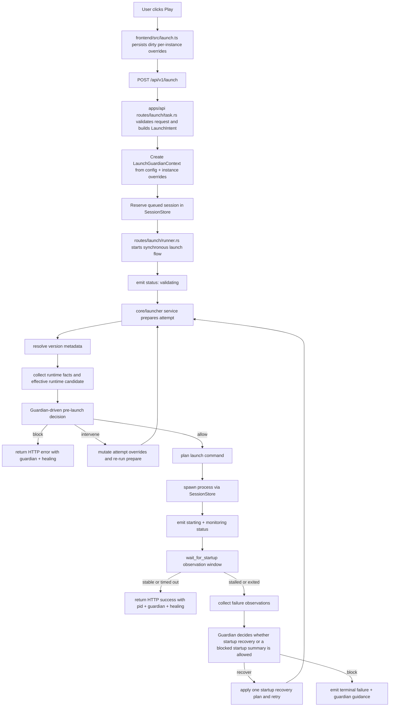
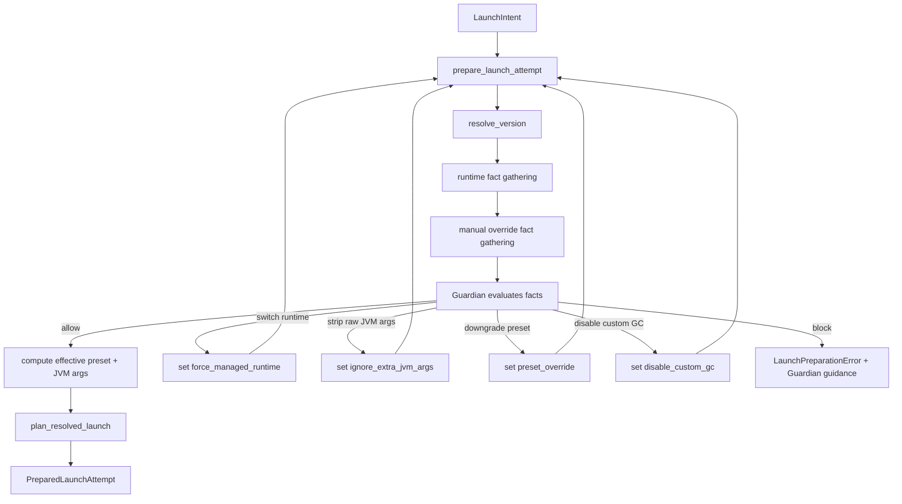
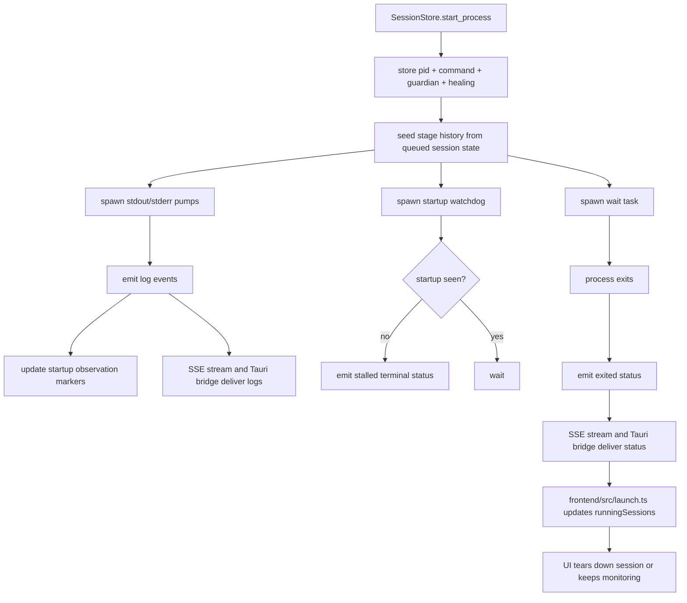
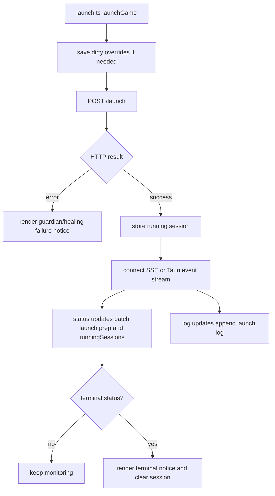
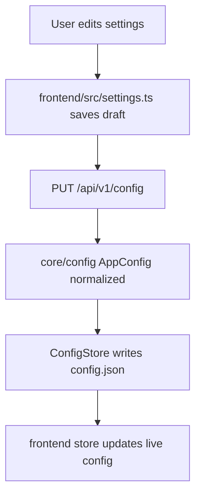
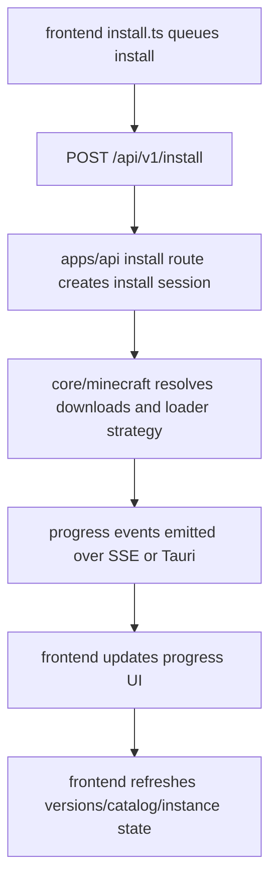
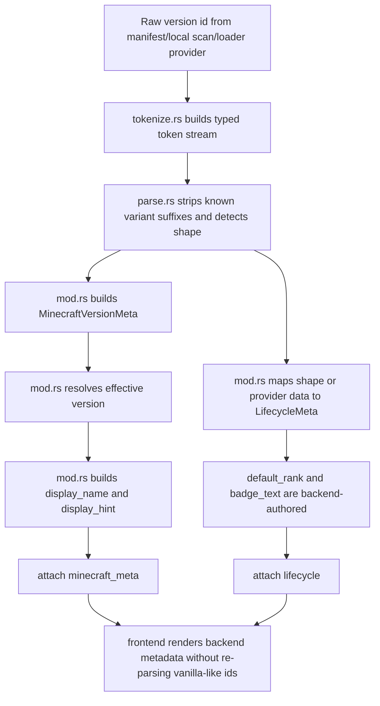
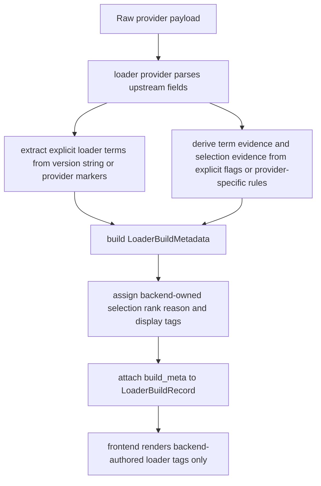

# Architecture
This is the current map of the launcher. Keep it accurate. If the architecture changes, update this file in the same change.

## Topology
- `frontend/`: Preact UI, state, launch/install workflows, browser + desktop runtime integration
- `apps/api`: local Axum HTTP surface and SSE endpoints under `/api/v1/*`
- `apps/desktop`: Tauri shell and native event bridge
- `core/config`: config model, normalization, persistence, path detection
- `core/launcher`: launch pipeline, Guardian, Healing, command planning, session/status mapping
- `core/minecraft`: version metadata, runtime discovery/install, download/install, loader strategies
- `core/performance`: managed performance planning/install

## Runtime topology
- Desktop builds use Tauri's local frontend bundle from `frontend/static`; desktop dev uses Tauri `devUrl` at `http://127.0.0.1:3000`.
- The desktop shell always starts its own Axum API on an ephemeral loopback port and exposes that address to the frontend through the `api_base_url` Tauri command.
- Browser dev runs the frontend dev server at `http://127.0.0.1:3000` and talks to the standalone API at `http://127.0.0.1:43430` unless `CROOPOR_WEB_API_BASE` overrides it.
- The API only accepts browser CORS requests from local development and Tauri origins; production desktop traffic uses the bundled frontend plus the shell-provided loopback API address.

## Primary docs
- Docs index: `docs/README.md`
- Guardian architecture: `docs/GUARDIAN-ARCHITECTURE.md`
- Loader architecture: `docs/LOADER-ARCHITECTURE.md`
- Version metadata architecture: `docs/VERSION-METADATA-ARCHITECTURE.md`
- ADRs: `docs/adr/`

## Frontend map
- `frontend/src/main.tsx`: app bootstrap
- `frontend/src/store.ts`: runtime state
- `frontend/src/actions.ts`: state transitions
- `frontend/src/launch.ts`: launch request, status/log subscription, failure handling
- `frontend/src/install.ts`: install workflow
- `frontend/src/settings.ts`: settings draft + save flow
- `frontend/src/native.ts`: desktop event bridge
- `frontend/src/machines/`: workflow machines that should hold complex async state

## Backend map
- `apps/api/src/routes/launch/`: launch route, task assembly, streaming, runner
- `apps/api/src/routes/instances.rs`: instance CRUD, resource listing, log tailing, and folder-opening boundary
- `apps/api/src/routes/auth.rs`: account/auth status, volatile Microsoft/Minecraft login state, and online launch readiness surface
- `apps/api/src/routes/skin.rs`: offline/default skin profile metadata and local head image surface
- `apps/api/src/state/sessions/`: live launch session store, subscriptions, process supervision
- `core/launcher/src/guardian/`: launch-safety authority and intervention model
- `core/launcher/src/service/`: launch preparation, mappings, Healing summary/recovery helpers
- `core/minecraft/src/runtime/`: runtime discovery and managed runtime installation; managed Java runtime files are streamed to temporary files and validated against Mojang component-manifest size/SHA-1 metadata when present before the ready marker is written, and the Croopor-managed runtime cache requires that ready marker before reusing an executable
- `core/minecraft/src/version_meta/`: Minecraft version interpretation, lifecycle classification, effective-version resolution, display metadata, deterministic ordering
- `core/minecraft/src/lifecycle.rs`: launcher-owned lifecycle model for Minecraft versions
- `core/minecraft/src/loaders/types.rs`: loader build metadata contract, explicit upstream terms, evidence, backend display tags, and default-selection policy

## Instance Isolation

Instances are direct Minecraft game directories under `<config_dir>/instances/<instance-id>/`. Launch requests are instance-scoped: the API resolves the instance, uses that directory for Minecraft's `--gameDir` and process working directory, and still resolves shared immutable launcher material such as `assets/`, `libraries/`, `runtime/`, and `versions/` from the configured library directory. The current Rust model does not create symlinks or junctions inside instance directories.

The mutable game-state boundary is instance-local. Croopor creates and reads user-visible folders such as `mods/`, `saves/`, `resourcepacks/`, `shaderpacks/`, `config/`, `screenshots/`, and `logs/` under the instance directory. The folder-opening API accepts an omitted `sub` query to open the instance root, or one of those explicit subfolder names; any other `sub` value returns a bounded JSON `400` instead of falling back to the root. Resource listing APIs scan fixed instance-local subdirectories and never accept caller-provided paths. Direct log tailing accepts only a single safe filename and rejects traversal, hidden, separator-containing, and control-character names.

## Full launcher pipeline

### High-level launcher lifecycle

### Launch pipeline: end-to-end

### Launch pipeline: backend detail

Effective launch memory selection is backend-owned at launch request time. Per-instance memory values remain the highest-precedence explicit selection, explicit launch request memory remains next, and customized global config memory remains the global default. Fresh instances whose global config still has the built-in memory pair use launch-time host total RAM and the current version target to derive defaults before the Guardian/resource-budget snapshot is recorded: legacy vanilla targets use a smaller allocation, modern vanilla targets use the standard allocation, and loader/modded targets use a larger allocation, all bounded by the launcher OS-headroom policy when host memory evidence is available. Successful launch responses include the effective `max_memory_mb` and `min_memory_mb` selected by backend preparation so the frontend can record the running session allocation without recomputing memory policy locally.

When Guardian blocks a launch before a process is available, the launch, benchmark launch, and benchmark suite launch routes return HTTP `422 Unprocessable Entity` with the normal bounded launch-error JSON (`error`, optional `healing`, optional `guardian`). This keeps a deliberate Guardian safety block distinct from an internal API failure, while non-Guardian launch request failures remain HTTP `500` unless a more specific route-level status applies.

The API exposes `GET /api/v1/launch/preflight/{instance_id}` as a read-only backend-authored Guardian preflight. The endpoint validates the configured library and instance existence, captures launch-preparation facts for Guardian mode, override origins, effective memory, selected-memory bounds, resource pressure, Custom-mode risky overrides, and no-download local launch-readiness diagnostics, then lets Guardian produce the warning summary and copy. It returns only bounded JSON facts: Guardian summary, effective memory, override origins/booleans, scalar resource pressure, and additive readiness state with stable reason ids such as missing installed version metadata, client jar, libraries, asset index, managed runtime, or explicit Java override. It never creates a launch session, starts Minecraft, installs files, ensures instance layout, writes proof state, probes Java by spawning a process, or exposes filesystem paths, command lines, raw JVM args, account names, usernames, or tokens. The current InstanceDetail overview does not render a persistent preflight panel; it keeps launch safety user-facing through launch/install affordances and backend-authored launch outcome notices.

Effective JVM preset selection is backend-owned. With no explicit preset override, HotSpot runtimes select from the current presets using version, loader/modded state, detected Java distribution, and host CPU/RAM evidence: supported GraalVM runtimes use the GraalVM preset, Java 8 legacy targets use the specific legacy preset for 1.8.9 PvP and modded 1.12.2 heavy launches when applicable, other Java 8 legacy targets use the conservative legacy preset, modern modded launches use the performance preset, high-end modern vanilla Java 21+ launches with at least 8 logical cores and 8 GiB total RAM use the ultra-low-latency preset, and other supported modern vanilla launches use the smooth preset. OpenJ9 and other unsupported HotSpot-tuning targets receive no Croopor GC flags.

Native library extraction is launch-planning owned in `core/launcher`. When a resolved launch includes native libraries, the planner extracts them into the Croopor natives cache under the OS cache directory, writes through a process-local staging directory, marks completed directories with `.ready`, and only reuses a cached extraction when the cache key still matches the version id plus native artifact identity and current file metadata. This keeps interrupted or repaired native artifacts from being treated as ready launch input.

### Live session and event flow

`SessionStore` owns the live stage history for each launch session. Status transitions update the stored `LaunchSessionRecord.stages` array and every status payload can include the current stage records. Each stage record carries the backend stage id, label, start timestamp, optional end timestamp, optional duration, optional result, warnings, and fallback reason. When a status payload carries Guardian data, non-allowed Guardian outcomes (`warned`, `intervened`, or `blocked`) contribute bounded unique Guardian-authored `details` to the stage warnings before Healing warnings are appended without duplicates; Healing `fallback_applied` remains the source of stage fallback reasons. Benchmark launches also attach bounded benchmark metadata to the live session record so active status can be correlated before proof persistence. The route snapshot at `/api/v1/launch/{id}/status`, browser SSE stream, and desktop Tauri bridge all expose the same additive `stages` data and optional benchmark metadata. `GET /api/v1/launch/{id}/command` is a local diagnostic endpoint only: it returns the launch command with credential-looking values redacted, reports whether redaction changed the command, and does not expose the raw Java path or act as an online credential channel. The backend now emits a `prewarming` stage after launch planning and before JVM spawn; that stage performs a bounded, sequential, best-effort read of high-value local launch files and records its duration like any other launch stage. The prewarm budget is selected from the launch resource-budget snapshot: low-pressure launches keep the normal bounded prewarm, pressure reduces prewarm work, and severe CPU/install or disk-headroom pressure skips prewarm rather than adding avoidable load. On Windows, the session process helper starts the game process below normal priority and promotes it back to normal priority after an explicit boot marker is observed; setup and promotion failures are logged as warnings and never fail launch status. Other platforms intentionally no-op this priority sandwich until Croopor has a reliable restore design. The live session record keeps bounded priority-management evidence for later proof persistence, but status events do not expose this evidence.

Launch completion also writes a local proof record under `<config_dir>/benchmarks/launch/`. Proof records are best-effort and never fail the launch path. They include session, instance, version, launch timestamps, outcome, scenario metadata, conservative local device metadata, launch-time resource budget snapshot, pid/exit/failure data, optional boot-marker-derived boot duration, optional priority-management evidence, Guardian, Healing, and stage history, while avoiding full command-line, Java-path, and raw process timestamp persistence. Priority proof evidence records bounded scalar modes only: startup mode, optional sanitized setup error, optional post-boot promotion outcome, and optional sanitized promotion error. Non-Windows launch sessions record explicit `noop` priority evidence because process priority restore is intentionally not attempted there. Proof JSON is parsed as strict current-schema local state: unknown fields and missing structural fields such as scenario, device, or stages are invalid rather than migrated. Optional evidence remains optional only where the current writer intentionally omits unavailable data, such as boot duration, priority evidence before a process launch attempt exists, benchmark tags on normal launches, comparison data, or host measurements that the OS did not expose. The boot duration is recorded only when the backend observes an explicit game boot marker after process spawn; timeout-based running transitions do not synthesize it. The resource budget snapshot is captured before the new queued session is inserted and records scalar pressure evidence such as active launch/install counts, active launch memory allocation, requested memory, signed estimated remaining memory, headroom threshold, and memory/CPU/install pressure booleans, plus best-effort measured memory evidence for host available memory, host used memory, and launcher process memory when the host exposes those values. It also records best-effort CPU load-average evidence, launch-relevant free disk space, and a conservative disk-pressure flag without storing filesystem paths. Stage history includes the bounded prewarming stage when launch reaches it, so benchmark proofs can show whether prewarm work ran and how long it took without storing warmed file paths.

When a previous local proof matches the same known launch mode, version target, requested memory, device tier, and any present benchmark profile/run-type/mode dimensions, the new proof also stores an additive comparison summary, but only when both the current proof and the baseline candidate have comparable outcomes (`running`, `exited`, or `completed`). Managed proofs may also compare against matching vanilla baseline proofs and prefer a matching vanilla baseline over a matching managed baseline when both exist; vanilla proofs compare only to vanilla proofs, custom proofs compare only to custom proofs, and unknown or empty modes do not compare. Failed, error, blocked, unknown, or empty outcomes are not compared and are not selected as baselines. Empty or `unknown` benchmark profile/run-type/mode values are treated as absent for normal launch comparisons; if either proof has a real value for one of those benchmark dimensions, both proofs must carry the same value. Benchmark id is persisted as a run descriptor but is not required for reusable baseline matching. Proofs with boot-marker-derived `boot_duration_ms` compare only against matching proofs that also have `boot_duration_ms`; proofs without boot duration retain the total completed launch-stage duration comparison. `POST /api/v1/launch/benchmark` reuses the normal launch path, returns the normal launch response plus bounded benchmark metadata, attaches the same sanitized metadata to the active session status, and tags the resulting proof scenario with sanitized benchmark profile/run-type/mode/id fields. Benchmark mode metadata accepts the current `development`, `qualification`, and `release_validation` ids only. `GET /api/v1/launch/benchmark/matrix` exposes the backend-authored local benchmark descriptor for stable `development`, `qualification`, and `release_validation` modes, run types, benchmark profile ids, and representative target descriptors; it is descriptor-only and never exposes paths, commands, account names, or runtime arguments. `POST /api/v1/launch/benchmark/suite` expands those stable ids into a deterministic bounded suite plan and launches one selected suite run through the same benchmark launch path, returning selected and remaining run metadata, including descriptor target ids where a suite run is tied to a representative target, plus a stable `suite_id` for an advanced caller to drive the suite one run at a time. When `run_index` is omitted, the suite endpoint resumes the first planned run in the persisted manifest without a session id; a complete suite returns a JSON conflict instead of relaunching run 0, and an existing non-terminal suite run returns a JSON conflict instead of overlapping runs. `POST /api/v1/launch/benchmark/suite/tick` is a polling-safe driver primitive for background orchestration: it returns `active` or `complete` as HTTP 200 non-error states when no run should start, or launches exactly one next pending run through the same suite path when the suite can advance. `POST /api/v1/launch/benchmark/suite/driver` starts one explicit in-memory suite driver per suite, clamps the polling interval to safe bounds, and reuses the tick decision path until stopped, complete, or failed; `GET /api/v1/launch/benchmark/suite/drivers/{id}` reports bounded driver state, `GET /api/v1/launch/benchmark/suite/drivers` lists a bounded set of recent driver states, `POST /api/v1/launch/benchmark/suite/drivers/{id}/stop` cancels future driver iterations without killing a launched game session, and `POST /api/v1/launch/benchmark/suite/drivers/{id}/resume` explicitly starts a fresh driver from a persisted terminal/interrupted record when its suite manifest still has a pending run. Driver status records persist under `<config_dir>/benchmarks/suite-drivers/`; API and desktop startup parse only strict current-schema driver records for discovery, mark previous non-terminal records as restart-interrupted, and run one bounded automatic resume pass for records whose visible terminal state is `interrupted` with the restart-interruption error. Stopped, failed, complete, manually interrupted, malformed, excess, and already consumed records remain visible but are not auto-resumed, and automatic resume reuses the same fresh-driver path as the explicit resume endpoint. Suite runs update a strict current-schema local manifest under `<config_dir>/benchmarks/suites/` with each planned run's profile, run type, target id when present, benchmark id, launch mapping, and state; after proof persistence, matching suite manifest runs are updated with the persisted proof outcome state. `GET /api/v1/launch/benchmark/suites/{id}` returns that manifest with planned runs and launched session mappings. `GET /api/v1/launch/benchmark/qualification/family-c-1-12-2/{suite_id}` is a local-only evidence check for the Family C Forge 1.12.2 release-validation pair: it reads the strict current-suite manifest plus bounded local proof records, reports `ready` or `incomplete` with per-target missing reason ids for the vanilla baseline and managed Family C Forge core target, and never launches Minecraft, installs files, or exposes paths, commands, accounts, tokens, Java arguments, or runtime arguments. `GET /api/v1/launch/benchmark/qualification/family-c-1-12-2/preview` is the no-launch preview boundary for the same pair: it expands the current `release_validation` suite plan in memory, returns an `incomplete` descriptor-only qualification shape without requiring a suite id, and does not read or write suite/proof state. The API exposes recent proofs through `GET /api/v1/launch/reports` and individual proofs through `GET /api/v1/launch/reports/{id}` using a sanitized export shape: unbounded failure detail, priority setup errors, arbitrary provider payloads, command fragments, Java paths, JVM arguments, usernames/account ids, token-like strings, and suspicious stage/Guardian/Healing free text are dropped or redacted at the API boundary while scalar proof evidence, bounded Guardian/Healing summaries, stage timing, resource budget, scenario metadata, and comparison evidence remain available. Settings Performance renders the recent proof history with benchmark metadata, comparison text, compact resource-budget evidence, sanitized proof-copy support, and a bounded advanced benchmark-driver block with instance, suite-mode, interval, start, refresh, stop, and resume controls.

For the Family C qualification route, `ready` additionally requires each target proof to carry backend-authored Guardian decision evidence and resource-budget memory, CPU, install, and disk evidence; the managed target also requires local `family-c-forge-core` composition state with expected managed artifacts, composition-managed ownership, Modrinth provenance, verified SHA-512 integrity, and a compact comparison against the vanilla baseline proof from the same suite using a supported launch-duration metric with non-empty samples and positive values. Missing evidence is reported through per-target descriptor-only reason ids.

### Frontend launch flow

Before `/launch` returns a session id, the frontend uses a bounded local launch-stage placeholder sequence from the same stage vocabulary. Those placeholders are conservative estimates only; backend status events replace them as soon as a session exists. Normal frontend launches post the instance id, username, and client start timestamp; memory warnings and effective memory selection are backend/Guardian authority.

### Config/settings flow

Normal config reads and writes parse and validate the strict current `AppConfig` schema. The config schema includes `telemetry_enabled`, a disabled-by-default consent flag only; current code does not upload telemetry or open a remote diagnostics channel from that field. API and desktop startup use a narrower startup-only load path: if `config.json` parses as current `AppConfig` and validation fails only because `launch_auth_mode` is not `offline` or `online`, startup keeps the file unchanged, uses `offline` in memory, and exposes a bounded warning through `GET /api/v1/status`. Parse failures, invalid usernames, and any other validation failure still fail startup.

### Install flow

### Version and lifecycle pipeline

### Loader metadata pipeline

## Performance Program

`core/performance` owns the bundled managed-performance manifest, cached remote manifest authority, plan resolution, bundle health vocabulary, emergency-disable evaluation, local rules-cache status, composition-owned artifact installation/removal, and local rollback snapshots for the last tracked managed bundle state. Current-schema manifests must declare `minimum_app_version`, `rule_channel`, the required top-level `artifacts` list, and the required `emergency_disables` list; validation rejects malformed app versions, manifests that require a newer running `croopor-performance` crate version, unknown rule channels, duplicate or empty artifact ids, composition mods that do not reference a declared artifact, composition mods whose inline Modrinth project/slug identity disagrees with the declared artifact, malformed non-empty managed-mod version ranges, negative managed-mod hardware requirements, and blank, padded, or duplicate managed-mod mutual exclusions. Each declared managed artifact has a stable id, `type: "mod"`, Modrinth source identity, `checksum_policy: "provider_sha512"`, and `ownership_class: "composition_managed"`. Emergency artifact disables are matched against the declared artifact id and declared Modrinth identity aliases, not by harvesting undeclared inline composition data. Normal API and desktop startup create or read `<config_dir>/performance/rules-cache.json`. When `CROOPOR_PERFORMANCE_RULES_URL` is unset or blank, the launcher records the bundled built-in manifest and performs no remote work. When the variable is configured, startup still constructs state synchronously from a cached valid remote manifest when one exists and validates, otherwise from the bundled built-in manifest with bounded diagnostics. Remote rules also require `CROOPOR_PERFORMANCE_RULES_ED25519_PUBLIC_KEY`, a hex-encoded 32-byte Ed25519 public key. Remote responses must include `x-croopor-rules-signature-ed25519`, a hex-encoded 64-byte detached Ed25519 signature, and may include bounded diagnostics key id header `x-croopor-rules-key-id`. Publishers sign the deterministic current-schema manifest payload: parse a `Manifest`, validate it with `validate_manifest`, serialize that same current-schema manifest with `serde_json::to_vec`, and sign those bytes. Accepted remote cache snapshots persist the manifest plus detached signature metadata, and cached remote snapshots are revalidated and signature-verified against the currently configured public key before startup can activate them. Built-in bundled rules remain offline and unsigned. After `AppState` exists, API startup and desktop startup each spawn one detached periodic background task that performs an initial bounded remote refresh soon after startup and then repeats at a bounded interval through the same refresh path used by the manual endpoint. The default interval is six hours; `CROOPOR_PERFORMANCE_RULES_REFRESH_INTERVAL_SECONDS` can override it and is clamped between 15 minutes and 24 hours. Launch preparation never waits on remote rules network work, and refresh attempts do not overlap because the periodic task awaits each attempt before sleeping for the next interval. Remote manifests are untrusted until parsed as the current manifest schema, accepted by `validate_manifest`, and verified with Ed25519. Missing or invalid public-key configuration, missing or invalid signatures, invalid remote data, or cache signature failures reject the remote rules as a whole and never partially apply them. The API exposes this through `/api/v1/performance/*`:

- `GET /api/v1/performance/status` reports the currently active rule source, channel, cache state, validation state, remote-refresh availability, and last successful remote refresh time when a cached or freshly accepted remote manifest is active. The status also includes per-family coverage diagnostics so older families can be distinguished between intentional vanilla-enhanced fallback and richer managed-mod coverage. Manifest-level emergency disables are exposed as public diagnostics with ids, target type, target id, reason, and optional family/loader/tier bounds. Local rules-cache diagnostics report whether the active rules snapshot was recorded, invalid, or unavailable.
- `POST /api/v1/performance/rules/refresh` is the explicit remote refresh trigger. It requires `CROOPOR_PERFORMANCE_RULES_URL`; when unset it returns HTTP 400 JSON `{ "error": "performance remote rules url is not configured" }`. When configured, it performs a bounded-time, bounded-body fetch, parses a `Manifest`, validates it with `validate_manifest`, verifies the detached Ed25519 signature over the deterministic current-schema payload, persists the accepted manifest and signature metadata as the active remote rules cache, swaps the in-memory active rules, and returns normal performance rules status. The startup periodic background task reuses this same path. Fetch, parse, size, validation, signature, key-configuration, or cache-write failures leave the previous active rules unchanged and expose a compact warning in status.
- `GET /api/v1/performance/plan` resolves the effective composition for a game version, loader, mode, and detected hardware profile. Resolution skips emergency-disabled compositions, drops emergency-disabled managed artifacts from selected plans, enforces any managed-mod version range before hardware requirements, and adds calm warnings/fallback reasons without touching user-managed mods. When an optional `instance_id` query parameter is present, the route validates that instance and includes backend-collected mod evidence from its `mods/` folder plus tracked managed project ids, so manifest mutual exclusions can drop managed artifacts such as Nvidium when a user-installed Iris jar is already present. Without `instance_id`, the route remains request-only and does not scan instance files.
- `GET /api/v1/performance/health` summarizes the tracked composition lock state for an instance. Instance-scoped health and install plan resolution include the same instance `mods/` evidence used by instance-scoped plan requests. Health and install/remove/rollback responses include a bounded `managed_artifacts` summary with project id, version id, filename, ownership class, source provider, whether a SHA-512 value is recorded, and whether SHA-512 verification evidence exists; summaries never expose filesystem paths or full hashes.
- `GET /api/v1/performance/rollback` lists compact rollback snapshot metadata for an instance. `POST /api/v1/performance/install` applies, removes, or rolls back only Croopor-tracked composition-managed files for an instance. The persisted composition lock records an explicit ownership class, source provenance, integrity metadata, and failure metadata on each current lock state, currently requiring `composition_managed` ownership and `modrinth` source provider for tracked artifacts written by managed compositions. Missing current fields, unknown fields, unknown ownership values, missing or unknown source/integrity shape, or non-composition-managed entries in the tracked lock are invalid current-state data and are not migrated silently. Modrinth installs resolve compatible versions with the declared project identity first, fall back to the declared slug only after a clean not-found or no-compatible-version result, and do not fall through on rate-limit, request, parse, or non-404 HTTP errors. When a non-empty managed composition has a severe install-time failure, the installer walks a bounded set of ids from that plan's declared fallback chain and builds each fallback attempt from the active manifest's current composition definition; minor degradation still persists the original degraded composition state. Vanilla-enhanced fallback writes an empty tracked state and removes only previously tracked composition-managed files. Modrinth installs verify SHA-512 when Modrinth provides one, record `sha512_verified: true` only after that verification or an existing file match, and record `sha512_verified: false` when no expected SHA-512 is available. Health reports otherwise valid tracked artifacts without SHA-512 verification evidence as degraded. Files outside that tracked composition-managed lock remain user-managed and are not deleted, snapshotted, or restored by performance install/remove/rollback. Publisher signature verification for managed artifacts is still future work and remains unimplemented; the current manifest definition and provenance/integrity lock record declared source, ownership, and checksum policy plus observed checksum verification state, not artifact publisher signatures. The blocker is structural: managed installs dynamically select the compatible Modrinth version and primary file at install time, while the current schema contains no pinned artifact version, pinned file identity, signed digest, publisher public key, detached signature, or provider-supplied publisher signature source to verify. Current-schema manifests reject unmodeled artifact signature fields instead of accepting unverifiable security metadata. A future real artifact-signature boundary must either pin artifact file/version/signature material in the manifest or consume a provider-backed publisher signature source before install can fail closed on invalid publisher signatures. Before install/remove mutation, Croopor records an identified rollback snapshot under `mods/.croopor-performance/rollback/latest.json` and keeps a bounded history of up to five retained identified snapshots under `mods/.croopor-performance/rollback/history/`; latest and history snapshots use the same strict current shape and contain the previous composition lock and tracked managed artifact bytes, never user-managed files. Rollback requests can omit `rollback_id` to restore latest or provide an id from the list route to restore an older retained snapshot. Missing rollback state and missing or invalid snapshot ids return bounded JSON errors. Requests can opt into queued execution with `queued: true`; queued performance operations return an install progress id, emit bounded progress through the existing `/api/v1/install/{id}/events` stream, and persist strict current-schema operation status records with the bounded execution payload under `<config_dir>/performance/operations/` for `GET /api/v1/performance/operations/{id}`. `GET /api/v1/performance/instances/{instance_id}/operation` validates the instance and returns a nullable single operation: active same-instance work first, otherwise the latest recorded operation for that instance, without exposing paths or requiring the caller to know the operation id. API and desktop startup keep terminal records visible, load valid non-terminal records as active same-instance work, and spawn a bounded detached resume pass through the normal queued executor. Malformed current-schema records are ignored with bounded diagnostics, and excess or duplicate pending records are marked `interrupted`. Runtime same-instance overlap protection is held in the operation store and terminal or interrupted records do not block new work.

Managed artifact promotion fails with a bounded artifact error when an untracked target filename already exists and does not match the expected provider SHA-512, so a same-name user mod is left in place; a same-name file from the previous strict composition-managed lock can be replaced by the new managed artifact.

The bundled manifest has explicit vanilla-enhanced fallback compositions for Families A-D, plus a conservative Family C Forge core path for 1.12.2 that falls back to `family-c-vanilla-enhanced`; Family C non-Forge loaders and Family D remain vanilla-enhanced-only. Families E-F have managed Fabric and Forge/NeoForge compositions with an extended -> core -> vanilla-enhanced fallback chain. The frontend Settings Performance section displays the active mode, rule-source status, and recent local launch proof history from `/api/v1/launch/reports`, including benchmark metadata, baseline comparison text, optional boot duration, resource pressure summaries, compact measured-memory details, CPU load details, and disk-free details when proof records contain them. It also renders the backend-authored benchmark matrix descriptor from `/api/v1/launch/benchmark/matrix` as an advanced reference, including compact representative target coverage, and lets advanced users start a background benchmark suite driver for an existing instance with a selected suite mode and bounded polling interval. Instance overview displays the effective plan/health summary and lifecycle action; that action uses queued performance operations for observable progress, but per-instance policy editing stays in instance Settings to preserve the overview grid layout.

## Accounts And Skin Identity

Croopor has an explicit launch auth mode in current config: `offline` by default, or `online`. Config update validation accepts only those two values. Offline launches validate the configured username through `core/config`, build `LaunchAuthContext::offline(...)`, and substitute the deterministic offline UUID, `null` access token, and legacy user type into Minecraft launch variables. Online launches do not overwrite the configured offline username; that username remains the persisted offline identity and normal launch metadata value.

When config selects `online`, the launch task first requires the active current Minecraft account in `AuthLoginStore` to be present, unexpired, Java-owned, and to contain a non-empty Minecraft profile id/name plus Minecraft access token. A Minecraft account is current only when it belongs to the active MSA login id and was authenticated no earlier than the active MSA token, so an older preserved Minecraft account is not reused after an MSA-only refresh. If those facts are available, the API builds the launch auth context from the active Minecraft profile: profile name, profile id/UUID, Minecraft access token, `msa` user type, and empty client/xuid fields because those are not currently stored. If those facts are unavailable, launch preparation may make one just-in-time refresh attempt using the same backend refresh-token grant and Xbox Live/XSTS/Minecraft auth-chain boundary as `POST /api/v1/auth/refresh`, but only when `CROOPOR_MSA_CLIENT_ID` is configured and a nonblank stored MSA refresh token exists. Active refresh work is serialized by `AuthLoginStore`: after entering that guard, the shared refresh helper re-checks whether another caller already stored a launch-ready Minecraft account for the current MSA refresh generation and reuses it instead of spending the same refresh token again. A successful launch-time refresh stores the refreshed active MSA/Minecraft snapshot and then builds the online launch auth context from the refreshed Minecraft account. Missing refresh configuration/material, refresh-token rejection, token endpoint failures, auth-chain failures, or refreshed account facts that are still not launch-ready fail before creating a runnable command with bounded JSON using the `auth_mode_incompatible` failure class and optional bounded refresh status/reason ids. If Microsoft refresh succeeded before a later auth-chain failure, the store may still retain the new MSA access token, rotated refresh token, and any older still-valid Minecraft account for retry evidence, but it does not mark the old Minecraft profile as current or newly refreshed. Non-recoverable refresh-token rejection clears active auth through the shared refresh behavior. Public launch errors/status do not expose raw tokens, command lines, account ids beyond bounded profile fields, device codes, or provider payloads. Active Microsoft/Minecraft auth snapshots are persisted only in the OS credential store under a current schema. Restore accepts an expired MSA access token only when the snapshot also has a nonblank MSA refresh token, and that expired access token is not reported as currently authenticated; expired Minecraft account state is not restored as launch-ready. Pending device-code sessions remain restart-volatile and are never persisted. Missing, unavailable, malformed, wrong-schema, blank-token, mismatched-login, or non-refreshable expired secure auth storage starts without restored auth and leaves offline launch behavior unchanged. There is no plaintext token file/cache fallback, status-polling refresh, periodic auth refresh, or launch-time refresh outside this selected-online launch preparation recovery path.

The API exposes `GET /api/v1/auth/status` as the account boundary. It validates and reports the configured offline identity honestly unless online mode is selected and the active current Minecraft account is ready for launch. The response includes the selected `launch_auth_mode`, effective identity mode/provider/verified fields, deterministic offline UUID when offline is effective, `online_mode_ready` for selected online mode readiness, login availability based on the optional public `CROOPOR_MSA_CLIENT_ID`, bounded active MSA sign-in facts, current Minecraft profile id/name with typed skin/cape metadata, Java ownership verification, and Minecraft token expiry seconds. `POST /api/v1/auth/login` is the login-start boundary. Without that client id it returns a JSON unavailable response; with the client id it requests a Microsoft device-code challenge using the `XboxLive.signin offline_access` scope, stores the raw Microsoft `device_code` in a restart-volatile in-memory `AuthLoginStore`, and returns a public pending response with a local `login_id`, user code, verification URL, expiry, interval, and optional message. `GET /api/v1/auth/login/{login_id}` reads that local session without contacting Microsoft: pending sessions return non-sensitive public metadata with bounded remaining seconds, expired sessions return `410 Gone`, and unknown sessions return `404`. `POST /api/v1/auth/login/{login_id}/poll` is the explicit one-shot Microsoft token polling boundary. Each request performs at most one bounded token-endpoint request with the stored server-side `device_code`, maps expected device-flow outcomes to public JSON, keeps `authorization_pending` and `slow_down` responses non-terminal without token fields, removes terminal declined/expired/bad-code sessions, and on Microsoft token success runs the internal Xbox Live/XSTS/Minecraft login/profile/ownership chain before storing active account state. Full chain success replaces any previous active MSA token and Minecraft account slot, saves the current active snapshot to the OS credential store, and returns `msa_authenticated` and Minecraft readiness metadata without raw tokens or device codes. Chain failure after Microsoft token success returns bounded JSON, removes the pending session, clears active auth if a partial chain reached it, deletes the persisted snapshot, and does not leave a partially signed-in active profile.

`POST /api/v1/auth/refresh` is the explicit backend refresh boundary, and launch preparation calls the same crate-internal typed refresh helper for selected-online recovery instead of round-tripping through HTTP JSON. It requires `CROOPOR_MSA_CLIENT_ID` and a stored nonblank MSA refresh token, then enters the store-owned active-refresh guard before posting a bounded refresh-token grant with `XboxLive.signin offline_access` and running the same Xbox Live/XSTS/Minecraft login/profile/ownership chain using the returned MSA access token. If another guarded refresh already completed and left a launch-ready active Minecraft account for the current MSA refresh generation, the waiting caller returns bounded refreshed metadata from stored state without another provider refresh. On success it replaces the stored refresh token when Microsoft returns a nonblank new one, preserves the old refresh token when Microsoft omits one, saves the current secure snapshot, and returns refreshed Minecraft readiness metadata without raw tokens. If Microsoft refresh succeeds but the later Minecraft auth chain fails, the route still returns bounded token-safe auth-chain failure JSON, but it stores the refreshed MSA token and any nonblank rotated refresh token with no newly refreshed Minecraft account claim. Missing refresh material returns bounded sign-in-required JSON without clearing active state. Non-recoverable refresh-token rejection clears active auth and deletes the persisted snapshot with bounded sign-in-required JSON. Request, upstream, and parse failures leave existing refresh material intact unless the refresh token was clearly rejected as unusable. `POST /api/v1/auth/logout` clears the active MSA token slot, active Minecraft account slot, persisted secure auth snapshot, and any pending device-code sessions, and is harmless when no one is signed in. Accounts & skins starts the device-code request, renders the user code, verification URL, expiry, and copy affordances inline, polls through the backend-owned one-shot poll route at the backend-provided interval, refreshes status when MSA sign-in becomes active, and exposes logout for that active state. The frontend never owns raw Microsoft device codes, token material, or provider payloads.

The API crate has an internal tested auth-chain client boundary in `apps/api/src/auth_chain.rs`. Given an MSA access token, it exchanges through Xbox Live user authentication, XSTS authorization, Minecraft `login_with_xbox`, Minecraft profile fetch, and Minecraft ownership fetch using injectable endpoints. The boundary has lightweight typed results for Xbox user hash, XBL/XSTS tokens, Minecraft access token, profile skins/capes, and ownership, and maps failures into bounded categories/messages without exposing tokens, device codes, usernames, commands, or raw provider payloads. The login poll and refresh routes use this client only after Microsoft token success; they keep the resulting MSA and Minecraft access tokens in active backend state for status and guarded online launch injection, persist only the active MSA/Minecraft snapshot in the OS credential store, and avoid retaining XBL/XSTS tokens after the exchange.

The API also exposes `GET /api/v1/skin/profile` as the local skin-profile boundary. Without an explicit `username`, it first uses the active current Minecraft account state from `AuthLoginStore` when available and returns the Minecraft profile name/id plus bounded skin metadata. It reports `online` auth mode for that path, selects the active Minecraft skin record when present, falls back to the first stored skin record otherwise, normalizes the variant to `classic` or `slim`, and exposes a public skin texture URL only when it is a strict HTTPS `textures.minecraft.net/texture/...` URL. With `username=...`, or when no current non-expired Minecraft account is available, it keeps the offline behavior: validate the selected/local username, return the deterministic offline UUID, report a deterministic default `classic` or `slim` variant hint, and include a local head URL. `GET /api/v1/skin/head` returns a deterministic offline `image/svg+xml` player head with bounded size and private cache headers. These endpoints do not fetch Mojang skins, store tokens, expose provider payloads, or contact Microsoft services.

## Launch authority boundaries
- Guardian is the authority for launch-safety policy.
- Healing is a capability used by Guardian, not the authority.
- Runtime/JVM/validation layers should produce facts and execution helpers, not user-policy decisions.
- Session heuristics are observations. They should not invent user-policy outcomes on their own; stalled and pre-startup exited observations are converted into Guardian-authored blocked summaries before terminal launch failure status is emitted.
- Guardian summaries carry additive backend-authored `message` and `details` fields for user-facing non-allowed outcomes.
- Live and persisted launch stage histories preserve bounded Guardian `details` for non-allowed status payloads, with Healing warnings retained as supporting detail and Healing fallback metadata retained as the fallback source.
- Launch preparation computes conservative host resource warnings from active session allocations, requested launch memory, active launch count, CPU thread count, best-effort CPU load averages, active install/download sessions, and launch-relevant disk free space. It also warns when the selected minimum memory exceeds the effective maximum and is clamped down for launch, and when the effective maximum memory allocation is below the conservative 2 GB startup threshold. Tight memory headroom, high launch concurrency, saturated measured CPU load, concurrent install pressure, low disk headroom, very low launch allocation, or memory-bound clamping produce non-blocking Guardian `warned` outcomes.
- Launch preparation also warns in Guardian Custom mode when explicit Java, JVM preset, or raw JVM argument overrides are preserved unchanged.
- The frontend should prefer backend-authored Guardian outcomes; when Guardian has authored actionable `blocked`, `warned`, or `intervened` details, guidance, or intervention details, those details own the launch notice, and Healing details are only supporting diagnostics for incomplete or non-actionable Guardian payloads.

## Where to look
- launch behavior: `apps/api/src/routes/launch/`, `apps/api/src/state/sessions/`, `core/launcher/`, `core/minecraft/src/runtime/`
- launch proof records: `apps/api/src/state/launch_reports.rs`
- config/settings: `core/config/`, `frontend/src/settings.ts`
- install flow: `apps/api/src/routes/install.rs`, `core/minecraft/`, `frontend/src/install.ts`
- account/skin identity: `apps/api/src/routes/auth.rs`, `apps/api/src/routes/skin.rs`, `core/config/`, `core/minecraft/src/launch/mod.rs`, `frontend/src/views/accounts/AccountsView.tsx`
- version and loader metadata analysis: `core/minecraft/src/version_meta/`, `core/minecraft/src/lifecycle.rs`, `core/minecraft/src/loaders/types.rs`, `core/minecraft/src/loaders/providers/`, `apps/api/src/routes/catalog.rs`, `apps/api/src/routes/versions.rs`, `core/minecraft/src/loaders/index/query.rs`
- desktop bridge: `apps/desktop/`, `frontend/src/native.ts`

## Current architectural pressure points
- Guardian authority is still being tightened across runtime, Healing, session heuristics, and frontend rendering.
- Session startup/failure inference still depends on log heuristics.
- `/api/v1/update` performs a bounded GitHub latest-release check for release-page detection only; provider errors fall back to no-update, and Croopor still has no native updater/distribution pipeline.
