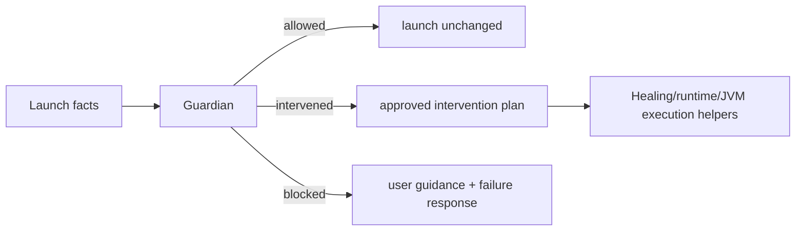

# Guardian Architecture
Guardian is the launch-safety authority. It exists so launch policy lives in one place instead of being spread across runtime resolution, JVM tuning, validation, route handlers, Healing, and frontend copy.

## Goal
Guardian answers one question:

`given the launch request, observed facts, and the configured safety mode, what is the single launch-safety decision?`

That decision must cover:
- whether launch is allowed
- whether Guardian may intervene
- which intervention is allowed
- whether launch must be blocked
- what guidance or intervention summary the user should see

## Scope
Guardian v1 is launch-only.

It owns:
- pre-launch safety decisions
- startup-recovery eligibility
- intervention summaries and user guidance
- the meaning of `managed` vs `custom`

It does not yet own:
- install policy
- multi-instance resource safety
- updater safety
- OS/process safety outside the launch flow

## Modes

### Managed
Intent:
- the launcher protects the user from technical mistakes

Policy:
- Guardian may replace an incompatible Java override with managed Java
- Guardian may strip fatal raw JVM args
- Guardian may downgrade or disable unsafe GC/preset choices
- Guardian may allow one startup recovery when launch fails during the startup window
- Guardian must log what it changed

### Custom
Intent:
- the launcher respects explicit technical choices and only blocks guaranteed-fatal setups

Policy:
- Guardian does not silently change explicit launch intent
- Guardian blocks guaranteed-fatal override combinations before spawn
- Guardian returns guidance instead of auto-healing explicit unsafe choices
- valid explicit overrides still pass unchanged

## Authority model

### What Guardian owns
- policy
- intervention eligibility
- block/allow/intervene decision
- user-facing safety outcome

### What lower layers should do
- `core/minecraft runtime`: discover requested/effective runtimes, report facts, install managed runtime when asked
- `core/launcher jvm`: compute preset/JVM args from a chosen policy outcome
- `core/launcher validation`: report why a requested configuration is incompatible
- `core/launcher healing`: execute recovery plans and format healing summaries
- `apps/api session store`: capture observations from the running process
- `frontend`: render the backend-authored Guardian outcome

Lower layers should not decide:
- whether a user override should be respected
- whether an intervention is allowed
- whether an incompatibility should be auto-fixed or blocked

## Core data model

### Inputs
Guardian should reason from explicit facts, not implicit booleans:
- Guardian mode
- explicit Java override present
- explicit preset present
- explicit raw JVM args present
- origin of each override: global or instance
- required Java major/runtime facts
- effective runtime facts
- requested preset and computed preset facts
- startup failure observations

### Output
Guardian should produce one normalized outcome for the pipeline:
- decision: `allowed | warned | intervened | blocked`
- interventions: list of concrete actions applied
- guidance: user-facing fix guidance when blocked
- optional approved recovery plan

## Current pipeline role

### Pre-launch
1. Route builds `LaunchIntent`
2. `LaunchGuardianContext` is assembled from config + instance overrides
3. preparation gathers runtime and override facts
4. Guardian evaluates those facts
5. Guardian either:
   - allows launch unchanged
   - intervenes and mutates attempt overrides
   - blocks and returns guidance

### Startup failure
1. Session layer reports observations about exit/stall/failure text
2. runner resolves a failure class
3. Guardian decides whether startup recovery is allowed
4. if allowed, Healing executes the recovery plan
5. if not allowed, Guardian blocks with guidance

## Guardian and Healing
Healing is narrower than Guardian.

Healing is responsible for:
- summarizing compatibility adjustments
- applying approved recovery plans
- emitting healing events/details for UI/logs

Healing is not supposed to decide:
- whether recovery is allowed
- whether manual overrides should be respected
- whether the launcher should intervene in managed/custom mode

The target architecture is:

## Guardian and runtime resolution
Runtime resolution should become fact-oriented.

Desired split:
- runtime code answers:
  - what Java was requested
  - what Java was found
  - what managed Java is available
  - whether the requested runtime matches required major/update constraints
- Guardian answers:
  - do we keep the requested runtime
  - do we switch to managed runtime
  - do we block in custom mode

## Guardian and session heuristics
Session heuristics are still needed, but they should be treated as observations:
- log lines observed
- boot markers seen
- process exited
- exit code
- classified failure signals

Guardian should own the interpretation of those observations when they affect launch-safety outcomes.

## Frontend contract
The frontend should not decide which authority wins between Guardian and Healing.

The preferred shape is:
- Guardian outcome is primary
- Healing is supporting detail inside or alongside the Guardian outcome
- UI copy is backend-authored as much as possible

Until the contract is normalized further:
- Guardian should be preferred for intervention/block messaging
- Healing should remain supporting detail for compatibility specifics

## Invariants
- one launch-safety authority: Guardian
- one user-facing safety decision per launch phase
- explicit managed/custom semantics
- no hidden intervention without a logged summary
- no frontend reinterpretation of policy when backend already decided it

## Known gaps
- some policy still leaks into runtime/prepare/Healing/session heuristics/frontend
- `warned` is not yet fully used as a first-class Guardian decision
- the API still exposes Guardian and Healing as separate top-level payload pieces instead of a more normalized outcome object

## Change rule
If Guardian behavior, authority boundaries, or the launch pipeline change, update:
- `docs/GUARDIAN-ARCHITECTURE.md`
- `docs/ARCHITECTURE.md`
- any user-facing copy that describes Guardian mode behavior
