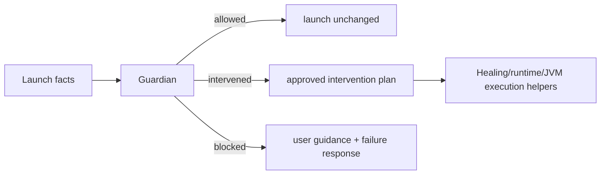

# Guardian Architecture
Guardian is the launch-safety authority. It exists so launch policy lives in one place instead of being spread across runtime resolution, JVM tuning, validation, route handlers, Healing, and frontend copy.

## Goal
Guardian answers one question:

`given the launch request, observed facts, and the configured safety mode, what is the single launch-safety decision?`

That decision must cover:
- whether launch is allowed
- whether Guardian may intervene
- which intervention is allowed
- whether launch must be blocked
- what guidance or intervention summary the user should see

## Scope
Guardian v1 is launch-only.

It owns:
- pre-launch safety decisions
- startup-recovery eligibility
- intervention summaries and user guidance
- the meaning of `managed` vs `custom`
- basic launch memory-pressure warnings
- warnings when the selected minimum memory is clamped down to the effective maximum memory
- warnings when the effective maximum memory allocation is very low for Minecraft startup
- conservative launch concurrency, measured CPU load, install/download pressure, and low-disk-space warnings
- custom-mode warnings for risky manual launch overrides

It does not yet own:
- install policy
- active install/download scheduling policy
- broader measured multi-instance resource coordination
- updater safety
- OS/process safety outside the launch flow

## Modes

### Managed
Intent:
- the launcher protects the user from technical mistakes

Policy:
- Guardian may replace an incompatible Java override with managed Java
- Guardian may strip fatal raw JVM args
- Guardian may downgrade or disable unsafe GC/preset choices
- Guardian may allow one startup recovery when launch fails during the startup window
- Guardian must log what it changed

### Custom
Intent:
- the launcher respects explicit technical choices and only blocks guaranteed-fatal setups

Policy:
- Guardian does not silently change explicit launch intent
- Guardian warns when explicit Java, JVM preset, or raw JVM argument overrides will be preserved
- Guardian blocks guaranteed-fatal override combinations before spawn
- Guardian blocks explicit named JVM presets before spawn when the selected runtime is known not to support the flags emitted by that preset
- Guardian returns guidance instead of auto-healing explicit unsafe choices
- valid explicit overrides still pass unchanged

## Authority model

### What Guardian owns
- policy
- intervention eligibility
- block/allow/intervene decision
- user-facing safety outcome

### What lower layers should do
- `core/minecraft runtime`: discover requested/effective runtimes, report facts, install managed runtime when asked
- `core/launcher jvm`: compute preset/JVM args from a chosen policy outcome
- `core/launcher validation`: report why a requested configuration is incompatible
- `core/launcher healing`: execute recovery plans and format healing summaries
- `apps/api session store`: capture running-process facts, store only bounded startup failure class observations, and preserve Guardian-authored stage telemetry details
- `frontend`: render the backend-authored Guardian outcome

Lower layers should not decide:
- whether a user override should be respected
- whether an intervention is allowed
- whether an incompatibility should be auto-fixed or blocked

## Core data model

### Inputs
Guardian should reason from explicit facts, not implicit booleans:
- Guardian mode
- explicit Java override present
- explicit preset present
- explicit raw JVM args present
- origin of each override: global or instance
- required Java major/runtime facts
- effective runtime facts
- requested preset and computed preset facts
- host memory total and active launch allocation
- selected raw minimum memory and effective maximum memory
- effective maximum memory allocation threshold facts
- CPU thread count, active launch count, and best-effort CPU load averages
- active install/download session count
- startup failure observations

### Output
Guardian should produce one normalized outcome for the pipeline:
- decision: `allowed | warned | intervened | blocked`
- message: concise backend-authored user-facing summary for non-allowed outcomes
- details: backend-authored user-facing details for interventions, warnings, or blocked guidance
- interventions: list of concrete actions applied
- guidance: user-facing fix guidance when blocked
- optional approved recovery plan

## Current pipeline role

### Pre-launch
1. Route builds `LaunchIntent`
2. `LaunchGuardianContext` is assembled from config + instance overrides
3. preparation captures selected memory bounds, host resource observations, active launch/install counts, CPU thread/load observations, and launch-relevant disk free space as Guardian warning facts
4. preparation gathers runtime and override facts
5. Guardian evaluates those facts
6. Guardian either:
   - allows launch unchanged
   - warns when the selected minimum memory is higher than the effective maximum and is clamped
   - warns when the effective maximum memory allocation is below the conservative 2 GB startup threshold
   - warns when launch is allowed but memory headroom is tight
   - warns when concurrent launches may saturate the CPU
   - warns when measured host CPU load already indicates saturated CPU headroom
   - warns when active install/download work may add disk or network pressure during startup
   - warns when launch-relevant storage has less than the conservative free-space headroom
   - warns in Custom mode when risky manual overrides are preserved
   - blocks Custom-mode explicit named JVM presets that would emit known unsupported flags for the selected runtime
   - intervenes and mutates attempt overrides
   - blocks and returns guidance

### Startup failure
1. Session layer reports observations about exit/stall/log output and stores only Guardian-classified startup failure classes
2. runner keeps the session observation plumbing and maps `stalled`/`exited` observations into bounded Guardian startup-failure facts
3. Guardian decides whether startup recovery is allowed
4. if allowed, Healing executes the recovery plan
5. if not allowed, Guardian converts the startup observation into a blocked message, details, and guidance before the runner emits terminal launch failure status

## Guardian and Healing
Healing is narrower than Guardian.

Healing is responsible for:
- summarizing compatibility adjustments
- applying approved recovery plans
- emitting healing events/details for UI/logs

Healing is not supposed to decide:
- whether recovery is allowed
- whether manual overrides should be respected
- whether the launcher should intervene in managed/custom mode

The target architecture is:

## Guardian and runtime resolution
Runtime resolution should become fact-oriented.

Desired split:
- runtime code answers:
  - what Java was requested
  - what Java was found
  - what managed Java is available
  - whether the requested runtime matches required major/update constraints
- Guardian answers:
  - do we keep the requested runtime
  - do we switch to managed runtime
  - do we block in custom mode

## Guardian and session heuristics
Session heuristics are still needed, but they should be treated as observations:
- log lines observed
- boot markers seen
- process exited
- exit code
- classified failure signals

Guardian should own the interpretation of those observations when they affect launch-safety outcomes.

## Frontend contract
The frontend should not decide which authority wins between Guardian and Healing.

The preferred shape is:
- Guardian outcome is primary
- Healing is supporting detail inside or alongside the Guardian outcome
- UI copy is backend-authored as much as possible through `guardian.message` and `guardian.details`

Current launcher behavior:
- `GET /api/v1/launch/preflight/{instance_id}` returns a read-only Guardian preflight for the instance overview. It reuses launch preparation fact gathering for effective memory, Guardian-owned memory clamp, low-allocation, resource pressure, and Custom override warnings, Guardian mode, and override origins, but it does not launch Minecraft, create a session, install files, ensure instance layout, write proof state, or expose paths, command lines, raw JVM args, account names, usernames, or tokens.
- Launch routes return HTTP `422 Unprocessable Entity` when a launch request fails because Guardian authored a `blocked` decision. The response body keeps the normal bounded launch-error JSON shape with Guardian details; non-Guardian launch request failures remain server errors unless a route has a more specific status.
- Guardian `message` is preferred for launch notices when present
- blocked Guardian `details` include the bounded backend-authored failure reason before guidance when one is available
- Guardian `details` are preferred over frontend-synthesized intervention/guidance copy
- startup `stalled` and pre-startup `exited` observations keep session plumbing as fact collection, but the terminal blocked summary and user guidance are Guardian-authored before launch failure status is emitted
- `guidance` and `interventions` remain serialized as current bounded diagnostics
- Healing remains supporting detail for runtime-adjustment specifics and retry/fallback context when Guardian has not already authored actionable `blocked`, `warned`, or `intervened` notice details
- live launch stage records preserve bounded unique Guardian `details` for `warned`, `intervened`, and `blocked` status payloads before appending Healing warnings without duplicates; Healing `fallback_applied` remains the only source of stage fallback reasons
- normal frontend launches do not run a separate pre-launch memory-pressure confirmation; backend preparation selects effective memory, Guardian owns memory warnings, and successful launch responses carry the selected `max_memory_mb` and `min_memory_mb`

## Invariants
- one launch-safety authority: Guardian
- one user-facing safety decision per launch phase
- explicit managed/custom semantics
- no hidden intervention without a logged summary
- no frontend reinterpretation of policy when backend already decided it

## Known gaps
- some policy still leaks into runtime/prepare/Healing/session heuristics, while the instance overview preflight now renders bounded Guardian-authored warning summaries from backend-captured facts instead of inferring launch-safety copy locally
- `warned` now covers min-memory clamp, very low launch allocation, memory pressure, conservative CPU/load/install/disk pressure, and Custom-mode risky overrides, but broader warning-only launch-safety paths are not normalized yet
- the API still exposes Guardian and Healing as separate top-level payload pieces, though Guardian now carries normalized message/details and session stage telemetry preserves those details

## Change rule
If Guardian behavior, authority boundaries, or the launch pipeline change, update:
- `docs/GUARDIAN-ARCHITECTURE.md`
- `docs/ARCHITECTURE.md`
- any user-facing copy that describes Guardian mode behavior
