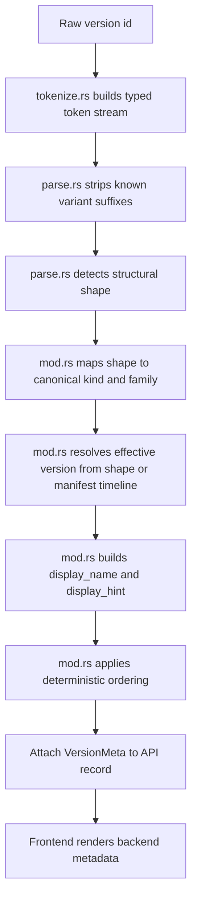

# Version Metadata Architecture
This is the current version-analysis model. Keep it accurate. If version naming, classification, or ordering changes, update this file in the same change.

## Purpose
The backend owns version interpretation.

That means:
- raw version ids are never the UI data model
- frontend code renders backend-authored version metadata
- weird version families are classified once in Rust, not re-guessed in multiple UI callsites
- ordering is deterministic and backend-owned
- unknown shapes still pass through a deterministic fallback path instead of devolving to raw provider order

## Source of truth
The authority lives in `core/minecraft/src/version_meta/mod.rs`.

The analysis pipeline is layered under:
- `core/minecraft/src/version_meta/tokenize.rs`
- `core/minecraft/src/version_meta/parse.rs`
- `core/minecraft/src/version_meta/mod.rs`

It produces `VersionMeta` for:
- vanilla catalog entries from `/api/v1/catalog`
- installed/local versions from `/api/v1/versions`
- loader-supported Minecraft versions from `/api/v1/loaders/components/{id}/game-versions`

## VersionMeta model
`VersionMeta` currently carries:
- `canonical_kind`: normalized launcher category such as `release`, `snapshot`, `old_beta`, `old_alpha`
- `family`: more precise version family such as `weekly_snapshot`, `pre_release`, `release_candidate`, `combat_test`, `experimental_snapshot`, `deep_dark_experimental_snapshot`, `potato_snapshot`
- `base_id`: normalized id without variant suffixes like `_unobfuscated` or `_original`
- `effective_version`: the real release target or practical grouping version
- `variant_of`: base version id when the raw id is a variant
- `variant_kind`: variant label such as `unobfuscated` or `original`
- `display_name`: backend-authored main label
- `display_hint`: backend-authored secondary hint text

Top-level API `type` remains as the normalized `canonical_kind` for simple filtering, but `VersionMeta` is the richer authority.

## Pipeline

## Layer responsibilities
### 1. Tokenizer
`tokenize.rs` converts a raw id into typed tokens:
- `number`
- `word`
- `separator`

This is the generic fallback layer. It should remain tolerant of unseen shapes and never encode version-family policy directly.

### 2. Structural parser
`parse.rs` uses the token stream to detect shapes without owning UI policy.

Current shapes:
- release
- pre-release
- release candidate
- weekly snapshot
- combat test
- experimental snapshot
- deep dark experimental snapshot
- old beta
- old alpha
- unknown

The parser also strips variant suffixes such as `_unobfuscated` and `_original` into:
- `base_id`
- `variant_kind`

### 3. Semantic interpreter
`mod.rs` is the policy layer over the parsed shape. It decides:
- canonical kind
- family
- effective version
- display name
- display hint
- sort precedence

This is where explicit knowledge of Minecraft version families belongs.

## Classification rules
### Family classification examples
Examples:
- `25w46a` -> `weekly_snapshot`
- `1.21.11-pre5` -> `pre_release`
- `1.21.11-rc3` -> `release_candidate`
- `1.18_experimentaI-snapshot-6` -> `experimental_snapshot`
- `1.19_deep_dark_experimental_snapshot-l` -> `deep_dark_experimental_snapshot`
- `1.16_combat-3` -> `combat_test`
- `24w14potato_original` -> `potato_snapshot` + `original`

### Effective version
This is the practical release target or grouping anchor.

Examples:
- `1.21.11-pre5` -> `1.21.11`
- `1.21.11-rc3` -> `1.21.11`
- `1.16_combat-3` -> `1.16`
- `1.18_experimentaI-snapshot-6` -> `1.18`
- `25w46a` -> nearest release by timestamp from the Mojang manifest

### Variant normalization
- suffix variants such as `_unobfuscated` and `_original` are stripped into `base_id`
- the removed suffix becomes `variant_kind`
- the base id stays visible in the main UI label
- variants stay in the hint text, not as separate fake versions

## Ordering rules
Installed version ordering is backend-owned and follows this shape:
1. normalized kind priority
2. release time descending when available
3. effective version descending
4. family priority
5. base id descending
6. variant priority
7. raw id descending as the final deterministic fallback

Loader-supported Minecraft versions are ordered by:
1. Mojang manifest order when the version exists there
2. backend fallback comparator for versions outside the manifest ordering path

The fallback comparator is also layered:
1. shape-aware comparison for known families
2. token-aware comparison for unknown or partially known shapes
3. raw id comparison as the last deterministic fallback

That means new weird ids should still sort stably even before a dedicated family interpreter exists.

## Frontend contract
Frontend code should:
- use `meta.display_name` and `meta.display_hint` for non-modded versions
- use backend `type` or `meta.canonical_kind` for filtering/badges
- avoid re-parsing vanilla, snapshot, experimental, combat, or suffix variants locally

The remaining frontend parsing is for modded composite ids like Fabric, Quilt, Forge, NeoForge, and OptiFine.

## Maintenance rules
- add new version-family semantics in the semantic interpreter layer, not in the frontend
- keep the tokenizer generic; do not turn it into a pile of family-specific regex checks
- if a new Mojang naming family appears, first make sure the fallback path renders and sorts it sanely, then add a family interpreter if the UX still needs more precision
