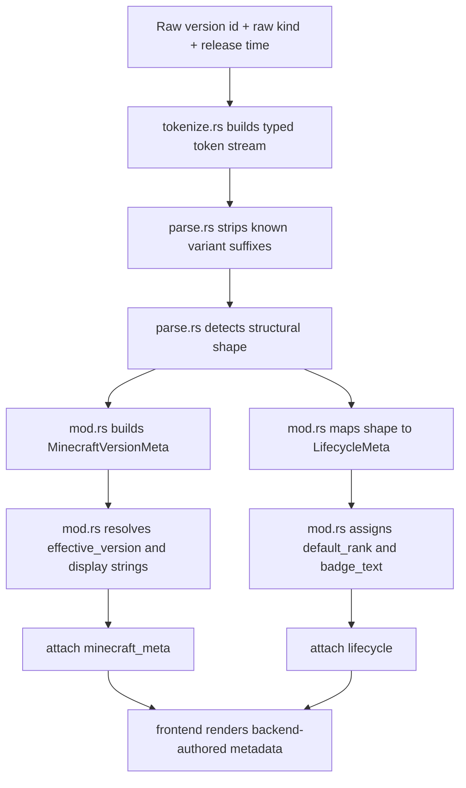

# Version Metadata Architecture
This is the current Minecraft-version interpretation model. Keep it accurate. If version naming, lifecycle classification, or ordering changes, update this file in the same change.

## Purpose
The backend owns two separate concerns:

- `minecraft_meta`: what kind of Minecraft version this is structurally
- `lifecycle`: how mature that version is in launcher terms

That split is deliberate. Loader builds use a different metadata contract and are documented separately in `docs/LOADER-ARCHITECTURE.md`.

## Source of truth
The authority lives in:

- `core/minecraft/src/version_meta/mod.rs`
- `core/minecraft/src/version_meta/parse.rs`
- `core/minecraft/src/version_meta/tokenize.rs`

It produces:

- `MinecraftVersionMeta`
- `LifecycleMeta`

Those fields are attached to:

- vanilla catalog entries from `/api/v1/catalog`
- installed/local versions from `/api/v1/versions`
- loader-supported Minecraft versions from `/api/v1/loaders/components/{id}/game-versions`

## Record model
Minecraft-version records expose:

- `subject_kind = minecraft_version` for catalog and loader-supported records
- `subject_kind = installed_version` for installed/local version records
- `raw_kind`: upstream kind string when available
- `minecraft_meta`
- `lifecycle`

`MinecraftVersionMeta` carries:

- `family`
- `base_id`
- `effective_version`
- `variant_of`
- `variant_kind`
- `display_name`
- `display_hint`

`LifecycleMeta` carries:

- `channel`: `stable | preview | experimental | legacy | unknown`
- `labels`
- `default_rank`
- `badge_text`
- `provider_terms`

`minecraft_meta` does not own maturity anymore. `lifecycle` does.

Installed-version scans also carry a backend-authored scan state alongside the version rows. The state distinguishes `ready`, `empty`, and `degraded`: a missing `versions/` directory is a fresh empty library, while unreadable directories, missing/malformed version JSON outside an `.incomplete` install marker, or malformed loader metadata degrade the scan. `/api/v1/versions`, `/api/v1/instances`, create-view rows, and create queue checks consume that same scan result instead of treating scan errors as an empty installed-version list.

Installed loader versions are classified by their Minecraft target, not by the composite local version id. Scans and enrichment use `inherits_from` or backend-authored loader metadata such as `minecraft_version` as the analysis id, so entries like `fabric-loader-0.16.14-1.21.5`, `1.19-forge-41.1.0`, and `neoforge-26.1.0.19-beta` inherit Minecraft display, lifecycle, and ordering metadata from `1.21.5`, `1.19`, and `26.1` respectively.

Loader-supported Minecraft-version rows can also carry provider stability hints. Some providers use this as Minecraft-version stability, such as Fabric and Quilt marking snapshot/prerelease game rows; those hints affect lifecycle display but do not by themselves mean loader builds are beta-only. Providers that derive the hint from build availability, currently Forge and NeoForge, may use a negative hint to indicate only unstable loader builds exist for that Minecraft target. Create-view renders that as a backend-authored beta tag, but the row remains selectable; version-level loader creation resolves the best stable build first and falls back to the best provider-ranked unstable build when no stable build exists. Build-level create-view exceptions, such as Quilt Java compatibility guards, use fresh cached build metadata when available and may render conservative non-blocking tags when live build metadata is intentionally deferred; submit/install paths re-resolve builds through the full loader catalog authority. The hint is serialized as part of normalized loader catalog cache data so cached supported-version rows re-enrich to the same lifecycle as fresh provider rows.

## Pipeline

## Layer responsibilities
### 1. Tokenizer
`tokenize.rs` converts a raw id into tolerant typed tokens:

- `number`
- `word`
- `separator`

It stays generic and should not own family policy.

### 2. Structural parser
`parse.rs` detects Minecraft version shapes and strips variant suffixes.

Current shapes include:

- release
- pre-release
- release candidate
- release snapshot
- weekly snapshot
- combat test
- experimental snapshot
- deep dark experimental snapshot
- old beta
- old alpha
- unknown

### 3. Semantic interpreter
`mod.rs` is the policy layer.

It decides:

- `minecraft_meta.family`
- `minecraft_meta.effective_version`
- `minecraft_meta.display_name`
- `minecraft_meta.display_hint`
- `lifecycle.channel`
- `lifecycle.labels`
- sort precedence

## Classification rules
Examples:

- `25w46a`
  - `family = weekly_snapshot`
  - `lifecycle.channel = preview`
  - `lifecycle.labels = [snapshot]`
- `1.21.11-pre5`
  - `family = pre_release`
  - `lifecycle.channel = preview`
  - `lifecycle.labels = [pre_release]`
- `1.7.10_pre4`
  - `family = pre_release`
  - `lifecycle.channel = preview`
  - `lifecycle.labels = [pre_release]`
- `1.21.11-rc3`
  - `family = release_candidate`
  - `lifecycle.channel = preview`
  - `lifecycle.labels = [release_candidate]`
- `26.1-snapshot-9`
  - `family = release_snapshot`
  - `lifecycle.channel = preview`
  - `lifecycle.labels = [snapshot]`
- loader-supported `26.2` from a provider that reports only beta loader builds
  - `family = release`
  - `lifecycle.channel = preview`
  - `lifecycle.labels = [beta]`
  - create-view row includes a backend-authored `Beta` tag and remains selectable
- `b1.7.3`
  - `family = old_beta`
  - `lifecycle.channel = legacy`
  - `lifecycle.labels = [old_beta]`
- `a1.2.6`
  - `family = old_alpha`
  - `lifecycle.channel = legacy`
  - `lifecycle.labels = [old_alpha]`
- an unknown id with upstream `raw_kind = old_beta` or `old_alpha`
  - `family` follows that raw kind
  - `lifecycle.channel = legacy`
  - the raw kind is not treated as a release fallback

## Effective version
`effective_version` is the practical release target or grouping anchor.

Examples:

- `1.21.11-pre5` -> `1.21.11`
- `1.21.11-rc3` -> `1.21.11`
- snapshot estimates represent the incoming edition: when a snapshot technically anchors to or timeline-matches an existing release, `effective_version` advances to the immediate next known release
- `26.1-snapshot-9` -> immediate next known release after `26.1`; falls back to `26.1` when no later release is known
- `1.16_combat-3` -> `1.16`
- `25w46a` -> nearest release by manifest timestamp

## Ordering rules
Installed version ordering is backend-owned and currently follows:

1. lifecycle priority
2. release time descending when available
3. effective version descending
4. family priority
5. base id descending
6. variant priority
7. raw id descending

Loader-supported Minecraft versions use:

1. Mojang manifest order when known
2. backend fallback version comparison otherwise

The fallback comparator stays deterministic even for unknown shapes.

## Frontend contract
Frontend code should:

- render version labels through `frontend/src/version-display.ts`
- use `minecraftVersionLabel()` for Minecraft-only UI labels
- never render composite loader ids such as `quilt-loader-0.29.2-1.16.5`, `1.19-forge-41.1.0`, or `neoforge-26.1.0.19-beta` as the Minecraft version; backend metadata must provide `inherits_from` or normalized Minecraft metadata
- installed loader versions must carry backend-authored loader metadata from `versions/<id>/.croopor-loader.json`; scanners and routes should not infer loader identity from raw version ids
- loader create rows must use backend-authored exact build identity (`component_id`, `build_id`, target version id, Minecraft version, loader version, installability, and catalog availability); frontend code must not infer preferred builds or installed/full state from component id + Minecraft version groupings
- loader create row tags are backend-authored; frontend code renders tags such as `Beta` but does not decide loader stability or compatibility
- use `normalizeVersionDisplay()` / `versionSearchText()` for version picker rows and filtering
- use `lifecycle` for filtering and badges
- avoid re-parsing vanilla-like version ids locally

## Maintenance rules
- add new Mojang naming families in `version_meta/mod.rs`, not in the frontend
- do not overload `family` as a maturity field
- do not reintroduce top-level `type` or `canonical_kind`
- if lifecycle policy changes, update both this doc and `docs/LOADER-ARCHITECTURE.md`
